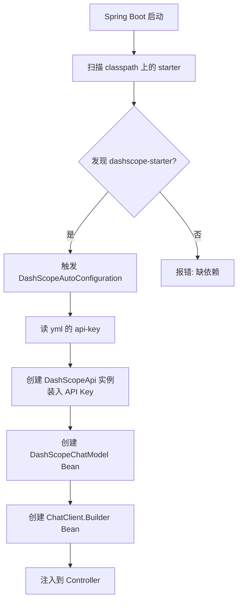
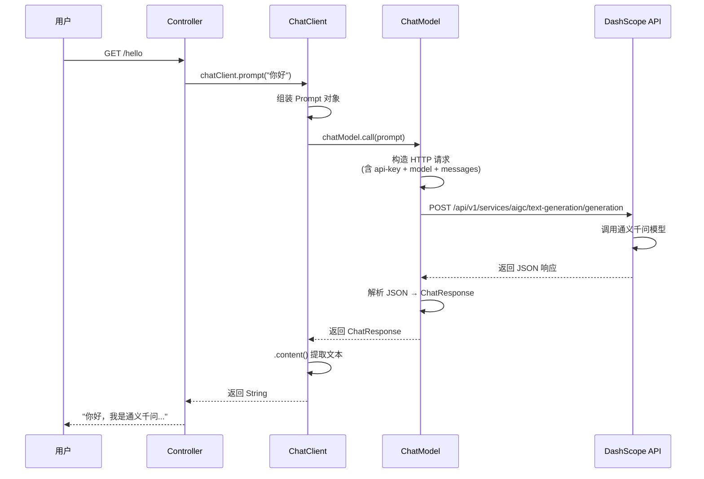

# 模块一：helloworld —— 入门

> [← 返回索引](./README.md) | [下一模块：chat-example →](./02-chat-example.md)

---

## 一、问题概述

helloworld 是 Spring AI 的**最小可运行单元**——用最少的代码跑通「Java 应用调通义千问大模型，拿到回答」这条链路。它本质上回答一个问题：**Spring Boot 是如何把「调 LLM」这件事简化成一行链式调用的？**

## 二、背景知识

要理解 helloworld，需要先知道三件事：

### 1. Spring Boot 自动装配（Auto-Configuration）

Spring Boot 的核心魔法。你在 pom.xml 里引入一个 starter（如 `spring-ai-alibaba-starter-dashscope`），框架启动时会**自动扫描**这个 starter 里的配置类，自动创建所需的 Bean（如 `ChatModel`、`ChatClient.Builder`），注入到 Spring 容器。你不需要写 `new ChatModel()`，Spring 帮你建好了。

### 2. DashScope 是什么

DashScope（灵积）是阿里云的**大模型推理服务平台**——一个 API 网关，你拿 API Key 调它，它帮你路由到通义千问、DeepSeek 等各家大模型。本项目的 `spring.ai.dashscope.api-key` 配置的就是它。

### 3. ChatClient vs ChatModel

Spring AI 提供两套 API：
- **ChatModel（底层）**：返回完整 `ChatResponse`，能拿 token、metadata，命令式
- **ChatClient（高级）**：Fluent 链式 API，`.prompt().call().content()`，简洁

helloworld 用的是 **ChatClient**（高级 API），因为最简洁。

## 三、详细解答

### Why：为什么一行链式调用就能调通 LLM？

**根本原因是 Spring Boot 自动装配 + ChatClient 的 Fluent 设计**。

当你在 `application.yml` 写：
```yaml
spring:
  ai:
    dashscope:
      api-key: ${AI_DASHSCOPE_API_KEY}
```

启动时发生的事：



所以你构造器里 `ChatClient.Builder builder` 一声明，Spring 就把建好的 Builder 塞给你。**你不用管怎么连 DashScope、怎么发 HTTP 请求——starter 全包了**。

### How：一行调用的完整流程



**整个流程分 5 步**：
1. **组装 Prompt**：`.prompt("你好")` 把字符串包装成 Prompt 对象
2. **调 ChatModel**：`.call()` 内部转调 `chatModel.call(prompt)`
3. **发 HTTP 请求**：ChatModel 构造请求（含 api-key、模型名、messages），POST 给 DashScope
4. **解析响应**：DashScope 返回 JSON，ChatModel 解析成 `ChatResponse` 对象
5. **提取文本**：`.content()` 从 ChatResponse 里抠出纯文本返回

### Principle：ChatClient 的 Fluent 设计原理

ChatClient 用**建造者模式 + 链式调用**，每一行返回的都是中间对象，最后才执行：

```java
chatClient.prompt("你好")   // 返回 ChatClient.RequestSpec
          .call()           // 返回 CallResponseSpec (真正发了 HTTP 请求)
          .content();       // 返回 String (从响应里提取文本)
```

**为什么这么设计**：链式调用让「配置请求 → 执行 → 取结果」三个阶段可以用一行表达，同时每一步都能继续配置（如 `.stream()` 改流式、`.entity()` 改结构化输出）。这是 Spring AI 所有高级 API 的统一风格。

## 四、代码逐行解析

```java
@RestController                                     // ① 标记为 REST 控制器, 返回值自动转 JSON
public class HelloWorldController {

    private final ChatClient chatClient;            // ② 持有 ChatClient (高级 API)

    public HelloWorldController(ChatClient.Builder builder) {  // ③ 构造器注入 Builder
        this.chatClient = builder.build();          // ④ 用 Builder 构建 ChatClient 实例
    }

    @GetMapping("/hello")                           // ⑤ 映射 GET /hello
    public String hello() {
        return chatClient.prompt("你好，介绍下你自己")  // ⑥ 组装 Prompt
                         .call()                     // ⑦ 同步调 LLM (发 HTTP 请求)
                         .content();                 // ⑧ 从响应提取文本
    }
}
```

| 行 | 作用 | 关键点 |
|----|------|--------|
| ① | `@RestController` | = `@Controller` + `@ResponseBody`，返回值自动序列化 |
| ② | 持有 ChatClient | 用高级 API 而非 ChatModel，写法最简 |
| ③ | 注入 `ChatClient.Builder` | Spring 自动配置提供 Builder，含 yml 里的默认参数 |
| ④ | `builder.build()` | Builder 是可配置的，build() 生成不可变的 ChatClient |
| ⑥ | `.prompt("...")` | 字符串包装成 Prompt，可继续配置 |
| ⑦ | `.call()` | 同步执行，发 HTTP 请求给 DashScope |
| ⑧ | `.content()` | 从 ChatResponse 提取纯文本 |

## 五、配置文件解析

```yaml
spring:
  ai:
    dashscope:
      api-key: ${AI_DASHSCOPE_API_KEY}   # 从环境变量读, 避免硬编码
```

- `${AI_DASHSCOPE_API_KEY}`：Spring 的**属性占位符**，启动时从环境变量 `AI_DASHSCOPE_API_KEY` 取值
- 这样做的好处：API Key 不写进代码/git，安全；不同环境（开发/生产）用不同 Key

## 六、运行验证

启动后访问 `GET http://localhost:8080/hello`，应返回通义千问的自我介绍。

**如果报错**，按这个顺序排查：
1. **401 Unauthorized** → API Key 错了或没配环境变量
2. **连接超时** → 网络问题，DashScope 需要能访问阿里云
3. **Bean 创建失败** → starter 没引对，检查 pom.xml

## 七、总结

- **根本机制**：Spring Boot 自动装配扫描 starter，自动创建 ChatModel 和 ChatClient.Builder Bean
- **调用链路**：`prompt() → call() → content()` 三步，分别对应「组装请求、发 HTTP、提取文本」
- **设计哲学**：ChatClient 用 Fluent 链式 API 把复杂的 HTTP 调用封装成一行，是 Spring AI 所有高级 API 的统一风格
- **学习意义**：helloworld 验证了 starter 装配、API Key、调用链三件事，跑通后所有后续模块都是「在调 LLM 前后加层」
