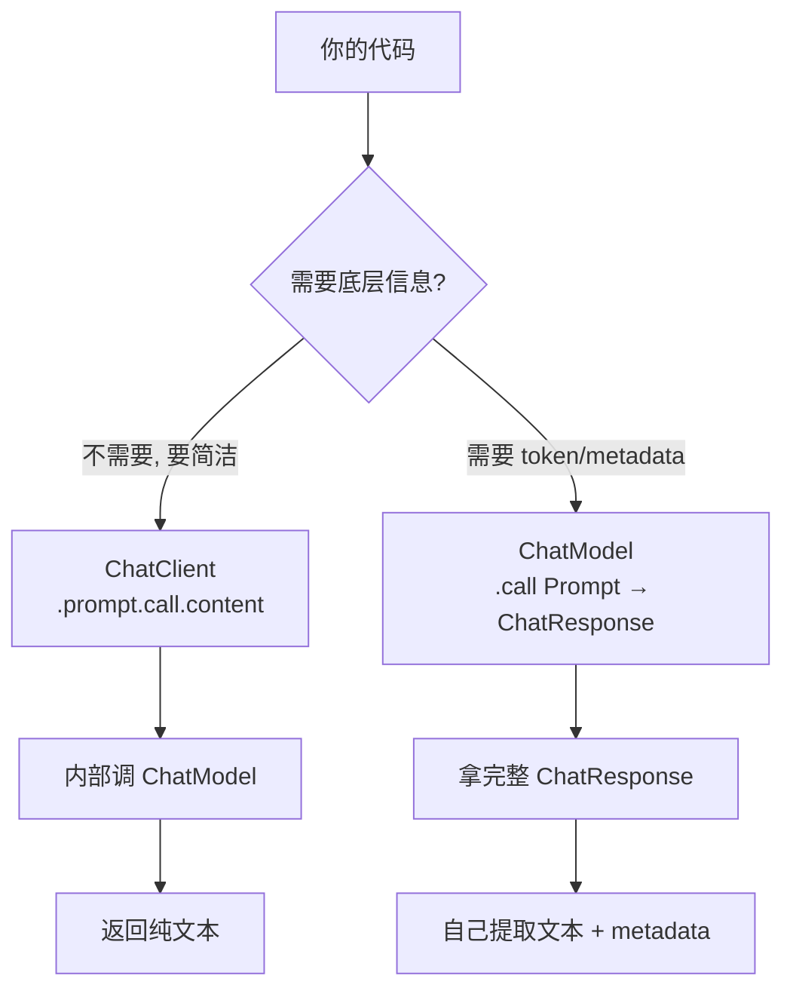
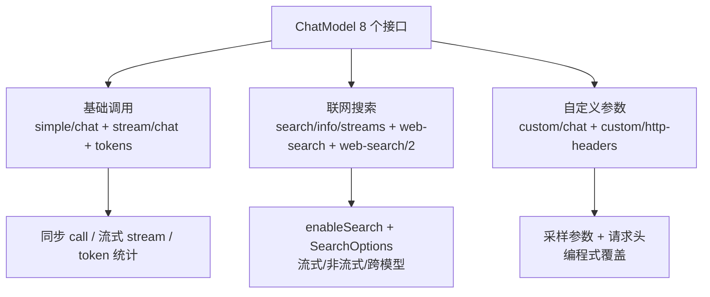
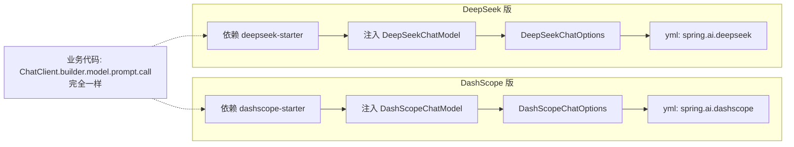

# 模块二：chat-example —— 调用层全解

> [← 返回索引](./README.md) | [← 上一模块：helloworld](./01-helloworld.md) | [下一模块：prompt-example →](./03-prompt-example.md)

---

## 一、问题概述

chat-example 是 Spring AI **调用层的完整教学**——它用 11 个子模块（dashscope/deepseek/openai/ollama 等）和十几个接口，回答一个核心问题：**Spring AI 是如何用统一抽象屏蔽不同大模型差异，让业务代码「换模型不动代码」的？同时如何调出 LLM 的全部能力（流式、token、多模态、联网搜索、参数覆盖）？**

## 二、背景知识

### 1. 两套 API 的定位

```
ChatModel (底层 API):
  - chatModel.call(new Prompt(...)) → ChatResponse
  - 能拿完整响应: token、metadata、finishReason
  - 命令式, 适合需要底层信息的场景

ChatClient (高级 API):
  - chatClient.prompt("...").call().content()
  - Fluent 链式, 简洁
  - 可挂 Advisor (拦截器), 可结构化输出
  - 日常开发 90% 用这个
```

### 2. 模型无关性

Spring AI 的核心承诺：**业务代码面向 `ChatModel`/`ChatClient` 接口编程，换模型只改 starter + yml**。本项目用 dashscope-chat 和 deepseek-chat 两个模块对照演示。

### 3. DashScope 专属能力

联网搜索、多模态、内容审查等是 DashScope 平台专属能力，不在 Spring AI 通用抽象里，必须用 `DashScopeChatOptions`。

## 三、详细解答

### Why：为什么有两套 API？

**根本原因是使用场景不同**：

- 90% 场景只需要「问→答」，用 ChatClient 一行搞定，简洁
- 10% 场景需要拿 token 用量、原始 metadata、做监控，用 ChatModel 拿完整响应
- ChatClient 内部也是调 ChatModel，只是帮你封装了样板代码



### How：ChatModel 全维度用法

DashScopeChatModelController 有 8 个接口，覆盖 ChatModel 的所有用法：



#### 同步 vs 流式

```java
// 同步: 一次性返回完整结果
ChatResponse call = dashScopeChatModel.call(new Prompt(...));
return call.getResult().getOutput().getText();

// 流式: 边生成边返回 (打字机效果)
Flux<ChatResponse> stream = dashScopeChatModel.stream(new Prompt(...));
return stream.map(resp -> resp.getResult().getOutput().getText());
```

**流式的底层原理**：DashScope API 用 SSE（Server-Sent Events）协议，模型每生成一小段就推一个事件。`stream()` 返回 Reactor 的 `Flux`（响应式流），每个元素是一个增量块。前端订阅这个 Flux，就能实时显示打字机效果。

#### token 统计

```java
ChatResponse resp = dashScopeChatModel.call(...);
Map<String, Object> res = new HashMap<>();
res.put("output_token", resp.getMetadata().getUsage().getCompletionTokens());  // 输出 token
res.put("input_token", resp.getMetadata().getUsage().getPromptTokens());       // 输入 token
res.put("total_token", resp.getMetadata().getUsage().getTotalTokens());        // 总 token
```

**token 是什么**：LLM 不按字符计费，按 token（词片段）计费。一个中文字约 1-2 token，一个英文单词约 1 token。这三个值是成本核算和限流的核心指标。

#### 联网搜索

```java
var searchOptions = DashScopeApiSpec.SearchOptions.builder()
    .forcedSearch(true)           // 强制搜索, 即使模型认为不需要
    .enableSource(true)           // 返回引用来源
    .searchStrategy("pro")        // pro 精准 / turbo 快速
    .enableCitation(true)         // 开启引用标注
    .citationFormat("[<number>]") // 引用格式 [1][2]
    .build();

var options = DashScopeChatOptions.builder()
    .enableSearch(true)           // 总开关
    .model(DashScopeModel.ChatModel.QWEN_PLUS.getValue())
    .searchOptions(searchOptions)
    .temperature(0.7)
    .build();
```

**联网搜索解决什么**：LLM 有知识截止日期（如训练到 2024 年），问它 2026 年的事它会瞎答或说不知道。开启搜索后，模型先检索互联网最新信息，再基于结果生成回答，带编号引用 `[1][2]`，类似 Perplexity。

#### 自定义请求头（内容审查）

```java
Map<String, String> headerParams = new HashMap<>();
headerParams.put("input", "cip");   // 输入内容审查
headerParams.put("output", "cip");  // 输出内容审查

Map<String, String> headers = new HashMap<>();
headers.put("X-DashScope-DataInspection", new ObjectMapper().writeValueAsString(headerParams));

var options = DashScopeChatOptions.builder()
    .model(DashScopeModel.ChatModel.DEEPSEEK_V3.getValue())
    .httpHeaders(headers)   // 附加自定义 HTTP 头
    .build();
```

**为什么需要自定义头**：阿里云内容安全、流量控制等高级特性通过 HTTP 头触发。`httpHeaders()` 让你在调用时附加这些头，触发平台侧能力。

### How：ChatClient + 多模态

#### 构造时固化配置

```java
public DashScopeChatClientController(ChatModel chatModel) {
    this.dashScopeChatClient = ChatClient.builder(chatModel)
        .defaultAdvisors(new SimpleLoggerAdvisor())           // 默认 Advisor
        .defaultOptions(DashScopeChatOptions.builder()        // 默认参数
            .withTopP(0.7).build())
        .build();
}
```

**构造时固化 vs 运行时覆盖**（核心模式）：

| 维度 | 构造时 API | 运行时 API |
|------|----------|----------|
| 模型参数 | `defaultOptions()` | `.options()` |
| 拦截器 | `defaultAdvisors()` | `.advisors()` |
| 工具 | `defaultTools()` | `.tools()` |

三者完全对称。生产推荐构造时固化（多个 ChatClient 按用途分）。

#### 多模态图片分析

```java
@GetMapping("/image/analyze/url")
public String analyzeImageByUrl(String prompt, String imageUrl) {
    // 1. 创建 Media (图片资源)
    List<Media> mediaList = List.of(new Media(MimeTypeUtils.IMAGE_JPEG, new URI(imageUrl)));
    
    // 2. 组装 UserMessage (文本 + 图片)
    UserMessage message = UserMessage.builder()
        .text(prompt).media(mediaList).build();
    
    // 3. 标记为图片格式
    message.getMetadata().put(DashScopeApiConstants.MESSAGE_FORMAT, MessageFormat.IMAGE);
    
    // 4. 配置视觉模型 + 多模态端点
    Prompt chatPrompt = new Prompt(message,
        DashScopeChatOptions.builder()
            .withModel("qwen-vl-max-latest")    // vl = vision-language 视觉模型
            .withMultiModel(true)                // 走多模态端点 URL
            .withVlHighResolutionImages(true)    // 高分辨率模式
            .build());
    
    return dashScopeChatClient.prompt(chatPrompt).call().content();
}
```

**多模态的关键认知**：
- 必须用视觉模型（qwen-vl 系列），普通 qwen-plus 无法识图
- `multiModel(true)` 让框架走多模态端点（`multimodal-generation`），否则报 url error
- 调用方式仍是 `.prompt().call().content()`，与纯文本一致——多模态差异封装在 Prompt 和 Options 里

### Principle：模型无关性的实现原理

DeepSeek 版和 DashScope 版业务代码几乎一样，区别只有三处：



**业务代码不变**是因为：ChatClient.builder 接受 `ChatModel` 接口（不是具体类），`.prompt().call()` 是接口方法。换模型只是换了接口的实现类，业务无感知。这就是「面向接口编程」的力量。

## 四、代码逐行解析（联网搜索流式版）

```java
@GetMapping("/search/info/streams")
public Flux<String> searchInfoStreams(HttpServletResponse response) {
    response.setCharacterEncoding("UTF-8");                    // ① 防中文乱码
    
    var searchOptions = DashScopeApiSpec.SearchOptions.builder()
        .forcedSearch(true)                                      // ② 强制搜索
        .enableSource(true)                                      // ③ 返回来源
        .searchStrategy("pro")                                   // ④ 精准策略
        .enableCitation(true)                                    // ⑤ 开启引用
        .citationFormat("[<number>]")                            // ⑥ 引用格式
        .build();
    
    var options = DashScopeChatOptions.builder()
        .enableSearch(true)                                      // ⑦ 搜索总开关
        .model(DashScopeModel.ChatModel.QWEN_PLUS.getValue())    // ⑧ 指定模型
        .searchOptions(searchOptions)                            // ⑨ 细化配置
        .temperature(0.7)                                        // ⑩ 采样温度
        .build();
    
    String prompt = "hi, 搜索下关于量子物理的最新研究进展";
    
    Flux<ChatResponse> stream = dashScopeChatModel.stream(new Prompt(prompt, options));  // ⑪ 流式调用
    
    return stream.map(resp -> {
        String text = resp.getResult().getOutput().getText();    // ⑫ 取增量文本
        if (resp.getResult().getOutput().getMetadata() != null) {
            Object searchInfo = resp.getResult().getOutput().getMetadata().get("search_info");  // ⑬ 提取引用
            if (searchInfo != null) {
                System.out.println("Search info: " + searchInfo);
            }
        }
        return text;
    });
}
```

| 步骤 | 作用 | 易错点 |
|------|------|--------|
| ① | 设 UTF-8 | 不设会乱码（浏览器默认 ISO-8859-1）|
| ②-⑥ | 搜索细节 | searchStrategy 选 pro 还是 turbo |
| ⑦-⑩ | 调用参数 | enableSearch 是总开关 |
| ⑪ | stream() | 返回 Flux，不是单个响应 |
| ⑫-⑬ | 提取结果 | search_info 在 output 的 metadata 里，不是顶层 |

## 五、DeepSeek 对照（模型无关性证据）

```java
// DeepSeekChatClientController - 和 DashScope 版结构完全一样
public DeepSeekChatClientController(DeepSeekChatModel chatModel) {
    this.DeepSeekChatClient = ChatClient.builder(chatModel)        // ★ 注入类型不同
        .defaultAdvisors(MessageChatMemoryAdvisor.builder(         // 提前预告记忆
            MessageWindowChatMemory.builder().build()).build())
        .defaultAdvisors(new SimpleLoggerAdvisor())
        .defaultOptions(DeepSeekChatOptions.builder()              // ★ Options 类不同
            .temperature(0.7d).build()).build();
}

@GetMapping("/ai/generate")
public String chat() {
    return this.DeepSeekChatClient.prompt(DEFAULT_PROMPT)          // ★ 调用方式完全一样
        .call().content();
}
```

**三处差异**：
1. 依赖 starter：`spring-ai-alibaba-starter-deepseek`（不是 dashscope）
2. 注入类型：`DeepSeekChatModel`（不是 DashScopeChatModel）
3. 参数类：`DeepSeekChatOptions`（没有联网搜索等专属能力）

**业务代码（prompt/call/content）一字不差**。

## 六、8 个接口分类总结

| 接口 | 分类 | 学什么 |
|------|------|--------|
| `/model/simple/chat` | 基础 | 同步调用 + 指定模型 |
| `/model/stream/chat` | 基础 | 流式调用（打字机）|
| `/model/tokens` | 基础 | token 统计（计费/监控）|
| `/model/search/info/streams` | 搜索 | 联网搜索 + 提取 search_info |
| `/model/dashscope/web-search` | 搜索 | 换模型也能用搜索 |
| `/model/dashscope/web-search/2` | 搜索 | 非流式版 |
| `/model/custom/chat` | 参数 | 编程式覆盖采样参数 |
| `/model/custom/http-headers` | 参数 | 自定义请求头（内容审查）|

## 七、总结

- **两套 API**：ChatModel（底层，拿完整响应）vs ChatClient（高级，Fluent 链式），日常用 ChatClient
- **模型无关性**：业务代码面向 ChatModel 接口，换模型 = 换 starter + 改 yml，业务不动
- **构造时固化**：`defaultOptions/defaultAdvisors/defaultTools` 三个维度对称，生产推荐多 ChatClient 按用途分
- **流式原理**：底层 SSE 协议，`stream()` 返回 Flux，每个元素是增量块
- **多模态关键**：视觉模型 + `multiModel(true)` 走多模态端点，调用方式与纯文本一致
- **联网搜索**：DashScope 专属能力，`enableSearch` + `SearchOptions`，解决知识截止问题
- **token 统计**：`getMetadata().getUsage()` 拿 input/output/total，用于计费和限流
