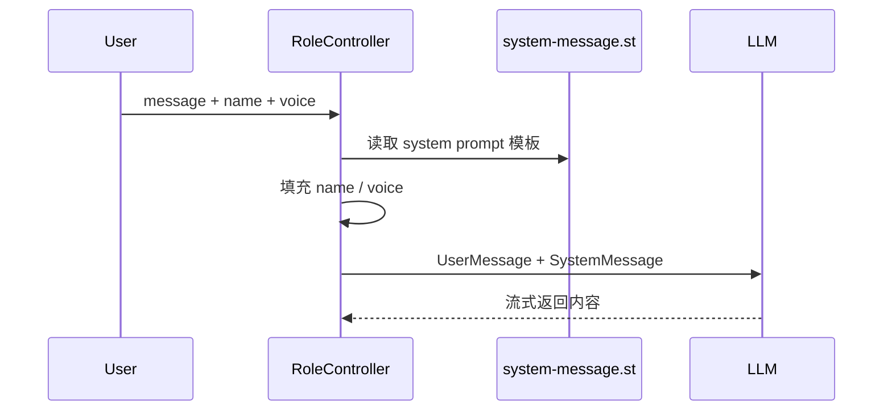

# 模块三：prompt-example —— Prompt 模板与上下文填充

> [← 返回索引](./README.md) | [← 上一模块：chat-example](./02-chat-example.md) | [下一模块：structured-example →](./04-structured-example.md)

---

## 一、问题概述

prompt-example 回答一个核心问题：**如何把提示词从 Controller 里的硬编码字符串，升级成可维护、可复用、可带变量的模板？**

ChatClient 解决“怎么调模型”，Prompt 模板解决“怎么稳定地组织模型输入”。后面的结构化输出、Tool Calling、Agent instruction、RAG 问答模板，本质都依赖 Prompt 能力。

## 二、背景知识

### 1. 为什么不能一直手写字符串

直接拼字符串有三个问题：

- 业务参数和提示词混在一起，后期很难维护
- 多个接口重复写系统提示词，容易不一致
- RAG、角色设定、输出格式约束都需要模板化变量

Prompt 模板把“固定规则”和“运行时变量”拆开：

```text
模板文件：你是 {name}，请用 {voice} 的语气回答
运行参数：name=Bob, voice=pirate
最终消息：你是 Bob，请用 pirate 的语气回答
```

### 2. 本模块两类示例

| 示例 | 入口 | 核心能力 |
|---|---|---|
| RoleController | `/example/ai/roles` | SystemPromptTemplate + 角色变量 |
| StuffController | `/prompt/ai/stuff` | PromptTemplate + 外部文档上下文填充 |

## 三、核心流程

### 1. 角色 Prompt



关键代码入口：

```text
spring-ai-alibaba-prompt-example
└── src/main/java/com/alibaba/cloud/ai/example/prompt/controller
    ├── RoleController.java
    └── StuffController.java
```

### 2. Stuffing Prompt

Stuffing 的意思是“把外部上下文塞进 prompt”。它是最朴素的 RAG 前身：

```text
用户问题 + 文档上下文 -> PromptTemplate -> LLM
```

如果 `stuffit=false`，模型只能靠自身知识回答。

如果 `stuffit=true`，Controller 会把 `wikipedia-curling.md` 填到 `{context}` 变量里，让模型基于文档回答。

## 四、和后续模块的关系

Prompt 是后面所有高级能力的底座：

| 后续模块 | 用到 Prompt 的地方 |
|---|---|
| structured-example | 给模型注入 JSON / Bean 输出格式要求 |
| tool-calling-example | 工具描述本质也是给模型看的 prompt 元数据 |
| react-agent-example | instruction 决定 Agent 的角色和行动边界 |
| rag-example | RAG 把检索出的文档填入 prompt |
| playground-flight-booking | 系统提示词、Advisor、工具说明一起约束客服行为 |

## 五、学习重点

- `SystemPromptTemplate` 适合系统角色设定
- `PromptTemplate` 适合普通问答模板和上下文填充
- 模板文件放到 `src/main/resources/prompts`
- 变量名必须和模板里的占位符一致
- Prompt 不只是“写得好听”，它是模型行为的接口契约

## 六、本模块注释阅读点

本次已给代码补充详细注释，阅读时重点看：

- `UserMessage` 为什么要和 `SystemMessage` 分开
- `SystemPromptTemplate` 如何从资源文件读取模板
- `{name}`、`{voice}` 变量如何被渲染成系统消息
- `PromptTemplate` 如何把 `question` 和 `context` 组合成最终 Prompt
- `stuffit=true` 为什么可以看作最朴素的手动 RAG

这样可以把“模板读取 → 变量填充 → Prompt 生成 → 模型调用 → 流式输出”的链路看清楚。

## 七、一句话总结

prompt-example 是从“能调模型”到“能稳定控制模型输入”的关键一步。后面学结构化输出、RAG 和 Agent，都要先理解 Prompt 模板这一层。
