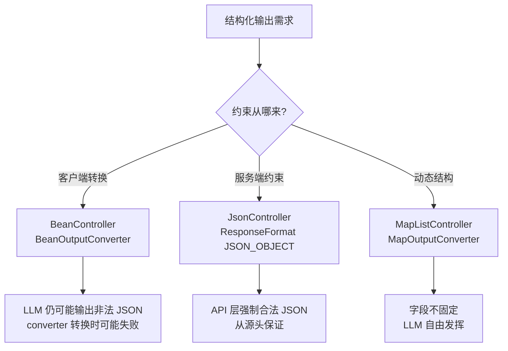
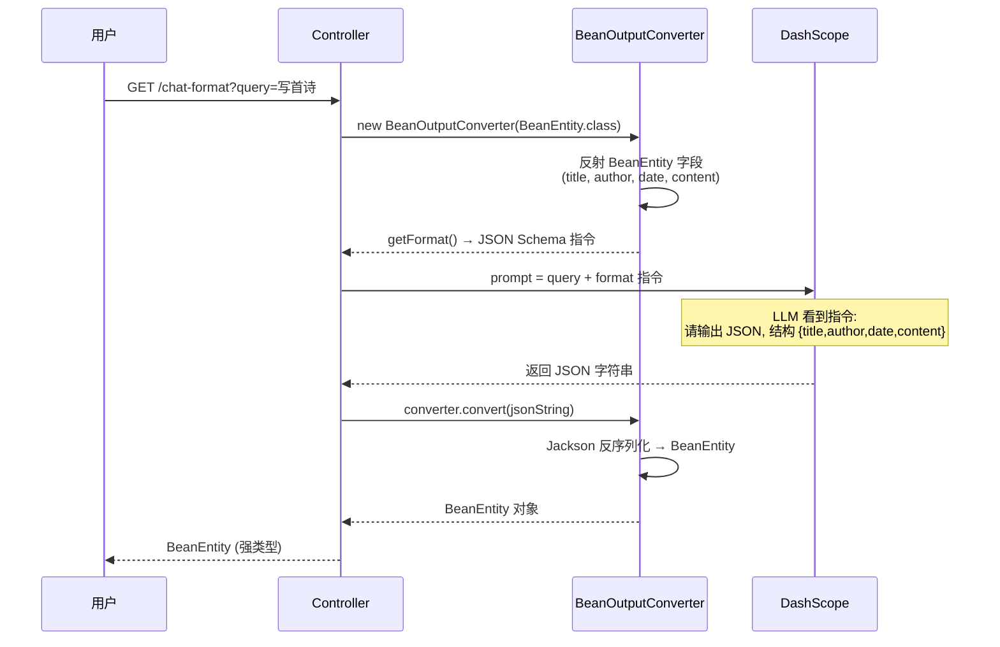

# 模块三：structured-example —— 结构化输出

> [← 返回索引](./README.md) | [← 上一模块：chat-example](./02-chat-example.md) | [下一模块：chat-memory-example →](./04-chat-memory-example.md)

---

## 一、问题概述

structured-example 回答一个核心问题：**如何让 LLM 不返回随意的自然语言文本，而是返回符合指定结构的 Java 对象（Bean / Map / List / JSON）？** 这是从「聊天机器人」迈向「AI 应用」的关键一步——业务代码需要类型安全的数据，不是一坨字符串。

## 二、背景知识

### 1. 为什么需要结构化输出

裸调 LLM 返回的是 `String`，业务代码要：
1. 自己写正则解析
2. 处理格式异常（LLM 可能加 markdown 包裹、加解释文字）
3. 手动反序列化

**痛点**：LLM 输出不可控，解析代码脆弱，一换模型/换 prompt 就崩。

**结构化输出解决**：框架自动注入格式指令 + 自动反序列化，拿到强类型对象。

### 2. 两种约束层级

```
格式层 (converter 管):  保证「形状对」——字段名、类型、必填、不缺字段
内容层 (prompt 管):     引导「内容对」——填什么值、长度、风格

converter 100% 保证格式, 内容只能引导 + 后处理兜底
```

### 3. 三种实现方式

| 方式 | 类 | 输出类型 | 机制 |
|------|-----|---------|------|
| Bean 转换 | BeanController | Java Bean | BeanOutputConverter（客户端转换）|
| JSON Mode | JsonController | JSON 字符串 | DashScope 服务端约束 |
| Map/List | MapListController | Map / List | MapOutputConverter |

## 三、详细解答

### Why：为什么有三种方式？

**根本原因是约束来源不同**：



- **BeanController**：靠 prompt 里写「请输出 JSON」，LLM 仍可能不听话（输出 markdown 包裹等），converter 尽力解析
- **JsonController**：DashScope API 层用 `response_format=json_object` 强制约束，模型在 token 采样阶段就被限制，几乎不输出非法 JSON
- **MapListController**：结构不固定（如「分析代码问题」→ 字段是动态的 issues/severity），用 Map 接收

### How：BeanOutputConverter 的工作流程



**关键步骤**：
1. **反射 BeanEntity**：converter 读取 BeanEntity 的字段（title/author/date/content），生成 JSON Schema 描述
2. **生成 format 指令**：类似 `"Your response should be in JSON format. The structure should match: {title: string, author: string, ...}"`
3. **注入 prompt**：把 format 指令拼到用户问题后面，LLM 看到后按结构输出
4. **反序列化**：LLM 返回 JSON 字符串，converter 用 Jackson 反序列化成 BeanEntity 对象

### Principle：format 指令的本质

```java
this.converter = new BeanOutputConverter<>(
    new ParameterizedTypeReference<BeanEntity>() {}  // 告诉 converter 目标类型
);
this.format = converter.getFormat();  // 自动生成格式指令
```

`converter.getFormat()` 生成的指令大致是：

```
Your response should be in JSON format.
Do not include any explanations, only provide a RFC8259 compliant JSON response.
The JSON structure should match the java class com.alibaba.cloud.ai.example.outparser.entity.BeanEntity:
{
  "title": "string",
  "author": "string",
  "date": "string",
  "content": "string"
}
```

**LLM 不知道 BeanEntity 是什么**——它看到的是这段文字描述。converter 就是「翻译官」，把 Java 类翻译成 LLM 能懂的 JSON Schema 指令。

### How：三种方式代码对比

#### 方式 1：BeanController（.entity 一行搞定）

```java
@GetMapping("/chat-format")
public BeanEntity simpleChatFormat(String query) {
    return chatClient.prompt(query)
        .call()
        .entity(BeanEntity.class);   // ★ 一行: 自动注入 format + 反序列化
}

// 手动版 (理解原理)
@GetMapping("/chat-model-format")
public String chatModel(String query) {
    String template = query + "{format}";   // 占位符
    PromptTemplate pt = PromptTemplate.builder()
        .template(template)
        .variables(Map.of("format", format))  // {format} 替换为指令
        .build();
    String result = chatModel.call(pt.create())
                            .getResult().getOutput().getText();
    BeanEntity convert = converter.convert(result);  // 手动反序列化
    return result;
}
```

#### 方式 2：JsonController（服务端 JSON Mode）

```java
public JsonController(ChatClient.Builder builder) {
    DashScopeResponseFormat fmt = new DashScopeResponseFormat();
    fmt.setType(DashScopeResponseFormat.Type.JSON_OBJECT);  // 强制 JSON 对象
    this.responseFormat = fmt;
}

@GetMapping("/chat-format")
public String simpleChatFormat(String query) {
    return chatClient.prompt(query)
        .options(DashScopeChatOptions.builder()
            .withResponseFormat(responseFormat)   // ★ 服务端约束
            .build())
        .call().content();   // 返回合法 JSON 字符串
}
```

**与 BeanController 的区别**：
- BeanController：客户端 converter 转换，LLM 可能输出非法 JSON
- JsonController：服务端 API 约束，模型采样阶段就被限制，几乎不输出非法 JSON
- 但 JsonController 返回的是 String（JSON 字符串），不自动反序列化成 Bean

#### 方式 3：MapListController（动态结构）

```java
@GetMapping("/chatMap")
public Map<String, Object> chatMap(String query) {
    return chatClient.prompt(query)
        .advisors(a -> a.param(                              // 通过 advisor 传 format
            ChatClientAttributes.OUTPUT_FORMAT.getKey(), 
            mapConverter.getFormat()))
        .call().entity(mapConverter);                        // 返回 Map
}
```

**与 BeanController 的区别**：
- BeanController：format 通过 PromptTemplate 的 `{format}` 占位符注入
- MapListController：format 通过 advisor 参数注入（框架内置 Advisor 自动处理）
- 两者本质都是「把 format 塞进 prompt」，注入通道不同

### How：流式结构化输出的清洗（/play 接口）

流式输出时 LLM 可能返回不完美的 JSON（多空格、换行、markdown 包裹），直接反序列化大概率失败：

```java
@GetMapping("/play")
public BeanEntity simpleChat(HttpServletResponse response) {
    Flux<String> flux = this.chatClient.prompt()
        .user(u -> u.text("""
            requirement: 请用 120 字, 作者牧生, 写计算机发展史现代诗;
            format: 以纯文本输出 json, 不要 markdown 格式;
            outputExample: {
                "title": {title},
                "author": {author},
                "date": {date},
                "content": {content}
            };
            """))
        .stream().content();
    
    // ★ 流式结果清洗四步曲
    String result = String.join("\n", flux.collectList().block())  // 1. 收集流块
        .replaceAll("\\n", "")                                      // 2. 去换行
        .replaceAll("\\s+", " ")                                    // 3. 合并空白
        .replaceAll("\"\\s*:", "\":")                              // 4. 修复 JSON 格式
        .replaceAll(":\\s*\"", ":\"");
    
    return converter.convert(result);  // 清洗后才反序列化
}
```

**为什么需要清洗**：流式输出在任意位置断开，可能在 JSON 中间插入换行/空格，破坏 JSON 结构。这是生产环境的真实踩坑——LLM 输出的 JSON 几乎总需要后处理。

## 四、代码逐行解析（BeanController 手动版）

```java
public BeanController(ChatClient.Builder builder, ChatModel chatModel) {
    this.chatModel = chatModel;
    
    // ① 创建 converter, 指定目标类型 BeanEntity
    this.converter = new BeanOutputConverter<>(
        new ParameterizedTypeReference<BeanEntity>() {}  // 泛型擦除问题, 用匿名子类传类型
    );
    
    // ② 生成格式指令 (反射 BeanEntity 字段)
    this.format = converter.getFormat();
    // format 内容: "Your response should be in JSON format... {title, author, date, content}"
    
    this.chatClient = builder.build();
}

@GetMapping("/chat-model-format")
public String chatModel(String query) {
    // ③ 模板: 用户问题 + {format} 占位符
    String template = query + "{format}";
    
    // ④ 用 PromptTemplate 渲染
    PromptTemplate promptTemplate = PromptTemplate.builder()
        .template(template)
        .variables(Map.of("format", format))   // {format} 替换为指令
        .renderer(StTemplateRenderer.builder().build())  // StringTemplate 引擎
        .build();
    
    // ⑤ 调 LLM
    Prompt prompt = promptTemplate.create();
    String result = chatModel.call(prompt)
        .getResult().getOutput().getText();
    
    // ⑥ 反序列化
    try {
        BeanEntity convert = converter.convert(result);  // Jackson 反序列化
        log.info("反序列成功: {}", convert);
    } catch (Exception e) {
        log.error("反序列化失败");  // LLM 没按格式输出时
    }
    return result;
}
```

## 五、格式 vs 内容的控制权

```
                converter 管              prompt 管
─────────────────────────────────────────────────────
输出格式         ✅ 100% 保证              —
字段名/类型      ✅ 100% 保证              —
字段不能少       ✅ 100% 保证              —
字段内容         —                        ⚠️ 引导, 不保证
内容约束         —                        ⚠️ 引导 + 后处理兜底
```

**converter 解决「形状对不对」，prompt + 后处理解决「内容对不对」**。

### 内容控制的三种方法

```java
// 方法 1: 加约束指令
chatClient.prompt("写一首诗。title 必须 7 字以内, author 必须是'牧生'")

// 方法 2: 给示例 (最有效, /play 接口用的)
chatClient.prompt("""
    outputExample: {
        "title": "硅基之诗",
        "author": "牧生"
    };
    """)

// 方法 3: 后处理校验 (最稳)
BeanEntity result = chatClient.prompt(query).call().entity(BeanEntity.class);
if (result.getTitle().length() > 7) {
    result.setTitle(result.getTitle().substring(0, 7));  // 强制截断
}
```

## 六、三种方式选哪个

| 场景 | 选哪个 | 理由 |
|------|--------|------|
| 输出结构固定、需要强类型 | BeanController `.entity()` | 类型安全，自动反序列化 |
| 只要 JSON 字符串、不关心类型 | JsonController `responseFormat` | 服务端约束更可靠 |
| 结构不固定、动态字段 | MapListController Map/List | 灵活，LLM 自由发挥 |
| 流式输出 | `/play` 模式 + 清洗 | 流式 JSON 需要后处理 |

## 七、总结

- **三种方式**：BeanController（客户端转换）、JsonController（服务端约束）、MapListController（动态结构）
- **converter 本质**：反射 Java 类生成 JSON Schema 指令，注入 prompt，LLM 看到后按结构输出
- **format 指令**：LLM 不知道你的 Bean，是 converter 把 Java 类翻译成 LLM 能懂的描述
- **格式 vs 内容**：converter 100% 保证格式，内容只能靠 prompt 引导 + 后处理兜底
- **流式坑**：流式 JSON 几乎总要清洗（去换行、合并空白、修复格式）才能反序列化
- **生产实践**：prompt 约束 + 示例 + 代码后处理，三层防线缺一不可
