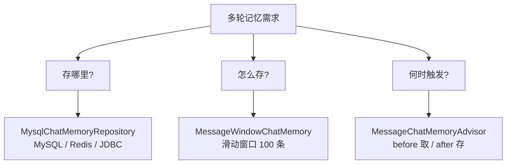
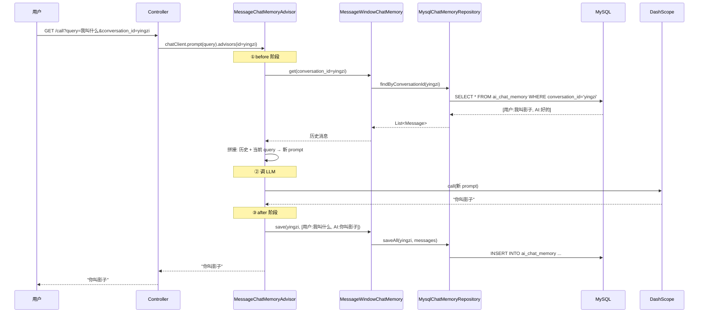
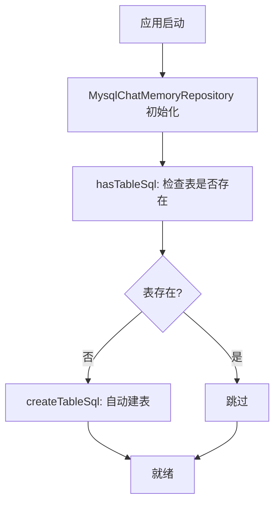
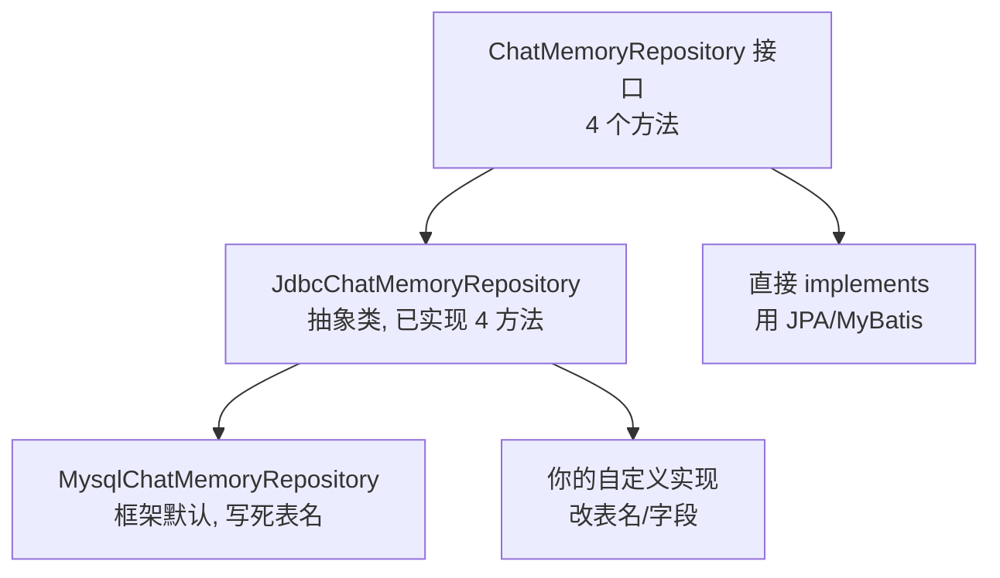
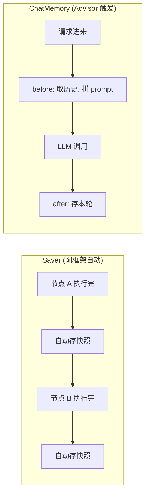

# 模块五：chat-memory-example —— 多轮记忆

> [← 返回索引](./README.md) | [← 上一模块：structured-example](./04-structured-example.md) | [下一模块：tool-calling-example →](./06-tool-calling-example.md)

---

## 一、问题概述

chat-memory-example 回答一个核心问题：**HTTP 是无状态的，每次请求独立，如何让 LLM「记住」之前的对话，实现多轮上下文连贯？** 答案是：用会话 ID（conversation_id）作为钥匙，把历史消息存在服务端，每次调用前注入到 prompt。

## 二、背景知识

### 1. HTTP 无状态的问题

```
请求 1: "我叫影子"        → LLM 答 "好的"
请求 2: "我叫什么?"       → LLM 失忆了, 不知道你叫啥 (新请求, 无历史)
```

LLM 本身无状态，每次调用独立。要让对话连贯，必须**手动维护历史**。

### 2. 解决方案：会话 ID + 服务端存储

```
请求 1 (conversation_id=yingzi): "我叫影子"
  → 服务端存: [用户:我叫影子, AI:好的]

请求 2 (conversation_id=yingzi): "我叫什么?"
  → 服务端取历史: [用户:我叫影子, AI:好的]
  → 拼进 prompt: 历史 + "我叫什么?"
  → LLM 答: "你叫影子"
```

### 3. Saver vs ChatMemory（关键区分，易混淆）

```
Saver:        存「图的执行现场」  (暂停/恢复用, 像存档游戏)
ChatMemory:   存「对话历史消息」  (多轮记忆用, 像聊天记录)

本质不同, 正交可叠加
```

## 三、详细解答

### Why：为什么需要三层装配？

**根本原因是职责分离**。多轮记忆涉及三个独立问题：「存哪里」「怎么存」「何时触发」，每层各管一个：



| 层 | 类 | 职责 | 可换吗 |
|----|-----|------|--------|
| 存哪里 | `MysqlChatMemoryRepository` | MySQL 持久化 | ✅ 换 Redis/JDBC |
| 怎么存 | `MessageWindowChatMemory` | 滑动窗口（最多 100 条）| ✅ 换其他策略 |
| 何时触发 | `MessageChatMemoryAdvisor` | before 取历史、after 存本轮 | 框架固定 |

### How：记忆的完整工作流程



**三阶段**：
1. **before**：用 conversation_id 查历史，拼进 prompt
2. **调 LLM**：LLM 带着历史上下文回答
3. **after**：把本轮（问+答）存回数据库

### Principle：MessageChatMemoryAdvisor 的洋葱模型

这个 Advisor 是你之前学的「洋葱模型」的实例：

```
请求 → [MemoryAdvisor.before: 取历史, 拼进 prompt]
     → [LLM 调用]
     → [MemoryAdvisor.after: 存本轮]
     → 返回
```

和 `ReasoningContentAdvisor`（after 提取思考）、`SimpleLoggerAdvisor`（before/after 打印）是同一套机制，只是职责不同。

### How：代码三层装配

```java
public MysqlMemoryController(ChatClient.Builder builder, 
                              MysqlChatMemoryRepository repo) {
    // ① 怎么存: 滑动窗口, 最多 100 条
    this.messageWindowChatMemory = MessageWindowChatMemory.builder()
        .chatMemoryRepository(repo)        // ② 存哪里: MySQL
        .maxMessages(100)
        .build();
    
    // ③ 何时触发: 挂 Advisor
    this.chatClient = builder
        .defaultAdvisors(
            MessageChatMemoryAdvisor.builder(messageWindowChatMemory).build()
        ).build();
}

@GetMapping("/call")
public String call(String query, String conversationId) {
    return chatClient.prompt(query)
        .advisors(a -> a.param(CONVERSATION_ID, conversationId))  // ★ 传会话 ID
        .call().content();
}
```

**为什么用滑动窗口（maxMessages=100）**：LLM 有 token 上限（如 8K），历史太多会超限。滑动窗口只保留最近 N 条，保证不超 token。

### How：表结构与自动建表

```sql
-- 框架自动建表 (写死在 MysqlChatMemoryRepository.class)
CREATE TABLE ai_chat_memory (
    id BIGINT AUTO_INCREMENT PRIMARY KEY,
    conversation_id VARCHAR(256) NOT NULL,   -- 会话 ID (你传的)
    content LONGTEXT NOT NULL,                -- 消息正文
    type VARCHAR(100) NOT NULL,              -- USER/ASSISTANT/SYSTEM/TOOL
    timestamp TIMESTAMP NOT NULL,
    CONSTRAINT chk_message_type CHECK (type IN ('USER', 'ASSISTANT', 'SYSTEM', 'TOOL'))
);
```

**自动建表机制**：



`hasTableSql` 和 `createTableSql` 写死在 Java 类里（反编译证实），yml 里没有表名配置。

### Principle：为什么表名写死

```java
// 反编译 MysqlChatMemoryRepository:
protected String getAddSql() {
    return "INSERT INTO ai_chat_memory (conversation_id, content, type, timestamp) VALUES (?, ?, ?, ?)";
}
protected String getGetSql() {
    return "SELECT content, type FROM ai_chat_memory WHERE conversation_id = ? ORDER BY timestamp";
}
```

**表名 `ai_chat_memory` 写死**。这是「约定优于配置」：用 starter 默认实现就接受约定，想改表名要自己实现 Repository。

### How：自定义 Repository（三种姿势）



#### 姿势 1：用 starter 默认（0 工作量）

```java
// yml 配 spring.chat.memory.repository.jdbc.mysql.*
// 框架自动建表 + 自动注入 MysqlChatMemoryRepository
```

#### 姿势 2：继承 JdbcChatMemoryRepository（4 个 SQL）

```java
public class MyMysqlChatMemoryRepository extends JdbcChatMemoryRepository {
    private static final String TABLE_NAME = "my_chat_history";  // 改表名!
    
    @Override
    protected String createTableSql(String tableName) {
        return "CREATE TABLE " + tableName + " (id BIGINT PRIMARY KEY, ...)";  // 自定义字段
    }
    @Override
    protected String getAddSql() { ... }
    @Override
    protected String getGetSql() { ... }
    @Override
    protected String hasTableSql(String tableName) { ... }
}
```

#### 姿势 3：直接 implements（完全自由）

```java
@Repository
public class JpaChatMemoryRepository implements ChatMemoryRepository {
    @PersistenceContext
    private EntityManager em;
    
    @Override
    public List<Message> findByConversationId(String id) {
        return em.createQuery("SELECT m FROM ChatMessage m WHERE m.sessionId = :id")
                 .setParameter("id", id).getResultList();
    }
    // ... 其他 3 个方法
}
```

## 四、代码逐行解析（Controller）

```java
@RestController
@RequestMapping("/advisor/memory/mysql")
public class MysqlMemoryController {

    private final ChatClient chatClient;
    private final int MAX_MESSAGES = 100;                              // ① 窗口大小
    private final MessageWindowChatMemory messageWindowChatMemory;
    
    public MysqlMemoryController(ChatClient.Builder builder, 
                                  MysqlChatMemoryRepository mysqlChatMemoryRepository) {
        // ② 构建 Memory: 指定 Repository + 窗口大小
        this.messageWindowChatMemory = MessageWindowChatMemory.builder()
            .chatMemoryRepository(mysqlChatMemoryRepository)
            .maxMessages(MAX_MESSAGES)
            .build();
        
        // ③ 构建 ChatClient: 挂 Memory Advisor
        this.chatClient = builder
            .defaultAdvisors(
                MessageChatMemoryAdvisor.builder(messageWindowChatMemory).build()
            ).build();
    }

    @GetMapping("/call")
    public String call(@RequestParam String query,
                       @RequestParam String conversationId) {
        return chatClient.prompt(query)
            .advisors(a -> a.param(CONVERSATION_ID, conversationId))  // ④ 传会话 ID
            .call().content();
    }

    @GetMapping("/messages")
    public List<Message> messages(@RequestParam String conversationId) {
        return messageWindowChatMemory.get(conversationId);           // ⑤ 直接查历史
    }
}
```

| 步骤 | 作用 | 关键点 |
|------|------|--------|
| ① | MAX_MESSAGES=100 | 滑动窗口，防 token 超限 |
| ② | builder 链式 | Repository + 窗口大小 |
| ③ | 挂 Advisor | before/after 自动触发 |
| ④ | `a.param(CONVERSATION_ID, ...)` | ★ 会话 ID 是钥匙 |
| ⑤ | `/messages` 接口 | 验证：直接查 DB 能看到历史 |

## 五、Saver vs ChatMemory 深度对比

### 存的内容对比

```
Saver 存的 (图的执行现场):
  threadId: "t1"
  state: {
     messages: [...],
     当前节点: "tool",              ← ★ 执行到哪了
     待执行工具: file_write(...),   ← ★ 暂停时正在干啥
     ...所有 state 字段
  }

ChatMemory 存的 (对话历史):
  conversationId: "yingzi"
  messages: [
     UserMessage: "我叫影子",
     AssistantMessage: "好的, 记住了",
     ...
  ]
```

### 触发时机对比



### 用 Saver 不用 ChatMemory 会怎样

```
请求 1: "把hello写到a.txt" → Agent 暂停, Saver 存现场
请求 2: /feedback 批准 → Saver 取现场, 恢复执行 ✓
请求 3: "我刚才让你写啥?" → ★ Saver 取的是「暂停现场」, 不是对话历史
        LLM 看不到「写过 a.txt」, 失忆 ✗
```

### 两个都配的完整例子

```
轮次 1: "我叫影子"           → ChatMemory 存 [用户:我叫影子, AI:好的]
轮次 2: "我叫什么?"          → ChatMemory 取历史, LLM 答"你叫影子"
轮次 3: "把hello写到a.txt"   → Agent 暂停(Saver存现场), 等审批
轮次 4: /feedback 批准       → Saver 取现场, 恢复执行, 写文件
轮次 5: "我刚才让你写啥?"    → ChatMemory 取历史, LLM 答"a.txt"

轮次 3-4 靠 Saver, 轮次 2/5 靠 ChatMemory —— 两个都用了, 缺一不可
```

## 六、关键认知

| 问题 | 答案 |
|------|------|
| 怎么找到上下文？ | 靠 `conversation_id`（会话 ID）|
| 上下文在请求里吗？ | 不在，存在服务端（Repository + DB）|
| 表名能改吗？ | 默认实现不能，自定义 Repository 可以 |
| 滑动窗口干嘛？ | 防历史太多超 token 上限 |
| Saver = ChatMemory 吗？ | 不等价，正交可叠加 |
| 为什么用 Advisor？ | before/after 自动触发，业务无感 |

## 七、总结

- **三层装配**：Repository（存哪里）+ MessageWindowChatMemory（怎么存）+ Advisor（何时触发）
- **会话 ID 是钥匙**：HTTP 无状态，靠 conversation_id 关联服务端历史
- **表名写死**：框架用「约定优于配置」，想改表名要自定义 Repository
- **滑动窗口**：最多 N 条历史，防 token 超限
- **Saver ≠ ChatMemory**：Saver 存执行现场（暂停/恢复），ChatMemory 存对话历史（多轮记忆），正交可叠加
- **生产推荐**：对话型 Agent 两个都配——Saver 管暂停恢复，ChatMemory 管跨轮记忆
