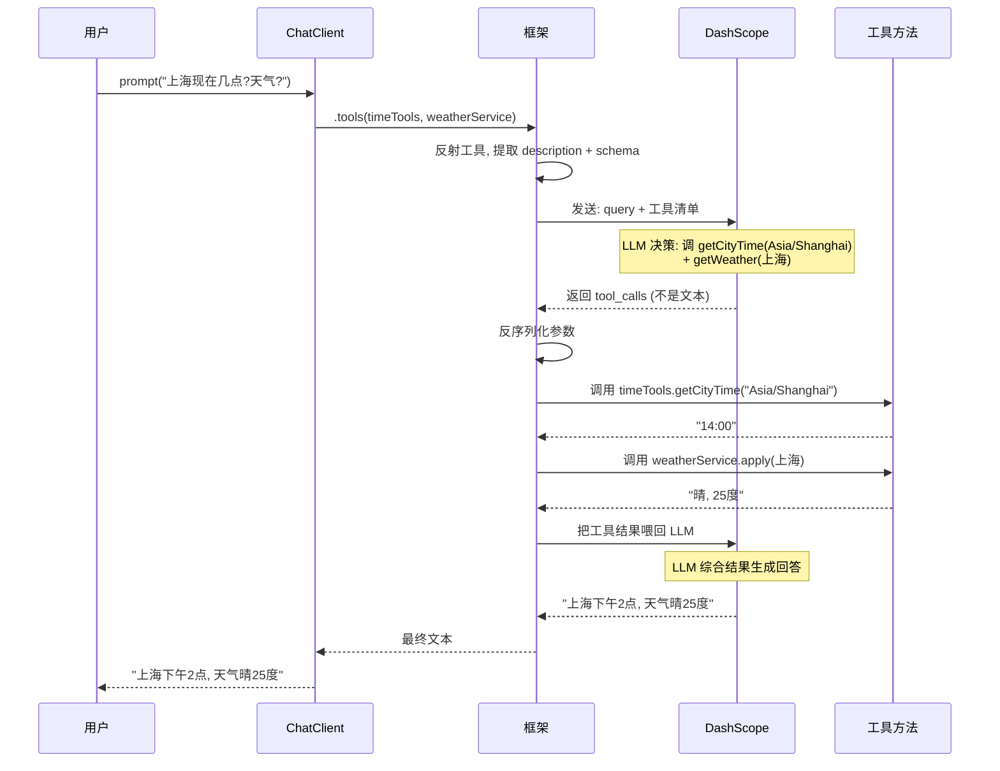

# 模块五：tool-calling-example —— 让 AI 调用代码

> [← 返回索引](./README.md) | [← 上一模块：chat-memory-example](./04-chat-memory-example.md) | [下一模块：react-agent-example →](./06-react-agent-example.md)

---

## 一、问题概述

tool-calling-example 回答一个核心问题：**如何让 LLM 不只是「说话」，而是「动手」——调用你写的 Java 方法、查数据库、调外部 API、执行函数？** 这是从「聊天机器人」迈向「智能体」的关键一步：LLM 成为调度者，你的代码成为执行者。

## 二、背景知识

### 1. LLM 的固有缺陷

LLM 训练后就定型了，有三个硬伤：
- **不知道实时信息**（训练到 2024 年，问 2026 年的事就瞎答）
- **不能执行动作**（不能查 DB、不能调 API、不能写文件）
- **没有记忆**（调完就忘）

Tool Calling 解决第二个：**让 LLM 调用你的代码**。

### 2. Tool Calling 的本质

```
不是 LLM 直接调你的方法, 而是这套协议:
  1. 框架把工具清单 (description + schema) 发给 LLM
  2. LLM 决策: 要不要调? 调哪个? 传什么参数?
  3. 框架接收决策, 反序列化参数, 调用实际方法
  4. 方法返回值喂回 LLM, LLM 生成自然语言回答
```

LLM 是调度者，框架是中介，你的方法是执行者。

### 3. 四件套

不管哪种方式，框架最终都要拿到这四样：

```
1. 工具名      (LLM 用它找工具)
2. 描述        (LLM 据此决定调不调)
3. 入参 Schema (LLM 据此填参数)
4. 可调用体    (框架据此真正执行)
```

## 三、详细解答

### Why：为什么有四种成为 Tool 的方式？

**根本原因是使用场景不同**：

```mermaid
flowchart TD
    A[成为 Tool 的需求] --> B{场景?}
    B -->|项目内私有工具, 简单| C[① @Tool 注解<br/>.tools&#40;component&#41;]
    B -->|包装外部 Service, 改名描述| D[② FunctionToolCallback<br/>.toolCallbacks&#40;cb&#41;]
    B -->|完全控制元数据, 动态反射| E[③ MethodToolCallback<br/>反射 + ToolDefinition]
    B -->|starter 提供的 Service, 解耦| F[④ Function Bean<br/>.defaultToolNames + resolver]
```



| 方式 | 怎么标记 | 怎么挂载 | 适合 |
|------|---------|---------|------|
| ① @Tool 注解 | 方法上加注解 | `.tools(component)` | 简单、内部工具 |
| ② FunctionToolCallback | 编程式 builder | `.toolCallbacks(cb)` | 包装外部 Service |
| ③ MethodToolCallback | 反射方法 + ToolDefinition | `.toolCallbacks(cb)` | 完全控制 |
| ④ Function Bean | `@Bean` + `implements Function` + `@Description` | `.defaultToolNames(name)` + resolver | starter 工具、解耦 |

### How：Tool Calling 完整流程



**五个阶段**：
1. **挂载工具**：`.tools()` 或 `.toolCallbacks()`
2. **生成清单**：框架反射工具，提取 description + 参数 schema，发给 LLM
3. **LLM 决策**：LLM 返回 tool_calls（不是文本，是结构化调用指令）
4. **框架执行**：反序列化参数，调用实际方法，拿结果
5. **LLM 总结**：把工具结果喂回 LLM，生成自然语言回答

### Principle：四件套从哪来（四种方式对比）

```mermaid
flowchart TD
    subgraph "① @Tool 注解"
        A1[方法名] --> A2[@Tool description]
        A2 --> A3[参数反射 schema]
        A3 --> A4[方法可调用]
    end
    subgraph "② FunctionToolCallback"
        B1[builder name] --> B2[builder description]
        B2 --> B3[inputType schema]
        B3 --> B4[Function 可调用]
    end
    subgraph "③ MethodToolCallback"
        C1[ToolDefinition name] --> C2[ToolDefinition description]
        C2 --> C3[JsonSchemaGenerator schema]
        C3 --> C4[反射 method 可调用]
    end
    subgraph "④ Function Bean"
        D1[Bean name] --> D2[@Description]
        D2 --> D3[Request 泛型反射 schema]
        D3 --> D4[Function.apply 可调用]
    end
```

**四种方式本质相同**——都是提供四件套，只是来源不同。

### How：方式 ① @Tool 注解（最简单）

```java
public class TimeTools {
    @Tool(description = "Get the time of a specified city.")   // ★ 工具描述
    public String getCityTime(
        @ToolParam(description = "Time zone id, such as Asia/Shanghai")  // ★ 参数描述
        String timeZoneId) {
        return timeService.apply(...).description();
    }
}

// 使用
chatClient.prompt(query).tools(timeTools).call().content();
```

**关键**：
- `@Tool` 标记方法，`description` 告诉 LLM 这工具干啥
- `@ToolParam` 描述参数，LLM 据此填值
- `.tools(timeTools)` 批量挂载（反射类里所有 @Tool 方法）

**description 的重要性**：LLM 决定「要不要调」完全看 description。写得模糊 LLM 就乱调或漏调。

### How：方式 ④ Function Bean（解耦，本模块 WeatherService 用这个）

```java
// 1. Service 实现 Function (Java 标准接口)
public class WeatherService implements Function<Request, Response> {
    public Response apply(Request request) { ... }
}

// 2. 注册成具名 Bean + @Description
@Bean(name = "getWeatherFunction")
@Description("Use api.weather to get weather information.")
public WeatherService getWeatherServiceFunction(WeatherProperties props) {
    return new WeatherService(props);
}

// 3. 按名字引用
ChatClient.builder(chatModel)
    .defaultToolNames("getWeatherFunction")   // ★ 按名字挂载
    .build();
```

**为什么不用 @Tool**：WeatherService 是 starter 提供的 Service，不想改源码加注解。直接当 Bean 注册，用 `@Description` 提供描述，靠 `resolver` 按名字找。

### Principle：SpringBeanToolCallbackResolver 机制（反编译证实）

```java
// 反编译 SpringBeanToolCallbackResolver:
public ToolCallback resolve(String toolName) {
    Object bean = applicationContext.getBean(toolName);    // 1. 按 toolName 找 Bean
    String desc = resolveToolDescription(toolName, bean); // 2. 读 @Description
    String schema = generateSchema(inputType);            // 3. 反射 Request 生成 schema
    return buildToolCallback(toolName, inputType, outputType, desc, bean); // 4. 包装
}
```

**Function Bean 能成为 Tool 的原因**：
1. `implements Function<I, O>` —— Java 标准函数接口（可调用契约）
2. `@Bean(name=...)` —— 注册成具名 Bean（工具名）
3. `@Description(...)` —— 提供工具描述
4. `Request` record 的 `@JsonProperty`/`@JsonPropertyDescription` —— 提供参数 schema

凑齐四件套，就是 Tool，不需要 `@Tool` 注解。

### How：方式 ③ MethodToolCallback（完全控制）

```java
@GetMapping("/chat-method-tool-callback")
public String chatWithBaiduMap(String address) {
    // 反射找方法
    Method method = ReflectionUtils.findMethod(
        AddressInformationTools.class, "getAddressInformation", String.class);
    
    return chatClient.prompt(address)
        .toolCallbacks(MethodToolCallback.builder()
            .toolDefinition(ToolDefinition.builder()
                // ★ 多场景描述技巧: 4 个等价描述并列
                .description("Search for places using Baidu Maps API "
                    + "or Get detail information of a address and facility query with baidu map or "
                    + "Get address information of a place with baidu map or "
                    + "Get detailed information about a specific place with baidu map")
                .name("getAddressInformation")
                .inputSchema(JsonSchemaGenerator.generateForMethodInput(method))  // 自动生成 schema
                .build())
            .toolMethod(method)
            .toolObject(addressTools)   // 指定方法在哪个对象上调用
            .build())
        .call().content();
}
```

**多场景描述技巧**：

```
1 个描述:   LLM 命中率 ≈ 30% (必须说得一模一样才识别)
4 个描述:   LLM 命中率 ≈ 85% (变着法说都能识别)
```

LLM 看到 4 个等价描述中的任何一个就触发。这是 Prompt Engineering 的「关键词覆盖」技巧——和搜索引擎相反，LLM description 鼓励多角度描述。

### How：综合案例（多 Tool 组合）

```java
@GetMapping("/chat-tools")
public String chatWithCampusTools(String query) {
    return chatClient.prompt(query)
        .tools(timeTools, campusScheduleTools)                    // ① 注解式 (2 个)
        .toolCallbacks(FunctionToolCallback.builder(              // ② 函数式 (1 个)
            "getWeather", weatherService)
            .description("...")
            .inputType(WeatherService.Request.class)
            .build())
        .call().content();
}
```

**两种方式可混用**——框架内部统一合并成「工具清单」发给 LLM，LLM 不区分挂载方式。

## 四、代码逐行解析（WeatherService）

```java
public class WeatherService implements Function<WeatherService.Request, WeatherService.Response> {
    // ① implements Function<I, O> —— 这是能当 Tool 的关键
    
    @Override
    public Response apply(Request request) {                      // ② 工具主逻辑
        if (request == null || !StringUtils.hasText(request.city())) {
            return null;                                           // ③ 防御: 返回 null 让 LLM 自己判断
        }
        String location = WeatherUtils.preprocessLocation(request.city());  // ④ 中文转拼音
        String url = UriComponentsBuilder.fromHttpUrl(WEATHER_API_URL)
            .queryParam("q", location)
            .queryParam("days", request.days)
            .toUriString();
        try {
            return doGetWeatherMock(request);                     // ⑤ mock 版本 (避免依赖 API key)
        } catch (Exception e) {
            return null;                                           // ⑥ 异常转 null, 不抛
        }
    }
    
    // ⑦ Request record —— 入参 schema (LLM 据此填参数)
    @JsonClassDescription("Weather Service API request")
    public record Request(
        @JsonProperty(required = true, value = "city") 
        @JsonPropertyDescription("city name") String city,
        @JsonProperty(required = true, value = "days") 
        @JsonPropertyDescription("Number of days...") int days) {}
    
    // ⑧ Response record —— 返回结构
    public record Response(String city, Map<String, Object> current, 
                           List<Map<String, Object>> forecastDays) {}
}
```

| 步骤 | 作用 | 关键点 |
|------|------|--------|
| ① | implements Function | Java 标准接口，能被 FunctionToolCallback 包装 |
| ② | apply 方法 | LLM 决策后框架调这个 |
| ③ | 防御返回 null | 让 LLM 收到「无结果」自己判断 |
| ④ | 中文转拼音 | 国外 API 不认中文 |
| ⑤ | mock 版本 | 开发演示用，避免依赖 API key |
| ⑥ | 异常转 null | 不抛异常打断流程 |
| ⑦ | Request record | @JsonProperty + @JsonPropertyDescription 提供 schema |
| ⑧ | Response record | LLM 拿到后基于它生成回答 |

## 五、Tool vs ChatMemory vs WebSearch 对比

| 能力 | 做什么 | 局限 |
|------|--------|------|
| ChatClient.prompt | 纯聊天 | 只能答它知道的事 |
| 联网搜索 | 查最新信息 | 受限于搜索引擎 |
| 记忆 | 上下文连贯 | 不能调外部系统 |
| **Tool Calling** | **让 LLM 调用你的代码** | **能查 DB、调 API、执行函数** |

## 六、关键认知

| 问题 | 答案 |
|------|------|
| WeatherService 没 @Tool 怎么成了 Tool？ | `Function<I,O>` Bean + `@Description`，靠 resolver 找 |
| description 多长合适？ | 越具体越好，多场景可并列（4 个 "or"）|
| 工具能挂多少个？ | `defaultTools` ≤5 个，多了分 ChatClient |
| 四种方式选哪个？ | 内部工具用 @Tool，外部 Service 用 Function Bean |
| Tool Calling 本质？ | LLM 决策 + 框架执行 + LLM 总结 |
| Tool 异常怎么处理？ | 返回 null/错误文本，不抛异常 |

## 七、总结

- **本质**：LLM 是调度者，框架是中介，你的方法是执行者——LLM 决策调哪个工具、传什么参数，框架执行
- **四件套**：工具名 + 描述 + 入参 schema + 可调用体，四种方式只是来源不同
- **四种方式**：@Tool 注解（简单）、FunctionToolCallback（编程式）、MethodToolCallback（完全控制）、Function Bean（解耦）
- **description 是关键**：LLM 靠它决定调不调，写得越具体、覆盖越多同义表达，调得越准
- **Function Bean 模式**：`implements Function` + `@Bean` + `@Description`，starter 工具常用
- **多 Tool 组合**：两种挂载方式可混用，框架统一合并成工具清单
- **异常处理**：工具内返回错误文本而非抛异常，让 LLM 自己判断怎么办
