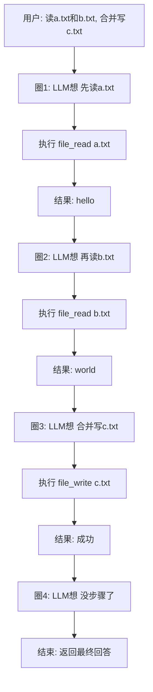
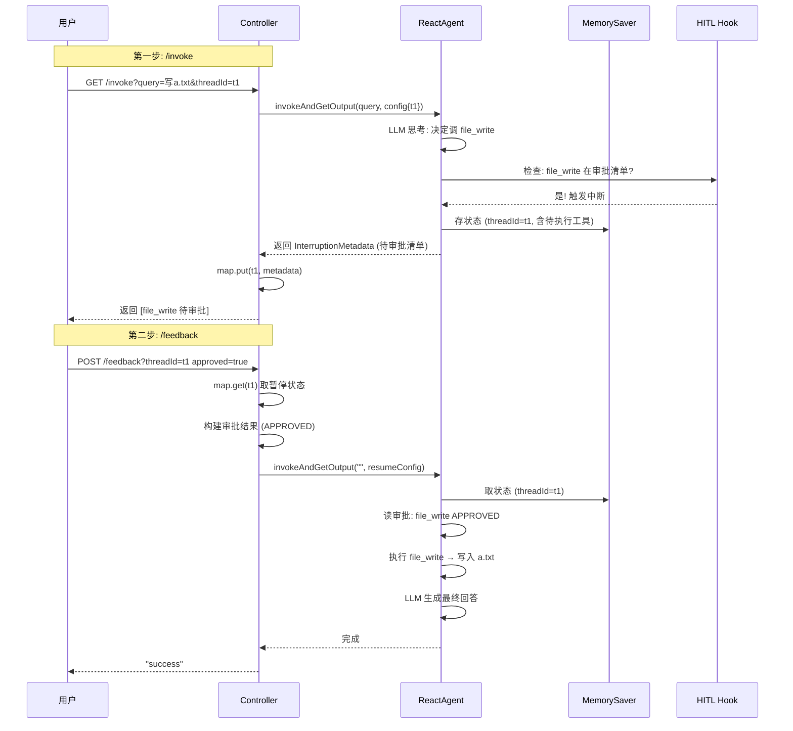
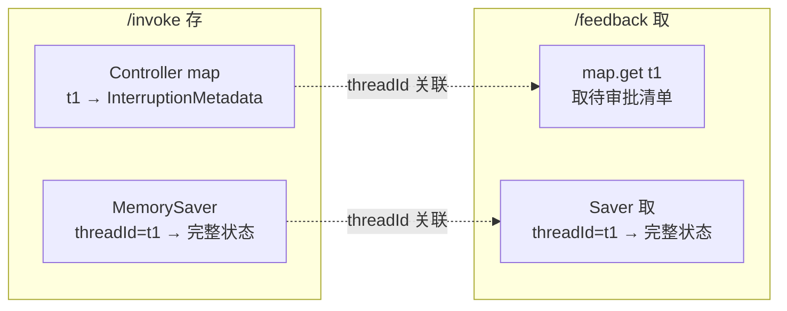

# 模块六：react-agent-example —— ReAct 智能体

> [← 返回索引](./README.md) | [← 上一模块：tool-calling-example](./05-tool-calling-example.md) | [下一模块：graph-example/react →](./07-graph-react.md)

---

## 一、问题概述

react-agent-example 回答一个核心问题：**如何让 LLM 不只是「一次决策调一个工具」，而是「多步推理、自主循环」——边想边做、边做边看、根据结果调整下一步？** 这就是 ReAct（Reasoning + Acting）范式，是所有 Agent 的鼻祖。

## 二、背景知识

### 1. 普通 tool-calling vs ReAct

```
普通 tool-calling (无循环):
  用户问 → LLM 决策 → 调工具 → 拿结果 → LLM 总结 → 结束  (一次决策, 一次工具)

ReAct Agent (有循环):
  用户问 → LLM 决策 → 调工具 → 拿结果 → LLM 再决策 → 调工具 → ... → LLM 不调了 → 结束  (N 次)
```

**循环是 ReAct 的核心**——LLM 看到上一步工具结果后，能决定「还要不要再调一次工具」。

### 2. HITL（Human-In-The-Loop）

敏感操作（如写文件）让 LLM 直接做有风险。HITL 让 Agent 在敏感操作前**暂停等用户审批**，用户同意才执行。

### 3. Saver（状态保存）

HITL 暂停时，要把「执行现场」存起来，用户审批后能从暂停点恢复。Saver 就是干这个的。

## 三、详细解答

### Why：为什么需要循环？

**根本原因是复杂任务需要多步**。一个用户问题「读 a.txt 和 b.txt，合并写到 c.txt」需要 3 次工具调用（读 a、读 b、写 c），单次决策做不了。



**关键**：步骤不是预先拆好的，是「边走边拆」——每一步 LLM 看了上一步结果才决定下一步。这是 Agent 显得「智能」的根源。

### How：ReactAgent 组装

```java
@Bean
public ReactAgent reactAgent() throws GraphStateException {
    return ReactAgent.builder()
        .name("agent")                                              // ① 身份标识
        .description("This is a react agent")                       // ② 多 Agent 场景用
        .model(chatModel)                                           // ③ LLM 大脑
        .saver(new MemorySaver())                                   // ④ 状态保存 (HITL 用)
        .tools(                                                     // ⑤ 工具手脚
            new FileReadTool().toolCallback(),
            new FileWriteTool().toolCallback())
        .hooks(HumanInTheLoopHook.builder()                         // ⑥ 审批刹车
            .approvalOn("file_write", "Write File should be approved")
            .build())
        .interceptors(new LogToolInterceptor())                     // ⑦ 监控
        .build();
}
```

| 配置 | 角色 | 何时用 |
|------|------|--------|
| `.model` | LLM 大脑 | 思考全靠它 |
| `.tools` | 工具手脚 | 行动靠它 |
| `.saver` | 状态存档 | HITL 暂停/恢复 |
| `.hooks` | 审批刹车 | 敏感操作前暂停 |
| `.interceptors` | 监控日志 | 每次工具调用记录 |

### How：HITL 两步流程



**两步的本质**：
1. `/invoke`：跑到敏感操作暂停，存现场，返回待审批清单
2. `/feedback`：用户审批，取现场，恢复执行

### Principle：循环的底层实现

```python
# 伪代码 (框架内部)
while True:
    llm_response = chatModel.call(prompt + 历史)   # LLM 思考
    if llm_response.要调工具:
        # 检查是否需要审批
        if 工具在 approvalOn 清单:
            暂停, 存状态到 Saver, 返回 InterruptionMetadata
            等待用户 /feedback
            取状态从 Saver, 读审批结果
            if 审批通过:
                tool_result = 执行工具(llm_response.工具调用)
            else:
                tool_result = "用户拒绝: " + 原因
        else:
            tool_result = 执行工具(llm_response.工具调用)
        
        把 tool_result 加进历史      # 喂回 LLM
        continue                     # ★ 回到 while 顶部
    else:  # LLM 没要求调工具, 给了最终答案
        return llm_response.最终回答  # 跳出循环
```

**循环终止条件**：LLM 返回不再包含 tool_calls，而是纯文本答案。

### How：threadId 如何关联两步



**两个存储**：
1. `Controller 的 map`：存待审批清单（业务侧）
2. `MemorySaver`：存完整执行状态（框架侧，含节点位置、对话历史、待执行工具）

两个都用 threadId 当钥匙。HTTP 请求不传上下文，靠 threadId 从服务端取。

### How：FileWriteTool 的安全设计

```java
public String apply(FileWriteTool.Request s, ToolContext toolContext) {
    try {
        // ★ 路径安全处理: 限制在工作目录内
        String safePath = Paths.get(System.getProperty("user.dir"))
            .resolve(s.filePath)      // 拼相对路径
            .normalize()              // 规范化, 消除 ../ 跳目录
            .toString();
        
        FileWriter writer = new FileWriter(safePath);
        writer.write(s.content);
        writer.close();
        return "Successfully wrote to file: " + s.filePath;
    } catch (IOException e) {
        return "Error writing to file: " + e.getMessage();  // 异常转文本
    }
}
```

**为什么需要路径安全**：LLM 可能传任意路径（如 `/etc/passwd`、`../../../sensitive`），造成越权写入。`normalize()` 消除 `../` 跳目录写法，限制在工作目录内。

## 四、代码逐行解析（AgentController）

### /invoke 接口

```java
@GetMapping("/invoke")
public List<InterruptionMetadata.ToolFeedback> invoke(
    @RequestParam String query,
    @RequestParam String threadId) throws Exception {
    
    // ① 创建 RunnableConfig, 带 threadId
    RunnableConfig runnableConfig = RunnableConfig.builder().threadId(threadId).build();
    
    // ② 调 Agent, 拿到中断元数据
    InterruptionMetadata metadata = (InterruptionMetadata) 
        reactAgent.invokeAndGetOutput(query, runnableConfig).orElseThrow();
    
    // ③ 存暂停状态 (key=threadId)
    map.put(threadId, metadata);
    
    // ④ 返回待审批清单
    return metadata.toolFeedbacks();
}
```

### /feedback 接口

```java
@PostMapping("/feedback")
public String feedback(@RequestBody List<Feedback> feedbacks,
                       @RequestParam String threadId) throws Exception {
    // ① 取暂停状态
    InterruptionMetadata metadata = map.get(threadId);
    if (metadata == null) return "no metadata found";
    if (metadata.toolFeedbacks().size() != feedbacks.size()) 
        return "feedback size not match";
    
    // ② 构建审批结果
    InterruptionMetadata.Builder newBuilder = InterruptionMetadata.builder()
        .nodeId(metadata.node())      // 保留原节点
        .state(metadata.state());     // 保留原状态
    
    for (int i = 0; i < feedbacks.size(); i++) {
        var toolFeedback = metadata.toolFeedbacks().get(i);
        var editedBuilder = InterruptionMetadata.ToolFeedback.builder(toolFeedback);
        if (feedbacks.get(i).isApproved()) {
            editedBuilder.result(FeedbackResult.APPROVED);           // 批准
        } else {
            editedBuilder.result(FeedbackResult.REJECTED)
                .description(feedbacks.get(i).feedback());           // 拒绝 + 原因
        }
        newBuilder.addToolFeedback(editedBuilder.build());
    }
    
    // ③ 构建恢复配置 (带审批结果)
    RunnableConfig resumeConfig = RunnableConfig.builder().threadId(threadId)
        .addMetadata(RunnableConfig.HUMAN_FEEDBACK_METADATA_KEY, newBuilder.build())
        .build();
    
    // ④ 恢复执行 (query 空, 是恢复不是新问题)
    reactAgent.invokeAndGetOutput("", resumeConfig);
    return "success";
}
```

| 步骤 | 作用 | 关键点 |
|------|------|--------|
| ① | 取暂停状态 | 靠 threadId 从 map 取 |
| ② | 构建审批结果 | 保留原节点/状态，只改审批字段 |
| ③ | HUMAN_FEEDBACK_METADATA_KEY | 把审批结果作为元数据塞进配置 |
| ④ | query 传空 | ★ 是恢复不是新问题，Agent 凭 threadId 从 Saver 取现场 |

## 五、HITL 多轮审批的局限

当前 `/feedback` 代码**丢弃了 `invokeAndGetOutput` 的返回值**：

```java
reactAgent.invokeAndGetOutput("", resumeRunnableConfig);  // ← 返回值被丢!
return "success";
```

**问题**：如果恢复执行后 Agent 又遇到审批（如写 b.txt），新暂停信息被丢弃，**只支持单次审批**。

**修复**：接收返回值，判断是否再次暂停，循环处理：

```java
Object result = reactAgent.invokeAndGetOutput("", resumeConfig);
if (result instanceof InterruptionMetadata newMetadata) {
    map.put(threadId, newMetadata);              // 又暂停, 存起来
    return newMetadata.toolFeedbacks();          // 返回新审批清单
}
map.remove(threadId);                            // 真结束了, 清理
return "success";
```

## 六、ToolInterceptor vs Advisor

| | Advisor | ToolInterceptor |
|---|---|---|
| 拦截哪层 | LLM 调用层（prompt→response）| 工具调用层（LLM 决策→工具执行）|
| 触发时机 | 每次 LLM 调用 | 每次工具调用 |
| 例子 | MemoryAdvisor、LoggerAdvisor | LogToolInterceptor |

两者层级不同，可叠加使用。

## 七、关键认知

| 问题 | 答案 |
|------|------|
| ReactAgent 比 ChatClient.tools() 多什么？ | 多轮循环 + Saver + HITL |
| 循环怎么停？ | LLM 返回不含 tool_calls |
| 步骤是预拆的吗？ | 不是，边走边拆（动态）|
| HITL 怎么找到上下文？ | 靠 threadId 从 Saver + map 取 |
| /feedback 为什么 query 传空？ | 是恢复不是新问题 |
| FileWriteTool 为什么要路径安全？ | 防 LLM 越权写敏感路径 |
| ToolInterceptor 拦截哪层？ | 工具调用层（不是 LLM 层）|

## 八、总结

- **ReAct = Reasoning + Acting**：思考-行动-观察循环，LLM 边走边拆步骤
- **循环终止**：LLM 返回不含 tool_calls，框架据此判断结束
- **HITL 两步流程**：/invoke 暂停存现场 → /feedback 审批恢复执行
- **threadId 是纽带**：HTTP 无状态，靠 threadId 从 Saver + map 取上下文
- **Saver 存执行现场**：节点位置 + 对话历史 + 待执行工具，用于暂停/恢复
- **安全设计**：FileWriteTool 路径 normalize 防越权 + HITL 审批防乱写
- **当前局限**：/feedback 丢弃返回值，只支持单次审批，生产需循环处理
- **两层拦截**：Advisor 拦 LLM 层，ToolInterceptor 拦工具层，可叠加
