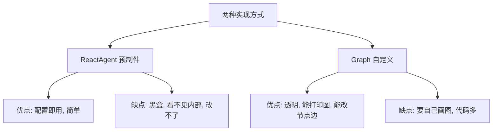
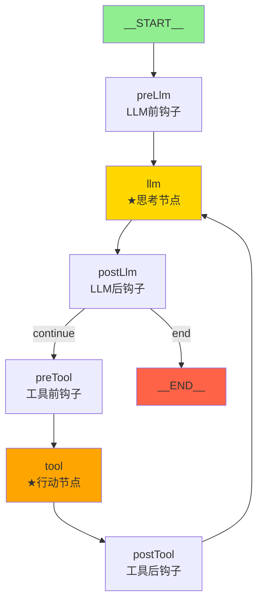
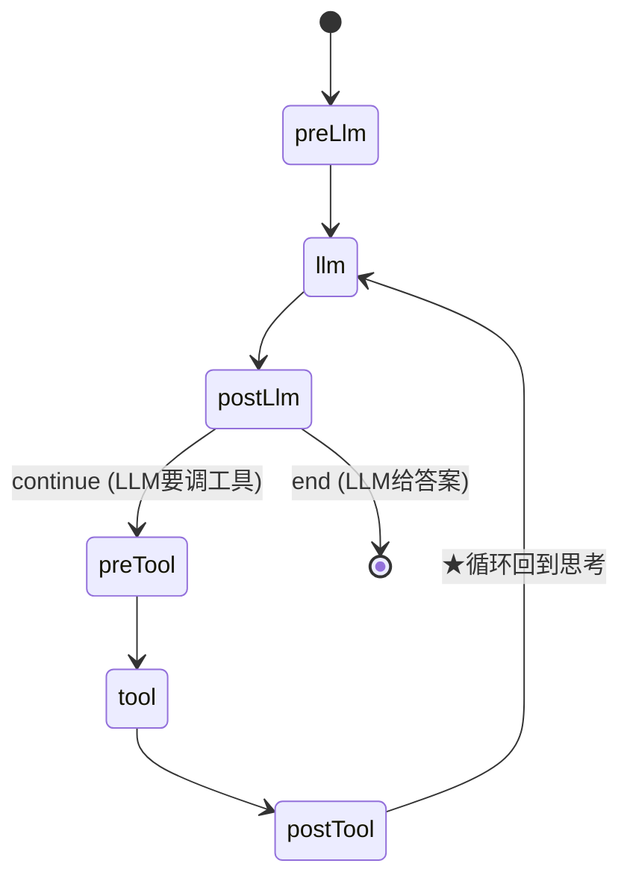
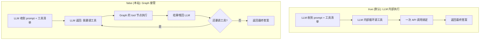
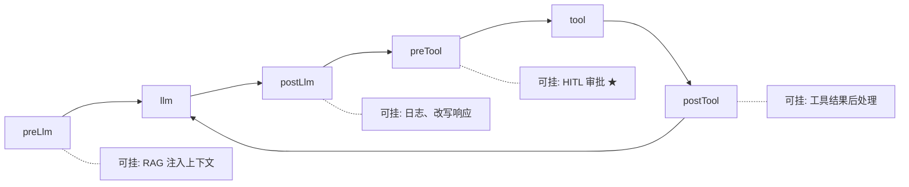

# 模块七：graph-example/react —— Graph 实现 ReAct

> [← 返回索引](./README.md) | [← 上一模块：react-agent-example](./06-react-agent-example.md) | [下一模块：graph-example/parallel-node →](./08-graph-parallel-node.md)

---

## 一、问题概述

graph-example/react 回答一个核心问题：**ReactAgent 内部到底是怎么实现「思考-行动-观察」循环的？** 上一站 ReactAgent 是黑盒（配置即用），本站用 Graph 把它打开——通过 `getAndCompileGraph()` 取出内部图结构，看清 ReAct 的节点和边是怎么搭出来的。

## 二、背景知识

### 1. 两站的本质区别

```
第 6 站 (react-agent-example):
  ReactAgent.builder().build()  → 黑盒, 框架内部跑循环, 你看不见
  调用: reactAgent.invokeAndGetOutput()

第 7 站 (graph-example/react):
  ★ 关键开关: internalToolExecutionEnabled(false)  ← 让 Graph 接管循环
  ★ getAndCompileGraph()  → 拿到底层 CompiledGraph → 能打印图结构
  调用: compiledGraph.invoke()
```

### 2. ReactAgent 内部就是个 Graph

**核心认知**：ReactAgent 不是魔法，它内部就是一个 Graph（节点+边）。框架帮你画好了标准 ReAct 图，本站把它「取出来」让你看见。

### 3. internalToolExecutionEnabled 的作用

```
true (默认):  LLM 内部自己调工具 → 一次 API 调用搞定 → 黑盒循环
false (本站): LLM 只说"我要调工具" → 返回给 Graph → Graph 执行 → 喂回 LLM → 循环

关掉它, 循环的控制权就从 LLM 转移到 Graph
```

## 三、详细解答

### Why：为什么要用 Graph 重新实现 ReAct？

**根本原因是可见性和可控性**：



| 维度 | ReactAgent（第6站）| Graph（第7站）|
|------|-------------------|--------------|
| 可见性 | 黑盒 | 能打印 PlantUML |
| 可改性 | 改不了节点 | 能加/删/改节点 |
| 代码量 | 少（配置即用）| 多（自己画图）|
| 适合 | 标准 ReAct | 自定义工作流 |

### How：ReactAgent 内部的 Graph 结构（反编译证实）

反编译 `ReactAgent.class`，发现它内部有 6 个节点：



### 真实的节点和边（反编译字节码）

```
6 个节点:
  preLlm, llm, postLlm    (LLM 思考相关)
  preTool, tool, postTool (工具执行相关)
  __START__, __END__      (起点终点)

7 条边:
  __START__ → preLlm → llm → postLlm
  postLlm → (continue) → preTool → tool → postTool
  postTool → llm        ← ★ 循环边! 工具完回到思考
  postLlm → (end) → __END__
```

### Principle：循环的物理实现



**循环的本质**：`postTool → llm` 这条回边。工具执行完，回到 `llm` 节点让 LLM 看结果再决策。

**循环终止**：`postLlm` 的条件边判断 LLM 返回有没有 tool_calls——有就走 continue 调工具，没有就走 end 结束。

### How：关键配置（ReactAutoconfiguration）

```java
@Bean
public ReactAgent normalReactAgent(ChatModel chatModel, 
                                    ToolCallbackResolver resolver) {
    ChatClient chatClient = ChatClient.builder(chatModel)
        .defaultToolNames("getWeatherFunction")       // ① 按名字挂工具
        .defaultAdvisors(new SimpleLoggerAdvisor())   // ② 日志 Advisor
        // ③ ★★★ 最关键的一行!
        .defaultOptions(OpenAiChatOptions.builder()
            .internalToolExecutionEnabled(false).build())  // 关闭 LLM 内部执行
        .build();

    return ReactAgent.builder()
        .name("React Agent Demo")
        .chatClient(chatClient)
        .resolver(resolver)    // ④ 按 Bean 名字找工具
        .build();
}

@Bean
public CompiledGraph reactAgentGraph(ReactAgent reactAgent) {
    // ⑤ ★ 把 ReactAgent 内部的图取出来编译
    CompiledGraph compiledGraph = reactAgent.getAndCompileGraph();
    
    // ⑥ 打印 PlantUML 图结构
    GraphRepresentation graphRep = compiledGraph.getGraph(GraphRepresentation.Type.PLANTUML);
    System.out.println(graphRep.content());
    
    return compiledGraph;
}
```

### Why：internalToolExecutionEnabled(false) 为什么是关键？

**对比两种模式**：



**关掉它的意义**：循环的控制权从 LLM 黑盒转移到 Graph。Graph 能在每一步插入钩子（preLlm/postLlm/preTool/postTool），实现 HITL 审批、日志、改写等。这就是 Graph 实现 ReAct 的原理。

### How：Controller 调用（用 CompiledGraph）

```java
@RestController
@RequestMapping("/react")
public class ReactController {

    private final CompiledGraph compiledGraph;
    
    ReactController(@Qualifier("reactAgentGraph") CompiledGraph compiledGraph) {
        this.compiledGraph = compiledGraph;
    }

    @GetMapping("/chat")
    public String simpleChat(String query) {
        // ★ 直接用 Graph 接口调用
        Optional<OverAllState> result = compiledGraph.invoke(
            Map.of("messages", new UserMessage(query))   // 输入状态
        );
        // 从最终状态取 messages 列表
        List<Message> messages = (List<Message>) result.get().value("messages").get();
        // 最后一条是 LLM 最终回答
        AssistantMessage assistantMessage = (AssistantMessage) messages.get(messages.size() - 1);
        return assistantMessage.getText();
    }
}
```

**与第6站对比**：
- 第6站：`reactAgent.invokeAndGetOutput(query, config)` → Agent 抽象层
- 第7站：`compiledGraph.invoke(Map.of("messages", ...))` → Graph 抽象层，能拿 OverAllState

### Principle：OverAllState 是什么

```java
Map.of("messages", new UserMessage(query))   // 输入状态
```

OverAllState 是图的**共享状态**（黑板），节点间通过它通信：
- 输入：`Map.of("messages", 用户消息)` 作为初始状态
- 执行：每个节点读写 state
- 输出：`result.get().value("messages")` 取最终状态

这是 Graph 编程模型的核心——**节点解耦，状态共享**。

## 四、代码逐行解析（ReactAutoconfiguration）

```java
@Bean
public ReactAgent normalReactAgent(ChatModel chatModel, ToolCallbackResolver resolver) {
    ChatClient chatClient = ChatClient.builder(chatModel)
        .defaultToolNames("getWeatherFunction")                    // ① 按名字挂工具
        .defaultAdvisors(new SimpleLoggerAdvisor())                // ② 日志 Advisor
        .defaultOptions(OpenAiChatOptions.builder()
            .internalToolExecutionEnabled(false).build())          // ③ ★关闭 LLM 内部执行
        .build();

    return ReactAgent.builder()
        .name("React Agent Demo")                                  // ④ Agent 名字
        .chatClient(chatClient)                                    // ⑤ 传入 ChatClient
        .resolver(resolver)                                        // ⑥ 工具解析器
        .build();
}

@Bean
public CompiledGraph reactAgentGraph(@Qualifier("normalReactAgent") ReactAgent reactAgent) {
    CompiledGraph compiledGraph = reactAgent.getAndCompileGraph(); // ⑦ ★取出内部图
    
    GraphRepresentation graphRep = compiledGraph.getGraph(         // ⑧ 导出 PlantUML
        GraphRepresentation.Type.PLANTUML);
    System.out.println(graphRep.content());                        // ⑨ 打印图结构
    
    return compiledGraph;
}
```

| 步骤 | 作用 | 关键点 |
|------|------|--------|
| ① | 按名字挂工具 | 用 resolver 从 Spring 容器找 Bean |
| ② | 日志 Advisor | 打印每次 LLM 调用 |
| ③ | ★关闭内部执行 | 让 Graph 接管循环（最关键）|
| ④-⑤ | Agent 身份 + ChatClient | ChatClient 含工具+Advisor+关闭配置 |
| ⑥ | resolver | SpringBeanToolCallbackResolver，按名字找工具 |
| ⑦ | getAndCompileGraph | ★取出 ReactAgent 内部的图 |
| ⑧-⑨ | 打印 PlantUML | 把图导出成文本，贴 plantuml.com 渲染 |

## 五、PlantUML 输出（打印的内容）

```
@startuml
state "__START__" as __START__
state "preLlm" as preLlm
state "llm" as llm
state "postLlm" as postLlm
state "preTool" as preTool
state "tool" as tool
state "postTool" as postTool

__START__ --> preLlm
preLlm --> llm
llm --> postLlm
postLlm --> preTool : continue
postLlm --> __END__ : end
preTool --> tool
tool --> postTool
postTool --> llm
@enduml
```

贴到 plantuml.com 可渲染成图。**这就是 ReactAgent 内部的真相**——6 节点 7 边的循环图。

## 六、Hook 节点的作用

4 个 Hook 节点（preLlm/postLlm/preTool/postTool）是**扩展点**：



| Hook 节点 | 可挂什么 |
|-----------|---------|
| preLlm | RAG 注入上下文、内容过滤 |
| postLlm | 日志、改写响应 |
| preTool | ★ HITL 审批（react-agent 第6站用的）|
| postTool | 工具结果后处理 |

第6站的 `HumanInTheLoopHook.approvalOn("file_write")` 就挂在 preTool——工具执行前检查要不要暂停审批。

## 七、关键认知

| 问题 | 答案 |
|------|------|
| 为什么 ReactAutoconfiguration 没看见节点边？ | 节点边在 ReactAgent 内部自动创建 |
| `internalToolExecutionEnabled(false)` 干嘛？ | 让 Graph 接管循环，而非 LLM 内部黑盒 |
| `getAndCompileGraph()` 干嘛？ | 取出 ReactAgent 内部的图，可打印/可视化 |
| `.defaultToolNames("xxx")` 怎么找工具？ | 靠 `resolver`（SpringBeanToolCallbackResolver）按 Bean 名找 |
| CompiledGraph.invoke 返回什么？ | `Optional<OverAllState>`，含完整 messages |
| 循环的物理实现？ | `postTool → llm` 这条回边 |
| 循环终止条件？ | `postLlm` 条件边判断 LLM 有没有 tool_calls |
| 4 个 Hook 节点干嘛？ | 扩展点，可挂 RAG/日志/HITL/后处理 |

## 八、总结

- **核心认知**：ReactAgent 内部就是个 Graph（6 节点 7 边），框架帮你画好了，本站取出来让你看见
- **关键开关**：`internalToolExecutionEnabled(false)` 把循环控制权从 LLM 转移到 Graph
- **6 个节点**：preLlm/llm/postLlm（思考）+ preTool/tool/postTool（行动）+ __START__/__END__
- **循环实现**：`postTool → llm` 回边，工具完回到思考
- **循环终止**：`postLlm` 条件边判断 LLM 返回有没有 tool_calls
- **4 个 Hook 节点**：扩展点，preTool 挂 HITL 审批，preLlm 挂 RAG
- **OverAllState**：图的共享状态，节点间通过它通信
- **两种调用**：第6站 `reactAgent.invokeAndGetOutput()`（Agent 抽象）vs 第7站 `compiledGraph.invoke()`（Graph 抽象）
- **PlantUML 打印**：`getAndCompileGraph().getGraph(PLANTUML)` 导出图结构，可渲染可视化
