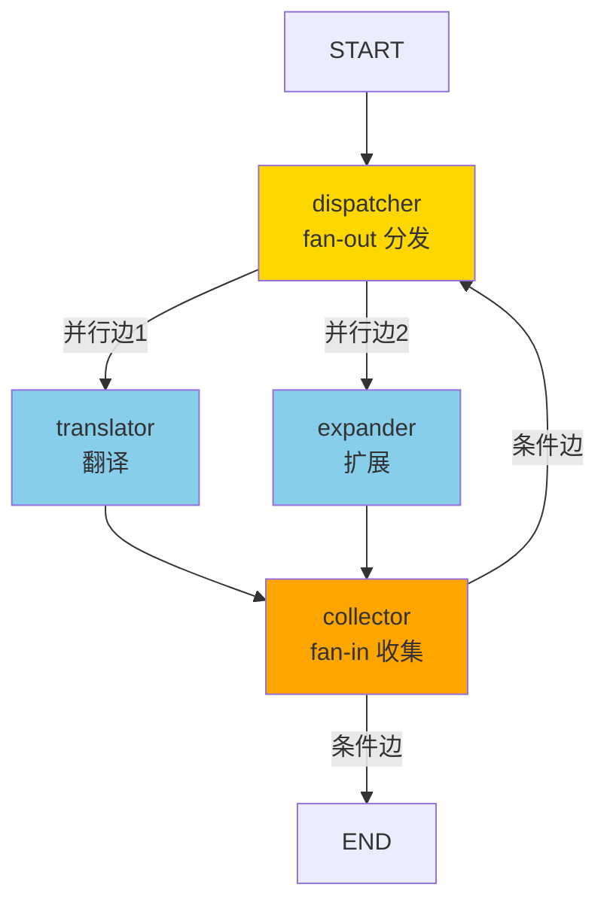
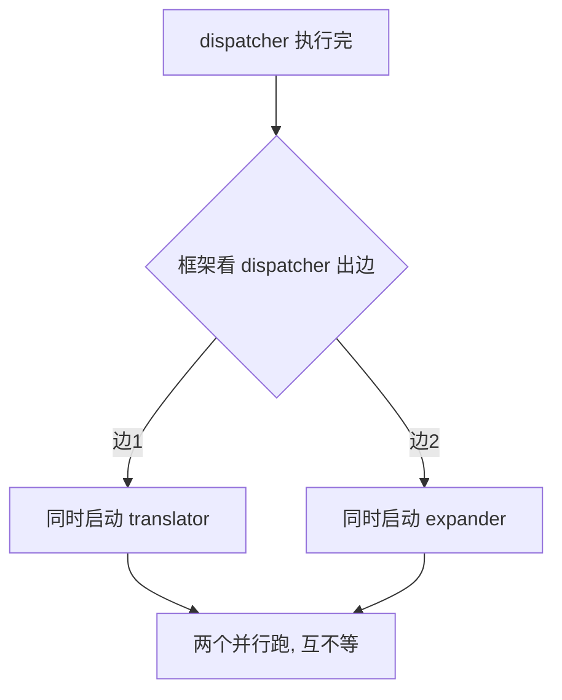
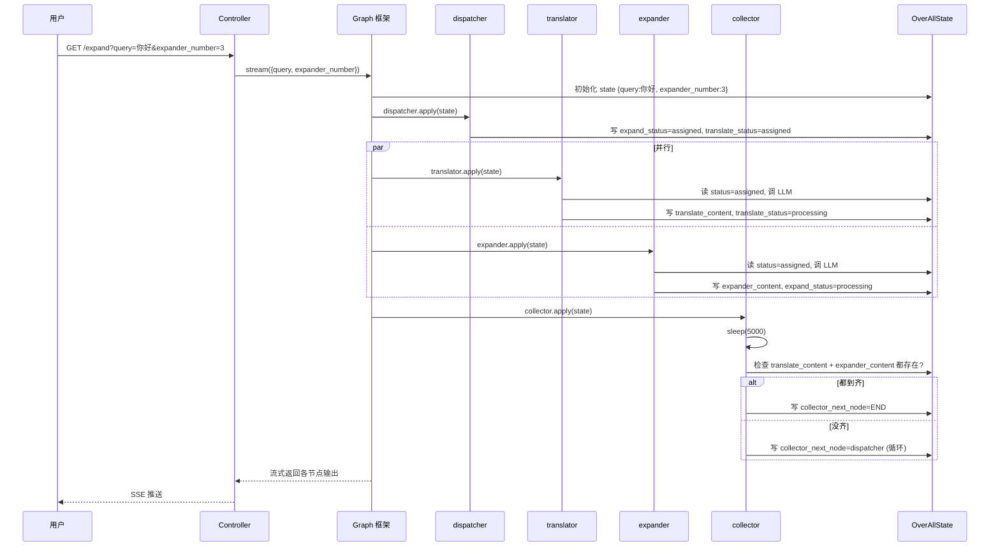

# 模块九：graph-example/parallel-node —— 并行编排

> [← 返回索引](./README.md) | [← 上一模块：graph-example/react](./08-graph-react.md)

---

## 一、问题概述

graph-example/parallel-node 回答一个核心问题：**如何让 Graph 里的多个节点同时执行（并行），而不是排队串行？** 这就是 fan-out/fan-in 模式——一个节点分发到多个并行分支，多个分支汇聚到一个收集节点。与 ReAct 的串行循环结合，就构成了 Plan-Execute 范式的基础。

## 二、背景知识

### 1. 串行 vs 并行

```
ReAct (串行循环):           parallel (并行):
  节点A → 节点B → 节点C        节点A ─┬─→ 节点B ─┐
  3 步耗时 = A+B+C                    │              ├─→ 汇总节点
                                      └─→ 节点C ─┘
                                     3 步耗时 = max(B,C)
```

### 2. fan-out / fan-in

```
fan-out: 一个节点出多条边 (分发到多个并行分支)
fan-in:  多条边指向同一节点 (汇聚收集)

合起来就是 MapReduce 思想: 分发 → 并行处理 → 收集
```

### 3. 节点 vs 边

| | NodeAction（节点）| EdgeAction（边）|
|---|---|---|
| 干活吗 | ✅ 干活 | ❌ 不干活 |
| 返回 | `Map`（状态更新）| `String`（下一个节点名）|

## 三、详细解答

### Why：为什么需要并行？

**根本原因是提速**。多个独立任务串行跑要累加时间，并行跑只取最慢的那个：

```mermaid
gantt
    title 串行 vs 并行 (翻译+扩展两个独立任务)
    dateFormat X
    axisFormat %s秒
    
    section 串行 (ReAct)
    翻译 (3秒)      :0, 3
    扩展 (4秒)      :3, 7
    section 并行 (fan-out)
    翻译 (3秒)      :0, 3
    扩展 (4秒)      :0, 4
```



串行 7 秒，并行 4 秒（取最慢的）。**独立任务并行能显著提速**。

### How：并行图结构



**4 个节点**：
- `dispatcher`：fan-out 分发（不调 LLM，只设状态）
- `translator`：并行腿1（翻译）
- `expander`：并行腿2（扩展）
- `collector`：fan-in 收集（检查结果齐不齐）

### How：显式画图（ParallelNodeGraphConfiguration）

```java
@Bean
public StateGraph parallelNodeGraph(ChatClient.Builder chatClientBuilder) {
    // ① 状态字段合并策略
    KeyStrategyFactory keyStrategyFactory = new KeyStrategyFactoryBuilder()
        .addPatternStrategy("query", new ReplaceStrategy())
        .addPatternStrategy("expand_status", new ReplaceStrategy())
        .addPatternStrategy("translate_status", new ReplaceStrategy())
        .addPatternStrategy("expander_content", new ReplaceStrategy())
        .addPatternStrategy("translate_content", new ReplaceStrategy())
        .addPatternStrategy("collector_next_node", new ReplaceStrategy())
        .build();

    // ② ★★★ 显式画图
    StateGraph stateGraph = new StateGraph(keyStrategyFactory)
        .addNode("dispatcher", node_async(new DispatcherNode()))
        .addNode("translator", node_async(new TranslateNode(chatClientBuilder)))
        .addNode("expander", node_async(new ExpanderNode(chatClientBuilder)))
        .addNode("collector", node_async(new CollectorNode()))
        
        // ★ 并行边 (fan-out)
        .addEdge("dispatcher", "translator")
        .addEdge("dispatcher", "expander")
        // ★ 汇聚边 (fan-in)
        .addEdge("translator", "collector")
        .addEdge("expander", "collector")
        
        .addEdge(StateGraph.START, "dispatcher")
        // ★ 条件边 (循环)
        .addConditionalEdges("collector", 
            edge_async(new CollectorDispatcher()),
            Map.of("dispatcher", "dispatcher", END, END));
    
    return stateGraph;
}
```

**与第8站对比**：第8站用 `ReactAgent.builder()` 预制图（黑盒），本站用 `StateGraph.addNode/edge` 自己画（白盒）。

### Principle：并行的三个核心问题

#### Q1: 怎么通知另外两个节点？

**不通知！靠 OverAllState 共享（黑板模式）**。

DispatcherNode 不直接呼叫 translator/expander，它只往 OverAllState 写 status 字段：

```java
public class DispatcherNode implements NodeAction {
    @Override
    public Map<String, Object> apply(OverAllState state) {
        Map<String, Object> updated = new HashMap<>();
        if (state.value("expand_status", "").isEmpty()) {
            updated.put("expand_status", "assigned");      // 写黑板
        }
        if (state.value("translate_status", "").isEmpty()) {
            updated.put("translate_status", "assigned");   // 写黑板
        }
        return updated;
    }
}
```

后续节点执行时自己读 status：

```java
public class TranslateNode implements NodeAction {
    @Override
    public Map<String, Object> apply(OverAllState state) {
        String status = state.value("translate_status", "");
        if (!"assigned".equals(status)) {
            return Map.of();   // 不是 assigned, 跳过 (幂等保护)
        }
        // 读 query, 调 LLM 翻译
        ...
        return Map.of("translate_content", flux, "translate_status", "processing");
    }
}
```

**这是黑板模式，不是消息推送**。DispatcherNode 不知道也不关心后面有谁在跑。

#### Q2: 怎么并发？

**靠「多条出边 + node_async()」**：

```java
.addEdge("dispatcher", "translator")   // 出边1
.addEdge("dispatcher", "expander")     // 出边2  → 两条出边 = 并行!
```

dispatcher 有两条出边 → 框架同时启动两个分支。`node_async` 让节点异步执行。



**并发的两个条件缺一不可**：
1. 多条出边
2. `node_async` 包装（异步执行）

#### Q3: 怎么决定顺序？

**边决定拓扑序，并行分支无固定序**。

```
固定: START → dispatcher → (translator ∥ expander) → collector → 条件边
不固定: translator 和 expander 谁先完成? 不保证!
```

collector 靠「等齐」处理乱序到达——检查两个结果都在不在，不关心谁先到。

### Principle：★ 误区纠正（关键）

```
❌ 误解: dispatcher 通过设 status="assigned" 来「通知/触发」并行
        (status 是并行的开关)

✅ 实际: 并行由「边」决定 (多条出边 → 自动并行)
        status 只是「幂等控制」(防止重跑时重复调 LLM), 和并行无关
```

即使把 status 代码全删掉，translator 和 expander **照样并行**——因为边还在。status 字段和并行是**两件独立的事**：
- **并行** = 边的拓扑结构（多条出边）+ node_async
- **status** = 幂等保护（重跑时跳过已执行的）

### How：fan-in 收集节点

```java
public class CollectorNode implements NodeAction {
    private static final long TIME_SLEEP = 5000;
    
    @Override
    public Map<String, Object> apply(OverAllState state) throws Exception {
        Thread.sleep(5000);  // ★ 等待并行分支完成
        
        String nextStep = END;
        if (!areAllExecutionResultsPresent(state)) {
            nextStep = "dispatcher";   // 没齐, 回 dispatcher 重检查
        }
        
        Map<String, Object> updated = new HashMap<>();
        updated.put("collector_next_node", nextStep);
        return updated;
    }
    
    public boolean areAllExecutionResultsPresent(OverAllState state) {
        return state.value("translate_content").isPresent() 
            && state.value("expander_content").isPresent();
    }
}
```

**等齐机制**（本例简化版）：
1. `sleep(5000)` 等 5 秒
2. 检查两路结果（translate_content + expander_content）是否都到齐
3. 没齐 → 回 dispatcher 重检查（循环等待）
4. 齐了 → 设 collector_next_node = END

**生产环境优化**：用 `CompletableFuture.allOf` 或 Reactor `zip` 优雅等待，不用 sleep。

### How：条件边（决定下一步去哪）

```java
public class CollectorDispatcher implements EdgeAction {
    @Override
    public String apply(OverAllState state) {
        return (String) state.value("collector_next_node", StateGraph.END);
    }
}
```

CollectorNode 写了 `collector_next_node`，CollectorDispatcher（边）读这个字段返回节点名。**节点决策，边执行**——职责分离。

### How：状态流转（黑板模式）



### How：SSE 流式输出（Controller）

```java
@GetMapping(value = "/expand", produces = MediaType.TEXT_EVENT_STREAM_VALUE)
public Flux<ServerSentEvent<GraphProcess.ChatMessage>> expand(
    String query, Integer expanderNumber, String threadId) {
    
    RunnableConfig config = RunnableConfig.builder().threadId(threadId).build();
    Map<String, Object> objectMap = new HashMap<>();
    objectMap.put("query", query);
    objectMap.put("expander_number", expanderNumber);
    
    GraphProcess graphProcess = new GraphProcess(this.compiledGraph);
    Sinks.Many<ServerSentEvent<GraphProcess.ChatMessage>> sink = 
        Sinks.many().unicast().onBackpressureBuffer();
    
    // ★ 流式执行图
    Flux<NodeOutput> nodeOutputFlux = compiledGraph.stream(objectMap, config);
    graphProcess.processStream(nodeOutputFlux, sink);
    
    return sink.asFlux()
        .doOnCancel(() -> logger.info("Client disconnected"))
        .doOnError(e -> logger.error("Error", e));
}
```

**流式 vs 一次性**：
- 第8站 `compiledGraph.invoke()` → 一次性返回最终结果
- 本站 `compiledGraph.stream()` → 流式返回每个节点的实时输出（SSE）

## 四、代码逐行解析（DispatcherNode）

```java
public class DispatcherNode implements NodeAction {
    @Override
    public Map<String, Object> apply(OverAllState state) throws Exception {
        logger.info("dispatcher node is running.");
        Map<String, Object> updated = new HashMap<>();
        
        // ① 检查 expand_status, 为空则设 assigned
        String expandStatus = state.value("expand_status", "");
        if (expandStatus.isEmpty()) {
            updated.put("expand_status", "assigned");       // 通知 expander 该干活
        }
        
        // ② 检查 translate_status, 为空则设 assigned
        String translateStatus = state.value("translate_status", "");
        if (translateStatus.isEmpty()) {
            updated.put("translate_status", "assigned");    // 通知 translator 该干活
        }
        
        // ③ 返回更新 (框架合并进 state, 然后按两条出边并行启动)
        return updated;
    }
}
```

| 步骤 | 作用 | 关键点 |
|------|------|--------|
| ① | 设 expand_status=assigned | 给 expander 的信号，不是并行触发 |
| ② | 设 translate_status=assigned | 给 translator 的信号 |
| ③ | 返回 Map | 框架合并后按出边并行启动 |

**为什么检查 isEmpty**：重跑场景（collector 没齐回到 dispatcher），status 已是 processing，不再设 assigned，避免重复。

## 五、边的两种类型

| 边类型 | 代码 | 决定什么 | 数量 |
|--------|------|---------|------|
| 普通边 `addEdge(A, B)` | `.addEdge("dispatcher", "translator")` | 固定顺序：A 完必到 B | 6 条 |
| 条件边 `addConditionalEdges` | `.addConditionalEdges("collector", ...)` | 动态顺序：看返回值决定去哪 | 1 条 |

```java
// 普通边: 静态顺序
.addEdge("dispatcher", "translator")  // dispatcher 后必跑 translator
.addEdge("dispatcher", "expander")    // dispatcher 后必跑 expander (★和上一条=并行)

// 条件边: 动态顺序
.addConditionalEdges("collector", 
    edge_async(new CollectorDispatcher()),     // 返回 "dispatcher" 或 END
    Map.of("dispatcher", "dispatcher", END, END))  // 映射表
```

**条件边是循环的来源**——collector 完成后，看 CollectorDispatcher 返回啥，可能回 dispatcher（循环），可能去 END（结束）。

## 六、三层上下文（本模块的定位）

```
┌─────────────────────────────────────────────┐
│ 1. 跨请求聊天记录 (chat-memory)              │
│    conversation_id → [历史消息列表]          │
├─────────────────────────────────────────────┤
│ 2. 图执行状态 (OverAllState)  ← 本模块这个!  │
│    本次请求内, 节点间共享的数据               │
│    请求结束就没了                            │
├─────────────────────────────────────────────┤
│ 3. 图执行快照 (Saver + threadId)             │
│    暂停/恢复时存取                           │
└─────────────────────────────────────────────┘

本模块没配 Saver 也没配 ChatMemory → 纯无状态, 每次请求全新一次
```

**OverAllState 不是聊天记录**——它装的是本次请求的输入（query）+ 节点间共享的中间结果（status、content），请求结束就销毁。

## 七、关键认知

| 问题 | 答案 |
|------|------|
| fan-out 怎么实现？ | dispatcher 有多条出边 |
| fan-in 怎么实现？ | 多条边指向 collector |
| 并行谁触发？ | 边（不是 status！）|
| 顺序谁决定？ | 边的拓扑 + 条件边 |
| 节点间怎么通信？ | OverAllState 共享黑板 |
| 本模块有聊天记录吗？ | 没有，无状态 |
| NodeAction vs EdgeAction？ | 节点干活返回 Map，边返回节点名 |
| node_async 干嘛？ | 把同步节点包成异步执行 |
| 并行分支谁先完成？ | 不保证，collector 等齐 |
| OverAllState 跨请求吗？ | 不跨，本次请求内有效 |

## 八、总结

- **fan-out/fan-in**：dispatcher 多条出边（并行分发）+ 多条边指向 collector（汇聚收集）
- **并行机制**：多条出边 + `node_async()` 异步执行，缺一不可
- **★ 误区纠正**：并行由「边」触发，不是 status 字段。status 只是幂等保护
- **节点 vs 边**：节点干活返回 Map（状态更新），边返回 String（下一个节点名）
- **黑板模式**：节点间不直接通信，靠 OverAllState 共享状态
- **等齐机制**：collector 检查所有分支结果是否到齐，不关心谁先到（fan-in 标准）
- **条件边**：collector 完成后动态决定去 END 还是回 dispatcher（循环）
- **流式 SSE**：`compiledGraph.stream()` 返回 `Flux<NodeOutput>`，前端实时看到各节点输出
- **无状态**：本模块没配 Saver/ChatMemory，每次请求全新，OverAllState 请求结束销毁
- **与 ReAct 结合**：串行循环（ReAct）+ 并行（fan-out/fan-in）= Plan-Execute 范式基础
