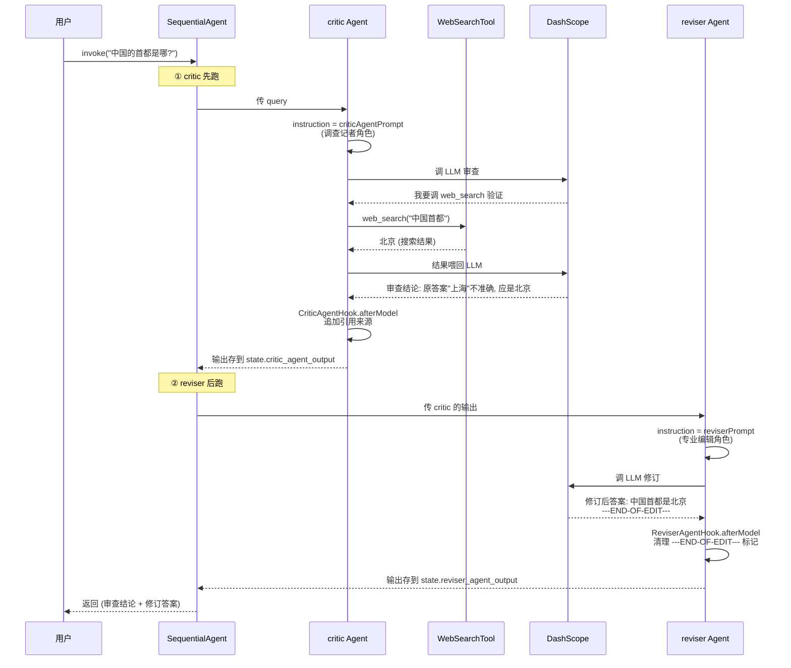
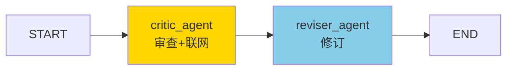
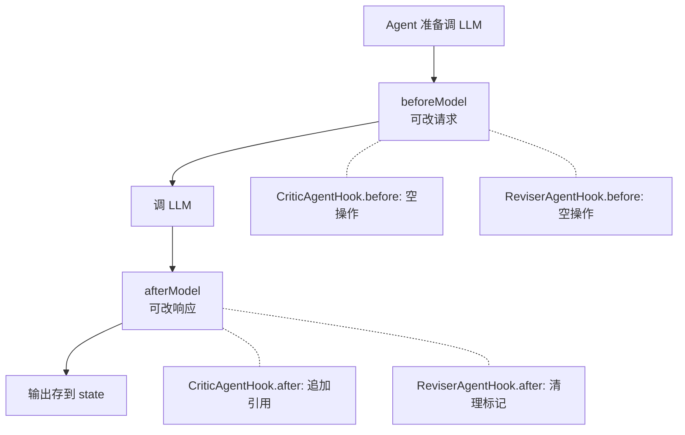

# 模块十：adk-samples-llm-auditor —— Reflection 范式

> [← 返回索引](./README.md) | [← 上一模块：graph-example/parallel-node](./09-graph-parallel-node.md)

---

## 一、问题概述

adk-samples-llm-auditor 回答一个核心问题：**如何让 LLM 不只是「一次生成」，而是「生成→审查→修订」循环，产出高质量内容？** 这就是 Reflection（反思）范式——多个 Agent 角色分工，critic 审查挑毛病，reviser 按审查意见修订，质量远超单 Agent。本模块同时引入 **SequentialAgent**（串行编排多 Agent）这一新概念。

## 二、背景知识

### 1. 三大 Agent 范式回顾

```
ReAct (第7-8站):    单 Agent + 工具, 想→做→看 循环
并行 (第9站):        fan-out/fan-in, 多分支同时跑
Reflection (本站):   多 Agent 互查, 生成→审查→修订 循环  ← 新的
```

### 2. 为什么需要 Reflection

LLM 一次生成的内容可能有事实错误、逻辑漏洞。让另一个 LLM 审查挑毛病，再让第三个 LLM 按审查意见修订，质量显著提升。**OpenAI o1、DeepSeek-R1 的"思考"本质都是 Reflection**。

### 3. 四种钩子机制横向对比

| 钩子 | 拦截哪层 | 方法 | 例子 |
|------|---------|------|------|
| Advisor | ChatClient 调 LLM | before/after | MemoryAdvisor |
| ToolInterceptor | 工具调用 | interceptToolCall | LogToolInterceptor |
| HumanInTheLoopHook | Agent 内部 (审批) | approvalOn | react-agent 第7站 |
| **ModelHook** | **Agent 内部调 LLM** | **beforeModel/afterModel** | **本站 CriticAgentHook** |

四种本质都是「洋葱模型」——请求前/响应后插入处理，只是层级不同。

## 三、详细解答

### Why：为什么用多 Agent 而非单 Agent 自我审查？

**根本原因是角色冲突**。单 Agent 既生成又审查，会有「自我肯定偏差」——倾向于认为自己说的对。拆成多 Agent，每个专注一个角色，审查更客观：

```mermaid
flowchart TD
    A[用户问: 中国首都是哪?] --> B[原答案: 中国首都是上海]
    
    B --> C{单 Agent 自查?}
    C -->|是| D[同一 LLM: 我说的对, 是上海 ✗]
    C -->|否, 多 Agent| E[critic Agent: 不对, 应该是北京<br/>(联网搜索验证)]
    E --> F[reviser Agent: 按审查修订<br/>中国首都是北京 ✓]
    
    D --> G[错误答案]
    F --> H[正确答案]
```

**多 Agent 的价值**：角色分工 + 联网验证 + 独立修订，三重保障提升质量。

### How：Reflection 完整流程



**三阶段**：
1. **critic 审查**：调 LLM + 联网搜索，挑毛病，输出审查结论 + 引用
2. **reviser 修订**：读 critic 的结论，按裁决标准修订答案
3. **返回**：拼接 critic 输出 + reviser 输出

### Principle：SequentialAgent 的本质

```java
SequentialAgent llmAuditor = SequentialAgent.builder()
    .name("llm_auditor")
    .subAgents(List.of(criticAgent, reviserAgent))  // ★ 按顺序串联
    .build();
```

**SequentialAgent 内部也是个 Graph**：



对比第 8/9 站自己用 `StateGraph.addNode/edge` 画图，**SequentialAgent 是「多 Agent 串联」的封装**——你只管给子 Agent 列表，框架自动串联。子 Agent 之间通过 `OverAllState` 传递数据（outputKey）。

### How：ReactAgent 的新配置项

本站的 ReactAgent 用了几个第 6 站没见的新配置：

```java
ReactAgent criticAgent = ReactAgent.builder()
    .name("critic_agent")
    .model(chatModel)
    .instruction(criticAgentPrompt)                              // ★ 系统提示词 (角色)
    .tools(WebSearchTool.getFunctionToolCallback(tavilyApiKey))  // 联网搜索工具
    .hooks(new CriticAgentHook())                               // ★ ModelHook
    .outputKey("critic_agent_output")                           // ★ 输出存到 state 的 key
    .build();
```

| 配置 | 作用 | 第7站有吗 |
|------|------|----------|
| `.instruction(prompt)` | 系统提示词，定义 Agent 角色 | ❌ 新 |
| `.hooks(ModelHook)` | 模型调用前后的钩子 | ✅ (HITL Hook) |
| `.outputKey("xxx")` | 输出存到 state 的哪个 key | ❌ 新 |
| `.tools(...)` | 工具 | ✅ |
| `.model(...)` | LLM 大脑 | ✅ |

**`outputKey` 的作用**：critic 的输出存到 `state.critic_agent_output`，reviser 存到 `state.reviser_agent_output`。SequentialAgent 据此让 reviser 读到 critic 的输出，最终 Controller 也能按 key 取出各自结果。

### How：ModelHook 的工作机制



**两个 Hook 的对比**：

| Hook | beforeModel | afterModel | 干什么 |
|------|-------------|------------|--------|
| CriticAgentHook | 空 | 追加引用 | 把搜索结果的引用追加到 critic 输出后 |
| ReviserAgentHook | 空 | 清理标记 | 删除 reviser 输出中的 ---END-OF-EDIT--- |

两者都是 afterModel 干活，方向相反：一个增加内容，一个删除内容。

### Principle：CriticAgentHook 提取引用的原理

critic 调 web_search 后，搜索结果作为 TOOL 类型消息存在 `state.messages` 里。CriticAgentHook.afterModel 做的事：

```
1. 从 state.messages 找 TOOL 类型消息
2. 解析其中的 responseData (WebSearchTool 返回的格式化文本)
3. 用正则提取 title/content/url
4. 拼成引用列表: * [标题](url): 内容
5. 追加到 critic 的输出后面
```

**为什么要提取引用**：让用户看到审查结论的证据来源，提升可信度（类似 Perplexity 的引用展示）。

### How：reviser 的 ---END-OF-EDIT--- 机制

reviser 的 prompt 要求 LLM 修订完输出 `---END-OF-EDIT---` 标记。这是**控制信号**：

```
LLM 输出: "中国首都是北京。\n---END-OF-EDIT---"
           ↑ 修订答案          ↑ 控制标记 (告诉框架修订结束)

ReviserAgentHook.afterModel:
   text.replace("---END-OF-EDIT---", "")
   → "中国首都是北京。\n"  ← 干净的最终答案
```

**为什么用标记而非结构化输出**：prompt 里用 few-shot 示例教 LLM 输出标记，比 JSON schema 更灵活（reviser 要保留原文风格，不适合结构化）。

## 四、代码逐行解析（核心编排）

```java
@GetMapping("/agent")
public String agent(@RequestParam String query) {
    // === ① critic Agent (审查者) ===
    ReactAgent criticAgent = ReactAgent.builder()
        .name("critic_agent")                                        // 身份
        .model(chatModel)                                            // LLM 大脑
        .instruction(criticAgentPrompt)                              // ★ 调查记者角色
        .tools(WebSearchTool.getFunctionToolCallback(tavilyApiKey))  // ★ 联网搜索
        .hooks(new CriticAgentHook())                               // ★ 追加引用
        .outputKey("critic_agent_output")                           // ★ 输出 key
        .build();

    // === ② reviser Agent (修订者) ===
    ReactAgent reviserAgent = ReactAgent.builder()
        .name("reviser_agent")
        .model(chatModel)
        .instruction(reviserPrompt)                                  // ★ 专业编辑角色
        .hooks(new ReviserAgentHook())                              // ★ 清理标记
        .outputKey("reviser_agent_output")                          // ★ 输出 key
        .build();  // 注意: reviser 没工具, 只根据 critic 的发现修订

    // === ③ ★★ SequentialAgent 串联 ===
    SequentialAgent llmAuditor = SequentialAgent.builder()
        .name("llm_auditor")
        .subAgents(List.of(criticAgent, reviserAgent))              // ★ 按顺序串联
        .build();

    // === ④ 执行 ===
    Optional<OverAllState> overAllState = llmAuditor.invoke(query);
    OverAllState state = overAllState.get();
    
    // === ⑤ 取两个 Agent 的输出 ===
    StringBuilder output = new StringBuilder();
    state.value("critic_agent_output", AssistantMessage.class).ifPresent(r -> {
        output.append("===============critic_agent_ouput============\n")
              .append(r.getText()).append("\n")
              .append("===============end============\n");
    });
    state.value("reviser_agent_output", AssistantMessage.class).ifPresent(r -> {
        output.append("===============reviser_agent_output============\n")
              .append(r.getText()).append("\n")
              .append("===============end============\n");
    });
    return output.toString();
}
```

| 步骤 | 作用 | 关键点 |
|------|------|--------|
| ① | critic 审查 | 有 web_search 工具，能联网验证 |
| ② | reviser 修订 | 无工具，根据 critic 发现修订 |
| ③ | SequentialAgent 串联 | ★ 多 Agent 编排核心 |
| ④ | invoke 执行 | 触发整个 Reflection 流程 |
| ⑤ | 按 outputKey 取结果 | 各 Agent 输出存不同 key |

## 五、与前面模块的对比

| 维度 | 第7站 react-agent | 第9站 parallel-node | 本站 llm-auditor |
|------|-------------------|---------------------|------------------|
| 范式 | ReAct | 并行 | Reflection |
| Agent 数 | 1 个 | 4 个节点（非 Agent）| **2 个 Agent** |
| 编排方式 | ReactAgent | StateGraph 自己画 | **SequentialAgent 封装** |
| 工具 | file_read/write | 无（节点调 LLM）| web_search |
| 钩子 | HumanInTheLoopHook | 无 | ModelHook (critic/reviser) |
| 循环 | ReAct 循环 | fan-out/fan-in | critic→reviser 串联 |
| 目标 | 让 AI 动手 | 并行提速 | **提升内容质量** |

## 六、关键认知

| 问题 | 答案 |
|------|------|
| Reflection 解决什么？ | 单 Agent 自我审查有偏差，多 Agent 互查更客观 |
| SequentialAgent 干嘛？ | 串行编排多个子 Agent，按顺序执行 |
| SequentialAgent 内部是啥？ | 也是个 Graph（子 Agent 串联）|
| outputKey 干嘛？ | Agent 输出存到 state 的 key，供后续 Agent/Controller 读 |
| ModelHook 拦截哪层？ | Agent 内部调 LLM 前后 |
| critic 和 reviser 谁有工具？ | critic 有 web_search，reviser 无 |
| ---END-OF-EDIT--- 干嘛？ | reviser 的控制标记，Hook 清理掉 |
| CriticAgentHook 干嘛？ | 提取搜索引用，追加到 critic 输出 |
| 多 Agent vs 多工具？ | 多工具是「一个 Agent 调多个函数」，多 Agent 是「多个角色协作」|

## 七、总结

- **Reflection 范式**：生成→审查→修订循环，多 Agent 角色分工提升质量
- **SequentialAgent**：串行编排多 Agent 的新概念，内部是 Graph，子 Agent 通过 outputKey 传数据
- **多 Agent vs 单 Agent**：单 Agent 自我审查有偏差，多 Agent 互查更客观
- **ModelHook**：Agent 内部调 LLM 前后的钩子，与 Advisor/ToolInterceptor/HITLHook 是四种钩子机制
- **critic + reviser 分工**：critic 有 web_search 联网验证，reviser 无工具只按发现修订
- **outputKey 机制**：Agent 输出存到 state 的指定 key，SequentialAgent 据此串联，Controller 据此取结果
- **---END-OF-EDIT--- 控制**：prompt 教 LLM 输出标记，Hook 清理，比结构化输出更灵活
- **CriticAgentHook 提取引用**：从 TOOL 消息解析搜索结果，追加引用列表提升可信度
- **价值**：OpenAI o1、DeepSeek-R1 的"思考"本质都是 Reflection，是提升 AI 内容质量的关键范式
