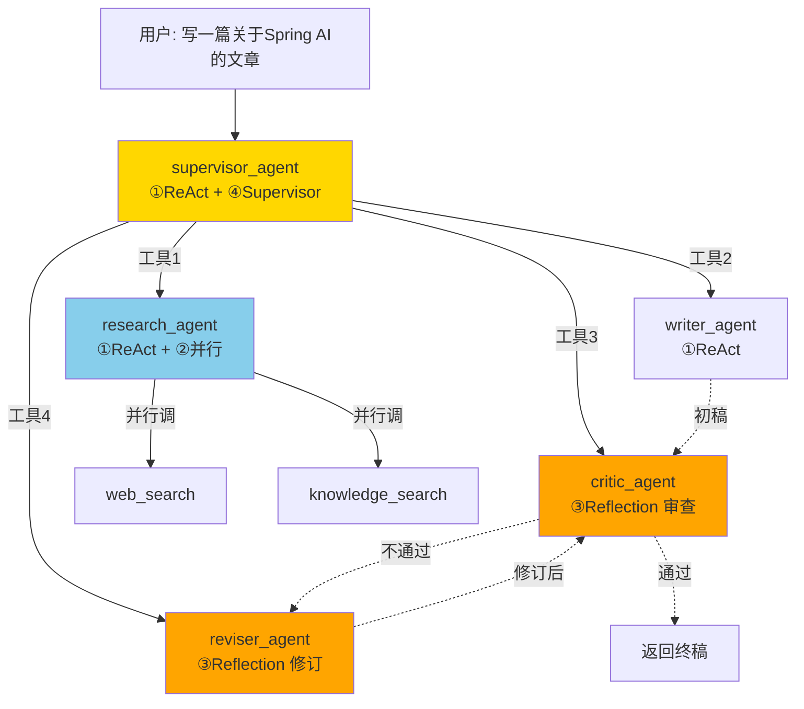
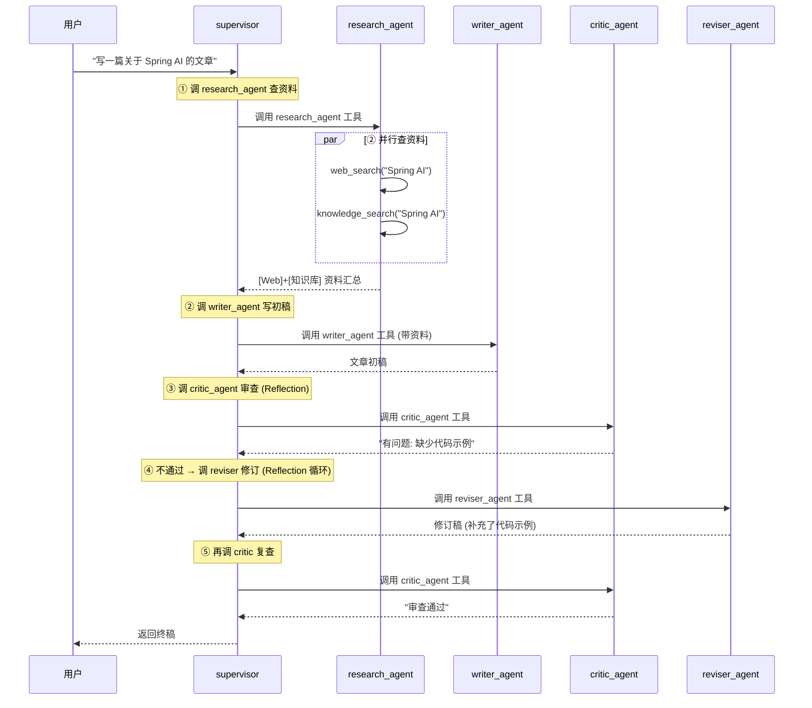

# 模块十一：four-paradigm-combined —— 四范式合一示例

> [← 返回索引](./README.md) | [← 上一模块：subagent-personal-assistant](./10-subagent-personal-assistant.md)

---

## 一、问题概述

这是一个**自建示例**（非官方模块），同时演示 **ReAct + 并行 + Reflection + Supervisor** 四种 Agent 范式如何协同工作。场景是「智能内容创作系统」——用户要写一篇文章，系统自动完成：查资料 → 写初稿 → 审查 → 修订（循环直到满意）→ 返回终稿。

**为什么建这个示例**：前面 4 站分别学了四大范式，但每个模块只侧重一种。本例把它们**组合在一个系统里**，让你看清范式之间如何叠加、如何分工。

## 二、背景知识：四大范式是正交积木

```
ReAct (第6-7站):        单 Agent 内部的「想-做-看」循环      (循环维度)
并行 (第8站):            多分支同时执行                       (并发维度)
Reflection (第9站):      生成-审查-修订                       (质量维度)
Supervisor (第10站):     主 Agent 调度子 Agent                (分工维度)
```

**四个维度相互独立，可任意组合**。本例同时使用全部四个：

| 范式 | 在本例哪体现 |
|------|-------------|
| ① ReAct | 每个 Agent 都是 ReactAgent，内部有循环 |
| ② 并行 | research_agent 同时调 web_search + knowledge_search |
| ③ Reflection | supervisor 编排 critic→reviser 循环直到满意 |
| ④ Supervisor | supervisor 把 4 个子 Agent 当工具动态调度 |

## 三、整体架构



## 四、完整执行流程



## 五、文件结构

```
four-paradigm-combined-example/
├── pom.xml
├── README.md
└── src/main/
    ├── java/com/alibaba/cloud/ai/example/combined/
    │   ├── CombinedApplication.java          启动类
    │   ├── config/
    │   │   └── CombinedAgentConfig.java      ★★ 四范式合一核心配置
    │   ├── tool/
    │   │   ├── WebSearchTool.java            并行分支1 (联网搜索)
    │   │   └── KnowledgeBaseTool.java        并行分支2 (知识库)
    │   └── controller/
    │       └── CombinedController.java       Web 入口
    └── resources/
        └── application.yml
```

## 六、代码逐个解析

### 1. 工具层：WebSearchTool + KnowledgeBaseTool（并行分支）

两个工具结构相同，都是 `BiFunction` 模式：

```java
public class WebSearchTool implements BiFunction<Map<String, Object>, ToolContext, String> {
    @Override
    public String apply(Map<String, Object> args, ToolContext toolContext) {
        String query = (String) args.getOrDefault("query", "Spring AI");
        // mock: 模拟联网搜索结果
        return "[Web搜索] 关于 '" + query + "' 的最新信息: Spring AI 是 Spring 官方的 AI 应用框架...";
    }

    public ToolCallback toolCallback() {
        return FunctionToolCallback.builder("web_search", this)
                .description("联网搜索工具, 查询互联网上的最新信息...")
                .inputType(Map.class)
                .build();
    }
}
```

**为什么两个工具代表并行**：research_agent 同时挂载这两个工具，LLM 在一次决策中可以同时返回两个 `tool_calls`（web_search + knowledge_search），框架**并行执行**它们。这是「单 Agent 内的多工具并行」——区别于第8站 graph 的「跨节点并行 fan-out/fan-in」，但本质都是并发执行。

### 2. 核心配置：CombinedAgentConfig（四范式合一）

这是整个示例的核心，逐段解析：

#### 2.1 四个子 Agent 的系统提示词

```java
// research_agent: 资料研究员, 同时用 web + 知识库查资料
private static final String RESEARCH_PROMPT = """
        你是资料研究员。接到主题后, 同时使用 web_search 和 knowledge_search 两个工具
        查询资料 (一个查互联网, 一个查本地知识库), 汇总后返回研究要点。
        """;

// writer_agent: 作家, 根据资料写初稿
private static final String WRITER_PROMPT = "你是技术作家。根据提供的研究资料, 撰写技术文章初稿。";

// critic_agent: 审稿人, 挑毛病 (Reflection 的审查者)
private static final String CRITIC_PROMPT = """
        你是严格的审稿人。审查文章的准确性、完整性、逻辑性。
        输出审查结论: 如果文章合格, 明确说"审查通过"; 如果不合格, 列出具体问题。
        """;

// reviser_agent: 编辑, 按审查意见修订 (Reflection 的修订者)
private static final String REVISER_PROMPT = "你是专业编辑。根据审稿人的意见修订文章...";
```

#### 2.2 ★ Supervisor 的提示词（编排 Reflection 循环）

```java
private static final String SUPERVISOR_PROMPT = """
        你是内容创作主管。用户让你写文章时, 按以下流程协调:

        1. 先调 research_agent 查资料
        2. 再调 writer_agent 写初稿
        3. 调 critic_agent 审查
        4. 如果 critic 说"审查通过", 结束并返回终稿
        5. 如果 critic 说有问题, 调 reviser_agent 修订, 然后回到第3步再审查 (Reflection 循环)
        6. 最多重试 3 次, 避免死循环

        你要根据每一步的结果动态决定下一步, 这是你的核心职责。
        """;
```

**这段 prompt 是范式③ Reflection 的关键**：它指导 supervisor 编排「审查-修订-再审查」的循环。第9站 llm-auditor 用 SequentialAgent 固定串联（无循环），本例用 supervisor 的 ReAct 循环驱动 Reflection——**supervisor 看 critic 结果决定要不要再循环**，这是带循环的完整版 Reflection。

#### 2.3 research_agent（范式① ReAct + 范式② 并行）

```java
public ReactAgent researchAgent() {
    return ReactAgent.builder()
            .name("research_agent")
            .model(chatModel)
            .systemPrompt(RESEARCH_PROMPT)
            // ★ 两个工具: LLM 会并行调用, 体现并行范式
            .tools(List.of(
                    new WebSearchTool().toolCallback(),
                    new KnowledgeBaseTool().toolCallback()))
            .instruction("查询指定主题的资料, 同时用 web_search 和 knowledge_search。")
            .inputType(String.class)
            .outputKey("research_output")
            .build();
}
```

| 配置 | 作用 | 对应范式 |
|------|------|---------|
| `ReactAgent.builder()` | 是 ReactAgent，内部有循环 | ① ReAct |
| `.tools(两个工具)` | LLM 可同时调两个 | ② 并行 |
| `.instruction(...)` | 当被当工具时的描述 | ④ Supervisor 需要 |
| `.inputType(String.class)` | 接收 String 输入 | ④ Supervisor 需要 |
| `.outputKey("research_output")` | 输出存到 state 的 key | 给 supervisor 读 |

#### 2.4 ★★ supervisorAgent（四范式合一的核心）

```java
@Bean("supervisorAgent")
public ReactAgent supervisorAgent() {
    // ★ 范式④: AgentTool.getFunctionToolCallback 把子 Agent 包装成工具
    ToolCallback researchTool = AgentTool.getFunctionToolCallback(researchAgent());
    ToolCallback writerTool = AgentTool.getFunctionToolCallback(writerAgent());
    ToolCallback criticTool = AgentTool.getFunctionToolCallback(criticAgent());
    ToolCallback reviserTool = AgentTool.getFunctionToolCallback(reviserAgent());

    return ReactAgent.builder()
            .name("supervisor_agent")
            .model(chatModel)
            .systemPrompt(SUPERVISOR_PROMPT)
            // ★ 范式④: supervisor 的工具 = 4 个子 Agent (Agent as Tool)
            .tools(List.of(researchTool, writerTool, criticTool, reviserTool))
            .build();
}
```

**这一段是四范式合一的精髓**：
- `AgentTool.getFunctionToolCallback(agent)` 把子 Agent 包装成工具 → **范式④ Supervisor**
- supervisor 自己是 `ReactAgent`，有多步推理循环 → **范式① ReAct**
- prompt 指导它编排 critic↔reviser 循环 → **范式③ Reflection**
- research_agent 内部并行调两个工具 → **范式② 并行**

### 3. Controller：触发完整流程

```java
@GetMapping("/create")
public String create(@RequestParam String query) {
    Optional<OverAllState> result = supervisorAgent.invoke(query);
    OverAllState state = result.get();

    StringBuilder output = new StringBuilder();
    // 按阶段拼接各子 Agent 的输出
    state.value("research_output").ifPresent(r -> output.append("【资料研究】\n").append(r));
    state.value("writer_output").ifPresent(r -> output.append("【初稿】\n").append(r));
    state.value("critic_output").ifPresent(r -> output.append("【审查】\n").append(r));
    state.value("reviser_output").ifPresent(r -> output.append("【修订】\n").append(r));
    return output.toString();
}
```

**按 outputKey 取各阶段输出**：每个子 Agent 的输出存在 state 的不同 key 里（research_output / writer_output / critic_output / reviser_output），Controller 据此拼接完整流程报告。

## 七、四范式对照表（本例具体体现）

| 范式 | 在哪体现 | 关键代码 | 对应前序模块 |
|------|---------|---------|-------------|
| ① ReAct | 每个 Agent 是 ReactAgent | `ReactAgent.builder()` | 第6-7站 |
| ② 并行 | research_agent 两个工具 | `.tools(webSearch, knowledgeSearch)` | 第8站 |
| ③ Reflection | supervisor 编排 critic↔reviser | SUPERVISOR_PROMPT 第3-5步 | 第9站 |
| ④ Supervisor | 子 Agent 当工具 | `AgentTool.getFunctionToolCallback(agent)` | 第10站 |

## 八、与前面模块的对比

| 模块 | 用的范式 | 子 Agent 关系 | Reflection 循环 |
|------|---------|-------------|----------------|
| 第6站 react-agent | ReAct | — | — |
| 第8站 parallel-node | 并行 | 节点 fan-out/fan-in | — |
| 第9站 llm-auditor | Reflection | SequentialAgent 固定串联 | ❌ 无循环（一遍过）|
| 第10站 subagent | Supervisor + ReAct | 子 Agent 当工具 | — |
| **本例** | **四合一** | **子 Agent 当工具** | **✅ 有循环（supervisor 驱动）** |

**本例相比第9站 llm-auditor 的进步**：
- llm-auditor 用 SequentialAgent 固定串联，critic→reviser 跑一遍就结束（无 Reflection 循环）
- 本例用 supervisor 的 ReAct 循环驱动 Reflection——critic 不通过就回 reviser，**真正实现了 Reflection 循环**

## 九、关键认知

### 1. 范式可组合的本质

四种范式是**四个独立维度**，不是「四选一」：
- ReAct 是「循环维度」（单 Agent 内部）
- 并行是「并发维度」（多分支同时）
- Reflection 是「质量维度」（审查-修订）
- Supervisor 是「分工维度」（主从调度）

一个系统可以同时具备四个维度的特征。

### 2. Reflection 循环靠什么驱动

**靠 supervisor 的 ReAct 循环**。supervisor 看 critic 的结果：
- 「审查通过」→ 结束
- 「有问题」→ 调 reviser → 再调 critic → 循环

这是**用 ReAct（循环维度）实现 Reflection（质量维度）**——两个范式协同。

### 3. 并行的两种形式

| 形式 | 在哪 | 特点 |
|------|------|------|
| 跨节点并行 | 第8站 graph | fan-out/fan-in，多节点同时跑 |
| 单 Agent 多工具 | 本例 research_agent | LLM 一次调多个 tool_calls |

本例用的是「单 Agent 多工具」的轻量并行，足够演示范式组合。

### 4. Agent as Tool 的嵌套

```
supervisor (ReactAgent)
  └─ tools: [research_agent, writer_agent, critic_agent, reviser_agent]
              ↑ 每个都是完整 ReactAgent, 有自己的工具和循环
```

**两层 Agent 嵌套**：supervisor 调子 Agent = 调工具，但这个「工具」内部又是一个完整 Agent。这是 Supervisor 范式的精髓。

## 十、运行方式（参考）

```bash
# 1. 配置 DashScope API Key
export AI_DASHSCOPE_API_KEY=your-api-key

# 2. 启动
cd four-paradigm-combined-example
mvn spring-boot:run

# 3. 访问
curl "http://localhost:8088/create?query=写一篇关于 Spring AI 的文章"
```

> 注：本例代码基于 Spring AI Alibaba 1.1.x API，部分方法签名可能随版本变化。核心范式组合思路不变。

## 十一、总结

- **四范式合一**：ReAct（循环）+ 并行（并发）+ Reflection（质量）+ Supervisor（分工）同时存在
- **Supervisor 是骨架**：动态调度 4 个子 Agent，比 SequentialAgent 灵活
- **Reflection 循环靠 ReAct 驱动**：supervisor 看 critic 结果决定是否再循环，这是带循环的完整 Reflection
- **并行在 Agent 内**：research_agent 多工具并行是轻量并行
- **Agent as Tool 嵌套**：子 Agent 整个变成 supervisor 的工具，两层 Agent 嵌套
- **范式是正交积木**：四个维度独立，可任意组合，构建任意复杂度的 Agent 系统
- **价值**：证明四大范式不是「四选一」，而是可叠加的积木——这是从「学范式」到「设计 Agent 系统」的关键认知
