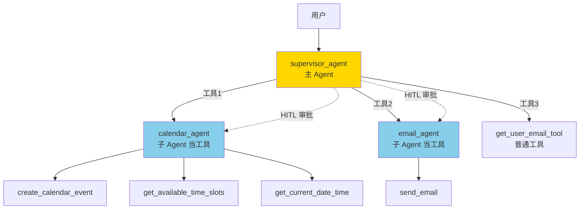
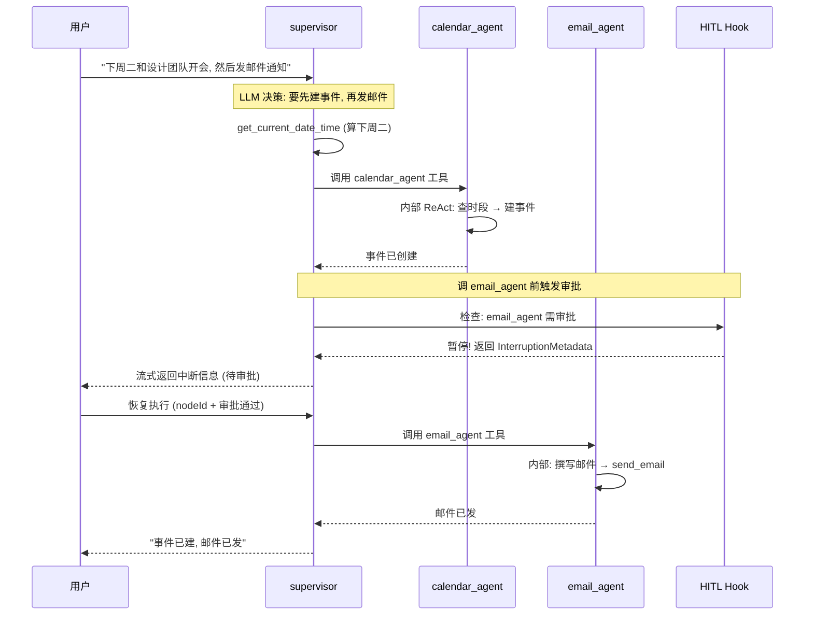

# 模块十一：subagent-personal-assistant —— Multi-Agent/Supervisor 范式

> [← 返回索引](./README.md) | [← 上一模块：adk-samples-llm-auditor](./10-llm-auditor.md)

---

## 一、问题概述

subagent-personal-assistant 回答一个核心问题：**如何让一个主 Agent（Supervisor）像主管一样，根据用户意图动态调度多个子 Agent（日历/邮件/用户数据），各司其职？** 这是 Multi-Agent/Supervisor 范式——区别于 SequentialAgent 的固定串联，Supervisor 是**动态调度**，子 Agent 成为父 Agent 的「工具」。

## 二、背景知识

### 1. 与 llm-auditor 的 SequentialAgent 对比

```
llm-auditor (SequentialAgent):   固定串联, critic→reviser 都跑
subagent (Supervisor):           动态调度, supervisor 按需调子 Agent
```

| 维度 | SequentialAgent | Supervisor |
|------|----------------|------------|
| 顺序 | 固定（配置时定）| **动态**（LLM 决定）|
| 子 Agent | 都跑 | **按需跑** |
| 子 Agent 角色 | 链式接力 | **被当工具调** |
| 适合 | 固定流程（审查-修订）| 灵活任务（用户意图多变）|

### 2. Agent as Tool（核心概念）

Supervisor 范式的精髓：**子 Agent 整个变成父 Agent 的工具**。

```java
ToolCallback calendarAgent = AgentTool.getFunctionToolCallback(calendarAgent());
// 子 Agent 被包装成 ToolCallback, supervisor 像调普通工具一样调它
```

supervisor 调 `calendar_agent` 工具时，实际是**运行整个 calendar ReactAgent**（它有自己的工具和 ReAct 循环）。

### 3. 四大范式集齐

```
ReAct (第7-8站):        单 Agent + 工具循环
并行 (第9站):            fan-out/fan-in
Reflection (第10站):      生成-审查-修订
Multi-Agent/Supervisor:  主 Agent 调度子 Agent  ← 本站
```

## 三、详细解答

### Why：为什么用 Supervisor 而非 SequentialAgent？

**根本原因是任务灵活**。个人助手的请求多种多样：

```
用户A: "查张三邮箱"              → 只需 get_user_email_tool
用户B: "下周二开会"              → 只需 calendar_agent
用户C: "查张三邮箱并发邮件"       → get_user_email_tool + email_agent
用户D: "查下周二空闲并建事件"     → calendar_agent (内部多次调工具)
```

**SequentialAgent 做不了**——它固定顺序跑所有子 Agent，查个邮箱也把日历跑一遍，浪费。**Supervisor 让 LLM 根据意图动态选**，需要谁调谁。

### How：Supervisor 完整架构



**三层结构**：
1. **supervisor（主）**：3 个工具（2 个子 Agent + 1 个普通工具）
2. **calendar/email（子）**：各有自己的工具
3. **HITL**：审批子 Agent 的调用（敏感操作前暂停）

### How：Supervisor 调度流程



**关键点**：
1. supervisor 是 ReactAgent，有自己的 ReAct 循环（多次调工具）
2. 调子 Agent = 调工具，子 Agent 内部又是一个完整 ReactAgent
3. HITL 在「调子 Agent」这一层拦住（不是拦子 Agent 内部的工具）

### Principle：AgentTool.getFunctionToolCallback 的魔法

```java
ToolCallback calendarAgent = AgentTool.getFunctionToolCallback(calendarAgent());
```

这一行把 `ReactAgent` 转成 `ToolCallback`。**supervisor 看到的就是一个普通工具**：

```
supervisor 收到的工具清单:
  - calendar_agent: "Schedule calendar events using natural language..."
  - email_agent: "Send emails using natural language..."
  - get_user_email_tool: "retrieve a user's email..."
```

supervisor 不知道 calendar_agent 是个完整 Agent，只当它是工具。调它时，框架运行 calendar ReactAgent，把结果返回给 supervisor。**这就是「Agent as Tool」**——嵌套 Agent 的核心机制。

### How：子 Agent 的配置差异

```java
// 子 Agent 比普通 ReactAgent 多两个配置:
ReactAgent calendarAgent = ReactAgent.builder()
    .name("calendar_agent")
    .model(dashScopeChatModel)
    .tools(...)                        // 子 Agent 自己的工具
    .systemPrompt(CALENDAR_AGENT_PROMPT)
    .instruction(instruction)          // ★ 当被当工具调时的描述 (告诉 supervisor 何时调)
    .inputType(String.class)           // ★ 接收 String 输入 (supervisor 传的自然语言)
    .build();
```

| 配置 | 作用 | 普通Agent需要吗 |
|------|------|----------------|
| `.instruction` | 当被当工具调时的描述 | ❌ 子 Agent 才需要 |
| `.inputType` | 接收的输入类型 | ❌ 子 Agent 才需要 |
| `.systemPrompt` | 角色定义 | ✅ |
| `.tools` | 自己的工具 | ✅ |

### How：HITL 审批子 Agent

```java
private HumanInTheLoopHook createHumanInTheLoopHook() {
    return HumanInTheLoopHook.builder()
        .approvalOn("calendar_agent", ...)   // ★ 审批子 Agent 名字
        .approvalOn("email_agent", ...)
        .build();
}
```

**审批的是子 Agent 名字**（calendar_agent/email_agent），不是具体工具名。因为 supervisor 把子 Agent 当工具调，审批在「运行子 Agent」这一层拦住，子 Agent 内部的工具就不会执行。

### How：流式 + HITL 二合一 Controller

```java
@GetMapping(value = "/react/agent/supervisorAgent", produces = TEXT_EVENT_STREAM_VALUE)
public Flux supervisorAgentTest(String query, String threadId, String nodeId) {
    if (nodeId != null && TOOL_FEEDBACK_MAP.containsKey(nodeId)) {
        // ★ 恢复执行: 取审批结果, 全部批准
        InterruptionMetadata approvalMetadata = HITLHelper.approveAll(...);
        config = RunnableConfig.builder()
            .threadId(threadId)
            .addHumanFeedback(approvalMetadata)
            .build();
        return supervisorAgent.stream(query, config).doOnNext(this::println);
    } else {
        // 首次调用
        config = RunnableConfig.builder().threadId(threadId).build();
        return supervisorAgent.stream(query, config).doOnNext(this::println);
    }
}
```

**与第7站 react-agent 的区别**：
- 第7站：`/invoke` + `/feedback` 两个接口
- 本站：单接口 + `nodeId` 判断（首次 vs 恢复）

### Principle：三种 HITL 审批方式（HITLHelper）

```java
HITLHelper.approveAll(metadata);                    // 全部批准
HITLHelper.rejectAll(metadata, "原因");              // 全部拒绝
HITLHelper.editTool(metadata, "toolName", newArgs); // 改参数后批准
```

| 方式 | 场景 | 结果 |
|------|------|------|
| approveAll | 用户全部同意 | Agent 继续执行 |
| rejectAll | 用户不同意 | LLM 收到拒绝原因，改方案 |
| editTool | 参数要改 | LLM 用新参数执行 |

## 四、代码逐行解析（AgentConfig 核心）

```java
@Bean("supervisorAgent")
public ReactAgent reactAgent() {
    MemorySaver memorySaver = new MemorySaver();                    // ① HITL 状态保存
    
    // ② ★ 把子 Agent 包装成工具
    ToolCallback calendarAgent = AgentTool.getFunctionToolCallback(calendarAgent());
    ToolCallback emailAgent = AgentTool.getFunctionToolCallback(emailAgent());
    
    return ReactAgent.builder()
        .name("supervisor_agent")
        .model(dashScopeChatModel)
        .systemPrompt(SUPERVISOR_PROMPT)                            // ③ 主 Agent 角色
        .hooks(createHumanInTheLoopHook())                          // ④ HITL 审批
        .tools(List.of(calendarAgent, emailAgent,                   // ⑤ 工具=2子Agent+1普通
            new UserDataTool().toolCallback()))
        .saver(memorySaver)
        .build();
}
```

| 步骤 | 作用 | 关键点 |
|------|------|--------|
| ① | MemorySaver | HITL 暂停/恢复必备 |
| ② | AgentTool.getFunctionToolCallback | ★ 子 Agent 当工具的核心 |
| ③ | SUPERVISOR_PROMPT | "分解请求, 协调多工具" |
| ④ | HITL Hook | 审批 calendar_agent/email_agent |
| ⑤ | tools | supervisor 的工具清单（含子 Agent）|

## 五、与前面模块的对比

| 维度 | 第7站 react-agent | 第10站 llm-auditor | 本站 subagent |
|------|-------------------|-------------------|---------------|
| 范式 | ReAct | Reflection | Multi-Agent/Supervisor |
| Agent 数 | 1 | 2（串联）| **3（主从）** |
| 编排 | 单 Agent | SequentialAgent | **Supervisor + AgentTool** |
| 子 Agent 关系 | — | 平级接力 | **被当工具调** |
| 调度 | LLM 调工具 | 固定顺序 | **动态选子 Agent** |
| HITL | 审批工具 | 无 | 审批子 Agent |
| 适合 | 单任务 | 固定流程 | 灵活任务 |

## 六、关键认知

| 问题 | 答案 |
|------|------|
| Supervisor 和 SequentialAgent 区别？ | 固定串联 vs 动态调度 |
| 子 Agent 怎么当工具？ | AgentTool.getFunctionToolCallback 包装 |
| supervisor 怎么知道调哪个子 Agent？ | 看 instruction 描述，LLM 决策 |
| HITL 审批什么？ | 子 Agent 名字（不是内部工具）|
| nodeId 干嘛？ | 区分首次调用 vs 恢复执行 |
| HITLHelper 三种方式？ | approveAll / rejectAll / editTool |
| 子 Agent 多了哪两个配置？ | instruction + inputType |
| Agent as Tool 的本质？ | 嵌套 Agent，子 Agent 整个变父 Agent 的工具 |

## 七、总结

- **Supervisor 范式**：主 Agent 动态调度子 Agent，区别于 SequentialAgent 固定串联
- **Agent as Tool**：`AgentTool.getFunctionToolCallback` 把子 Agent 包装成工具，supervisor 像调工具一样调子 Agent
- **动态调度**：supervisor 是 ReactAgent，根据用户意图 LLM 决策调哪个子 Agent，按需调用
- **子 Agent 配置**：比普通 Agent 多 `instruction`（描述）+ `inputType`（输入类型）
- **HITL 审批子 Agent**：审批在「运行子 Agent」这一层，拦住后子 Agent 内部工具不执行
- **HITLHelper**：封装 approveAll/rejectAll/editTool 三种审批方式
- **流式 + HITL 二合一**：单接口用 nodeId 区分首次/恢复，比第7站两接口更紧凑
- **四大范式集齐**：ReAct + 并行 + Reflection + Multi-Agent，后续模块都是它们的组合变体
- **价值**：复杂任务分工——主管派活给手下，比单 Agent 全干更可控、更专业
