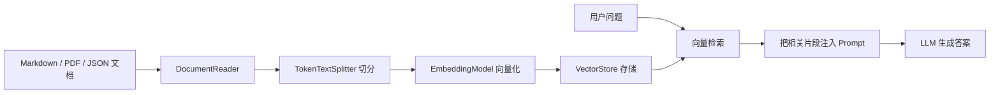

# 模块十三：rag-example —— 基础 RAG 检索增强

> [← 返回索引](./README.md) | [← 上一模块：four-paradigm-combined](./12-four-paradigm-combined.md) | [下一模块：rag-agent-example →](./14-rag-agent.md)

---

## 一、问题概述

rag-example 回答一个核心问题：**如何让模型基于本地知识库回答，而不是只依赖模型参数里的旧知识？**

RAG 的完整名称是 Retrieval-Augmented Generation，检索增强生成。它不是让模型“记住”文档，而是在每次回答前先检索相关片段，再把片段作为上下文交给模型。

## 二、传统 RAG 流程



和第 14 站 rag-agent 的区别：

| 维度 | 基础 RAG | RAG Agent |
|---|---|---|
| 检索时机 | 每次请求固定检索 | Agent 自己判断是否检索 |
| 编排方式 | Advisor / Retriever | Tool Calling / ReAct |
| 复杂度 | 低 | 高 |
| 适合场景 | 文档问答、客服知识库 | 复杂任务、多步检索、自主决策 |

## 三、本次重点模块

本仓库的 RAG 示例很多，这一站先看最基础、最容易理解的：

```text
spring-ai-alibaba-rag-example/module-rag
```

关键代码：

```text
module-rag
├── controller
│   └── ModuleRAGBasicController.java
├── init
│   └── VectorDBInit.java
└── resources
    └── documents
        ├── story-1.md
        └── story-2.md
```

## 四、启动时做了什么

`VectorDBInit` 在应用启动后执行：

1. 读取 `story-1.md`，附加 metadata：`location=North Pole`
2. 读取 `story-2.md`，附加 metadata：`location=Italy`
3. 检查 Elasticsearch 向量索引是否存在
4. 不存在则创建包含 `content`、`embedding`、`metadata` 的索引
5. 使用 `TokenTextSplitter` 切分文档
6. 调用 `vectorStore.add(splitDocuments)` 写入向量库

这一段是 RAG 的“入库链路”。

## 五、请求时做了什么

`ModuleRAGBasicController` 的 `/module-rag/rag/basic` 接口负责问答：

```text
用户 prompt
-> RetrievalAugmentationAdvisor
-> VectorStoreDocumentRetriever
-> VectorStore similaritySearch
-> 相关文档片段
-> 注入 ChatClient
-> LLM 生成答案
```

核心配置：

```text
similarityThreshold = 0.50
```

这个阈值控制召回片段的相似度门槛。太低会引入噪声，太高可能召回不到文档。

## 六、和 Prompt 模块的关系

第 3 站 prompt-example 手动把文档塞进 Prompt。

第 13 站 rag-example 把这个动作自动化：

```text
手动 stuffing:
  人决定塞哪段上下文

RAG:
  Retriever 自动检索上下文
  Advisor 自动注入上下文
```

所以 RAG 可以理解为“自动化的 Prompt stuffing + 向量检索”。

## 七、本模块注释阅读点

本次已给基础 RAG 代码补充详细注释，阅读时重点看：

- `MarkdownDocumentReader` 如何把 Markdown 变成 `Document`
- metadata 为什么要跟文档一起进入向量库
- `TokenTextSplitter` 为什么要先把长文档切成片段
- Elasticsearch 索引里 `content`、`embedding`、`metadata` 分别负责什么
- `RetrievalAugmentationAdvisor` 如何把检索链路挂到 ChatClient 请求前
- `VectorStoreDocumentRetriever` 的 similarity threshold 如何影响召回

通过这些注释可以看清楚 RAG 的两条链路：

```text
入库链路：文档 -> 切分 -> 向量 -> VectorStore
问答链路：问题 -> 检索 -> 上下文 -> LLM
```

## 八、一句话总结

rag-example 是传统 RAG 的基础站。先理解固定检索、Advisor 注入和向量库入库流程，再去看第 14 站 rag-agent，才能真正分清“RAG 作为流程”和“RAG 作为 Agent 工具”的区别。
