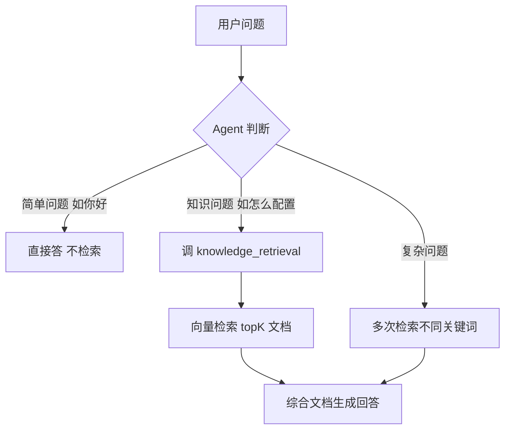
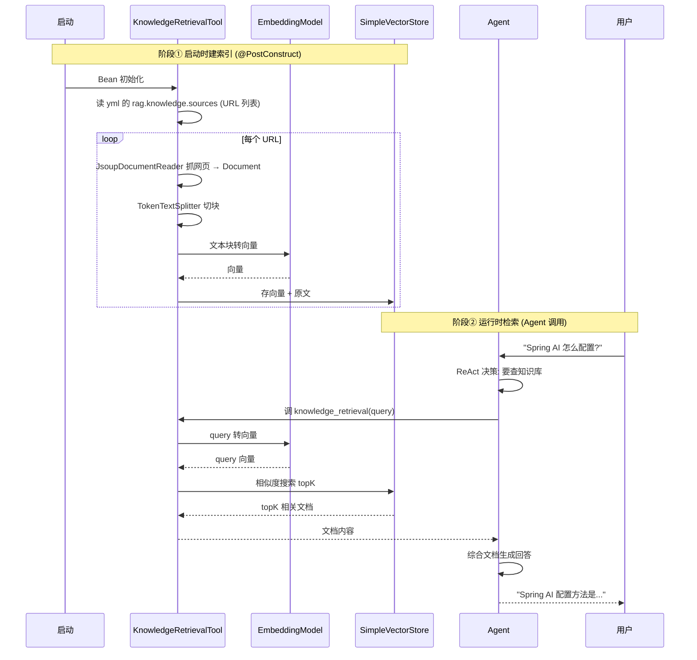

# 模块十四：rag-agent-example —— ReAct + 检索增强

> [← 返回索引](./README.md) | [← 上一模块：rag-example](./13-rag-example.md) | [下一模块：playground-flight-booking →](./15-playground-flight-booking.md)

---

## 一、问题概述

rag-agent-example 回答一个核心问题：**RAG（检索增强生成）在 Agent 体系里到底是什么角色？** 答案出人意料地简单——**RAG 不是独立范式，只是 ReAct 的一个工具**。把「向量检索」包成 Tool 挂给 ReactAgent，Agent 自主决定何时检索，这就是「Agentic RAG」。

## 二、背景知识

### 1. 传统 RAG vs Agentic RAG

```
传统 RAG (固定流程):
  问题 → 必检索 → 生成
  (每次都先检索, 不管问题是否需要)

Agentic RAG (本例, Agent 自主决策):
  问题 → Agent 判断要不要检索
    ├─ 简单问题 ("你好") → 不检索, 直接答
    ├─ 知识问题 ("Spring AI 怎么配置") → 检索 → 答
    └─ 复杂问题 → 可能检索多次, 每次查不同关键词
```

### 2. RAG 的本质在 Agent 体系里

```
你以为的 RAG:  一种独立的 Agent 范式
实际的 RAG:    ReAct + 检索工具 (和"ReAct + 文件工具"结构完全一样)
```

对比第7站 react-agent：

| | 第7站 react-agent | 本站 rag-agent |
|---|---|---|
| Agent | ReactAgent | ReactAgent |
| 工具 | file_read / file_write | knowledge_retrieval |
| 循环 | ReAct 循环 | ReAct 循环 |
| 区别 | 只是工具不同 | 只是工具不同 |

**结构完全一样**，只是工具从「文件操作」换成「知识检索」。

## 三、详细解答

### Why：为什么用 Agentic RAG 而非传统 RAG？

**根本原因是灵活性**。传统 RAG 每次都检索，浪费；Agentic RAG 按需检索，智能：



**Agentic RAG 的优势**：
- 简单问题不浪费检索
- 复杂问题可多次检索（换关键词再查）
- Agent 决定查什么、查几次、怎么用结果

### How：KnowledgeRetrievalTool 的工作机制



**两阶段**：
1. **建索引**（@PostConstruct）：抓文档 → 切块 → 向量化 → 存库
2. **检索**（运行时）：query 向量化 → 相似度搜索 → 返回文档

### Principle：向量检索的原理

```java
// 建索引时: 文本 → 向量
vectorStore.add(splitDocuments);  // 内部调 EmbeddingModel 把每块转成向量

// 检索时: query → 向量 → 余弦相似度比对
SearchRequest searchRequest = SearchRequest.builder().query(request.query()).topK(topK).build();
List<Document> documents = vectorStore.similaritySearch(searchRequest);
```

**为什么能「语义搜索」**：EmbeddingModel 把文本转成高维向量，语义相近的文本向量也相近。检索时算 query 向量和文档向量的余弦相似度，取最相似的 topK 个。这不是关键词匹配，是**语义匹配**——「怎么配置」能匹配到「configuration setup」。

### How：极简的 Agent 配置

```java
@Bean
public ReactAgent ragAgent() throws GraphStateException {
    return ReactAgent.builder()
        .name("rag-agent")
        .description("A RAG agent that can answer questions about Spring AI Alibaba...")
        .model(chatModel)
        .saver(new MemorySaver())
        .tools(knowledgeRetrievalTool.toolCallback())  // ★ 唯一的工具
        .build();
}
```

**就这么简单**——一个 ReactAgent + 一个检索工具。对比第7站 react-agent 的配置，结构一模一样，只是工具换了。**这就是「RAG 是 ReAct 的工具」的铁证**。

### How：Agent 的 ReAct 循环（RAG 版）

```
用户: "Spring AI 怎么配置 DashScope?"

圈1: LLM 想 "这是知识问题, 要查知识库"
     → 调 knowledge_retrieval("Spring AI DashScope 配置")
     → 返回 4 篇相关文档

圈2: LLM 看 "文档提到 application.yml, 但细节不够"
     → 调 knowledge_retrieval("DashScope api-key 配置示例")
     → 返回更多细节文档

圈3: LLM 看 "信息够了, 不用再查"
     → 输出最终回答: "在 application.yml 配置 spring.ai.dashscope.api-key..."
```

**这就是 ReAct 循环**——LLM 决定调工具、看结果、决定再调或输出。和第7站完全一样的机制，只是工具是检索。

## 四、代码逐行解析（KnowledgeRetrievalTool）

```java
@Component  // ① Spring 扫描注册为 Bean
public class KnowledgeRetrievalTool implements BiFunction<Request, ToolContext, String> {

    private final SimpleVectorStore vectorStore;  // ② 内存向量库

    public KnowledgeRetrievalTool(EmbeddingModel embeddingModel) {
        this.vectorStore = SimpleVectorStore.builder(embeddingModel).build();  // ③ 建库
    }

    @PostConstruct
    void initKnowledgeBase() {  // ④ ★启动时建索引
        for (String url : knowledgeSourceUrls) {
            List<Document> documents = new JsoupDocumentReader(url).get();  // 抓文档
            List<Document> splitDocuments = new TokenTextSplitter().apply(documents);  // 切块
            vectorStore.add(splitDocuments);  // 向量化+存库
        }
    }

    @Override
    public String apply(Request request, ToolContext toolContext) {  // ⑤ ★检索逻辑
        SearchRequest searchRequest = SearchRequest.builder()
            .query(request.query()).topK(topK).build();
        List<Document> documents = vectorStore.similaritySearch(searchRequest);  // 相似度搜索
        return documents.stream().map(doc -> "---\n" + doc.getFormattedContent() + "\n---")
            .collect(Collectors.joining("\n\n"));  // 格式化返回给 LLM
    }

    public ToolCallback toolCallback() {  // ⑥ 工具元数据
        return FunctionToolCallback.builder("knowledge_retrieval", this)
            .description("Retrieves relevant information from the Spring AI Alibaba knowledge base...")
            .inputType(Request.class)
            .build();
    }

    public record Request(String query, Integer topK) {}  // ⑦ 入参 schema
}
```

| 步骤 | 作用 | 关键点 |
|------|------|--------|
| ① | @Component | 注册 Bean，可注入 |
| ② | SimpleVectorStore | 内存向量库（生产换 Milvus/PGVector）|
| ③ | 建库 | EmbeddingModel 把文本转向量 |
| ④ | @PostConstruct 建索引 | 抓文档→切块→向量化→存库 |
| ⑤ | apply 检索 | similaritySearch 语义搜索 |
| ⑥ | toolCallback | description 决定 Agent 何时调 |
| ⑦ | Request record | LLM 据此填 query + topK |

## 五、RAG vs ChatMemory vs WebSearch（三种「外部信息」）

| 能力 | 数据来源 | 跨请求 | 例子 |
|------|---------|--------|------|
| ChatMemory | 历史对话 | ✅ | "我刚才说啥" |
| RAG (本站) | 知识库文档 | ✅ (索引) | "Spring AI 怎么配置" |
| WebSearch | 互联网 | ❌ (实时) | "今天新闻" |

**三者都是给 LLM 补充外部信息**，区别在信息来源。在 Agent 体系里，它们都是「工具」。

## 六、与前面模块的对比

| 模块 | Agent | 工具 | 范式 |
|------|-------|------|------|
| 第7站 react-agent | ReactAgent | file_read/file_write | ReAct |
| 第10站 llm-auditor | SequentialAgent | web_search | Reflection |
| 第11站 subagent | ReactAgent (Supervisor) | 子 Agent | Supervisor |
| **本站 rag-agent** | **ReactAgent** | **knowledge_retrieval** | **ReAct (RAG 变体)** |

**本站就是第7站的变体**——同样的 ReactAgent，工具换成检索。

## 七、关键认知

| 问题 | 答案 |
|------|------|
| RAG 是独立范式吗？ | ❌ 不是，是 ReAct 的一个工具 |
| Agentic RAG 和传统 RAG 区别？ | Agent 自主决定检索 vs 固定先检索 |
| 检索怎么实现的？ | 向量相似度搜索（EmbeddingModel 转向量）|
| 为什么切块？ | 长 document 匹配不准 + 超 token |
| Agent 怎么知道何时检索？ | 看 toolCallback 的 description |
| 和 chat-memory 区别？ | RAG 查外部知识，memory 查历史对话 |
| 本站和第7站区别？ | 只是工具不同（file → retrieval）|

## 八、总结

- **核心认知**：RAG 不是独立范式，是 ReAct + 检索工具，结构同第7站
- **Agentic RAG**：Agent 自主决定要不要检索、查什么、查几次，比传统 RAG 智能
- **向量检索原理**：文本 → EmbeddingModel → 向量 → 余弦相似度 → topK
- **两阶段**：启动建索引（抓文档→切块→向量化→存库）+ 运行时检索（query→向量→搜索）
- **KnowledgeRetrievalTool**：BiFunction + FunctionToolCallback，和 WeatherService 同款模式
- **三种外部信息**：ChatMemory（历史）、RAG（知识库）、WebSearch（互联网）都是工具
- **价值**：证明 RAG 在 Agent 体系里只是工具之一，Agent 编排才是核心
