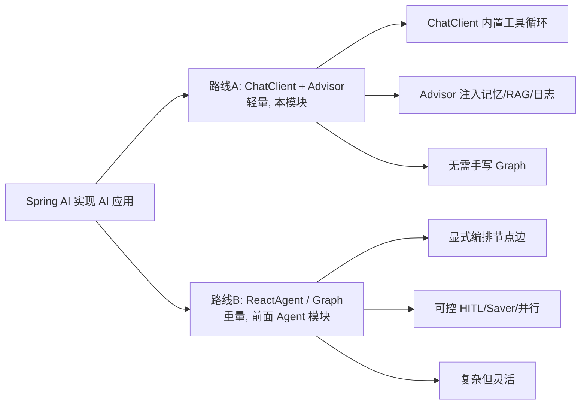
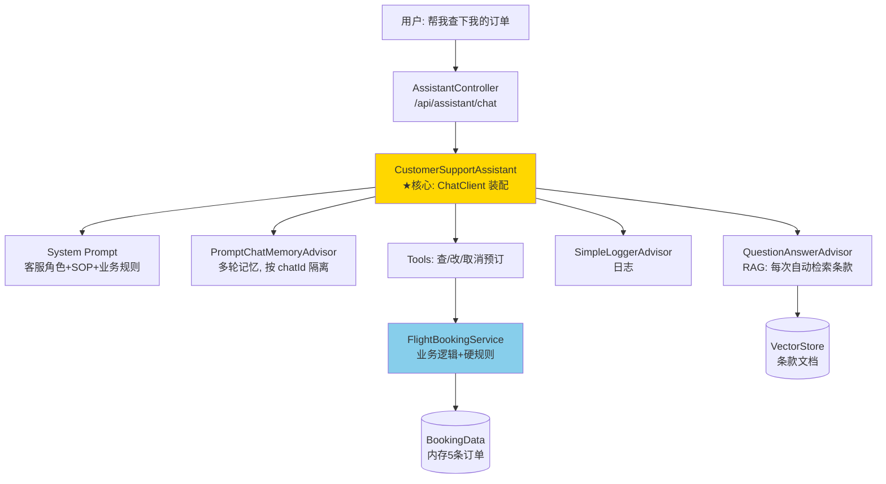
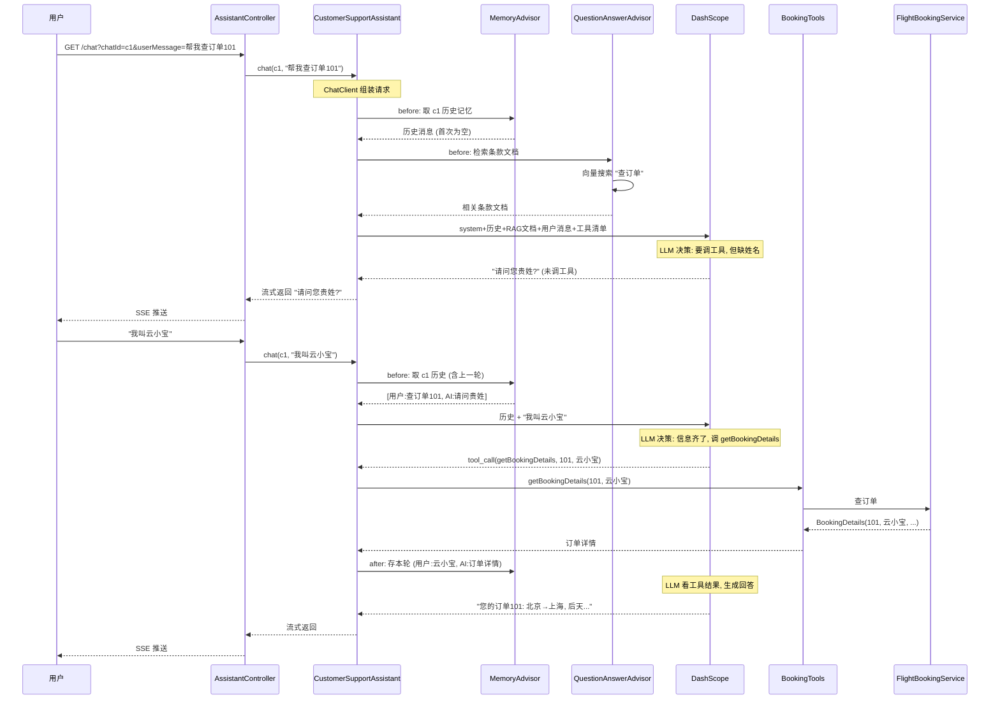
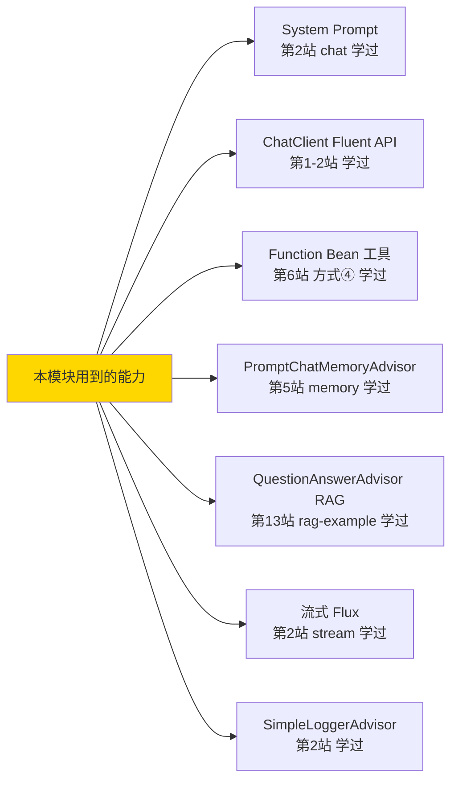

# 模块十五：playground-flight-booking —— 综合实战（毕业作品）

> [← 返回索引](./README.md) | [← 上一模块：rag-agent-example](./14-rag-agent.md)

---

## 一、问题概述

playground-flight-booking 是整个学习路线的**毕业作品**——一个完整的航班预订客服系统。它演示了 Spring AI 的**另一条路线**（ChatClient + Advisor），把前面学的能力（系统提示词、记忆、RAG、工具调用、流式输出）在一个真实业务场景里全串起来。

**最关键的认知**：本模块**没有 ReactAgent、没有 Graph、没有 Saver**——它用更轻的 `ChatClient + Advisor` 路线实现了同样的事。这证明 Spring AI 有两条路线，**复杂度不同，适用场景不同**。

## 二、背景知识：Spring AI 的两条路线



| 维度 | 路线A（本模块）| 路线B（前面模块）|
|------|---------------|----------------|
| 核心 | ChatClient + Advisor | ReactAgent / StateGraph |
| 工具循环 | ChatClient 内置（隐式）| 显式 Graph（preLlm/tool/postTool 节点）|
| 记忆 | PromptChatMemoryAdvisor | Saver + state.messages |
| RAG | QuestionAnswerAdvisor（每次自动检索）| 作为 Tool（Agent 自主决定检索）|
| HITL | ❌ 难做（无暂停机制）| ✅ HumanInTheLoopHook |
| 并行 | ❌ 难做 | ✅ fan-out/fan-in |
| 复杂度 | 低 | 高 |
| 适合 | 客服、问答、简单工具 | 复杂编排、需暂停、多 Agent |

## 三、整体架构



## 四、完整执行流程



**关键点**：
1. **多轮靠 MemoryAdvisor**：chatId 隔离，第二轮能记住第一轮说的内容
2. **RAG 每次 automatic**：QuestionAnswerAdvisor 每次请求都检索（不管需不需要）
3. **工具循环靠 ChatClient 内置**：LLM 决定调工具 → ChatClient 自动执行 → 结果回传 → LLM 继续
4. **没有显式 Graph**：整个流程是 ChatClient 内部驱动的，不用画节点边

## 五、核心代码解析

### 1. CustomerSupportAssistant（核心装配）

```java
public CustomerSupportAssistant(ChatClient.Builder modelBuilder,
                                 VectorStore vectorStore,
                                 ChatMemory chatMemory) {
    this.chatClient = modelBuilder
        // ① System Prompt: 客服角色 + 业务 SOP + 规则
        .defaultSystem("""
            您是"Funnair"航空客服...
            操作前必须获取: 预订号、客户姓名
            改签前检查条款, 收费需用户同意
            今天的日期是 {current_date}.
            """)
        // ② 三个 Advisor: 记忆 + RAG + 日志
        .defaultAdvisors(
            PromptChatMemoryAdvisor.builder(chatMemory).build(),  // 多轮记忆
            QuestionAnswerAdvisor.builder(vectorStore).build(),    // RAG 自动检索
            new SimpleLoggerAdvisor()                              // 日志
        )
        // ③ 三个工具: 查/改/取消
        .defaultToolNames("getBookingDetails", "changeBooking", "cancelBooking")
        .build();
}
```

**四合一装配**：System Prompt + 3 Advisor + 3 工具，一次性绑完。这就是路线A的简洁。

### 2. chat 方法（流式 + 参数注入）

```java
public Flux<String> chat(String chatId, String userMessageContent) {
    return this.chatClient.prompt()
        .system(s -> s.param("current_date", LocalDate.now().toString()))  // 注入今天日期
        .user(userMessageContent)
        .advisors(a -> a
            .param(CONVERSATION_ID, chatId)   // ★ 记忆按 chatId 隔离
            .param(TOP_K, 100))                // RAG 返回100条
        .stream()
        .content();  // 流式返回 Flux<String>
}
```

**两个运行时参数**：
- `CONVERSATION_ID = chatId`：记忆隔离，不同聊天窗口不串扰
- `TOP_K = 100`：RAG 检索返回上限
- `{current_date}` 占位符：让 LLM 知道今天，判断「24h/48h」相对时间

### 3. BookingTools（工具注册 + 业务解耦）

```java
@Bean
@Description("获取机票预定详细信息")
public Function<BookingDetailsRequest, BookingDetails> getBookingDetails() {
    return request -> {
        try {
            return flightBookingService.getBookingDetails(request.bookingNumber(), request.name());
        } catch (Exception e) {
            // ★ 异常不抛给 LLM, 返回稀疏对象让 LLM 优雅降级
            return new BookingDetails(request.bookingNumber(), request.name(), null, null, null, null, null);
        }
    };
}
```

**设计要点**：
- `@Bean + Function + @Description`：第6站学的「方式④ Function Bean」
- 工具只做转发，业务在 `FlightBookingService`，**解耦可独立测试**
- 异常**绝不抛给 LLM**——返回空字段，让 LLM 自然告诉用户「未找到订单」

### 4. FlightBookingService（业务硬规则）

```java
public void changeBooking(...) {
    var booking = findBooking(bookingNumber, name);
    if (booking.getDate().isBefore(LocalDate.now().plusDays(1))) {
        throw new IllegalArgumentException("Booking cannot be changed within 24 hours...");
    }
    // 修改...
}

public void cancelBooking(...) {
    var booking = findBooking(bookingNumber, name);
    if (booking.getDate().isBefore(LocalDate.now().plusDays(2))) {
        throw new IllegalArgumentException("Booking cannot be cancelled within 48 hours...");
    }
    // 取消...
}
```

**业务规则硬编码**：改签提前 24h、取消提前 48h。**System Prompt 里有「软约束」（LLM 应遵守），业务代码里有「硬约束」（强制兜底）**——LLM 是概率系统，涉及真实状态变更必须有确定性代码兜底。

## 六、本模块用到的全部能力（串联前面所学）



**本模块没有用 ReactAgent / Graph / Saver / HITL**——这就是路线A的特点，用更轻的方式组合基础能力。

## 七、两种 RAG 对比（关键认知）

| | 第14站 rag-agent | 本模块 QuestionAnswerAdvisor |
|---|---|---|
| 类型 | Agentic RAG | 传统 RAG |
| 检索触发 | Agent 自主决定 | 每次请求自动检索 |
| 实现 | RAG 作为 Tool | RAG 作为 Advisor |
| 简单问题 | 不检索（省）| 也检索（浪费）|
| 复杂问题 | 可多次检索 | 固定检索一次 |
| 复杂度 | 高（ReactAgent）| 低（Advisor）|

**本模块用传统 RAG**——客服场景每个问题都可能涉及条款，固定检索更简单可靠。

## 八、关键认知

| 问题 | 答案 |
|------|------|
| 本模块用 ReactAgent 了吗？| ❌ 没有，用 ChatClient + Advisor |
| 工具循环靠什么？| ChatClient 内置机制（隐式，非显式 Graph）|
| RAG 怎么做的？| QuestionAnswerAdvisor，每次自动检索（传统 RAG）|
| 多轮记忆靠什么？| PromptChatMemoryAdvisor + chatId |
| 有 HITL 吗？| ❌ 没有（路线A难做暂停）|
| 工具异常怎么处理？| 不抛给 LLM，返回稀疏对象优雅降级 |
| 业务规则在哪？| System Prompt 软约束 + Service 硬约束双保险 |
| 和前面 Agent 模块区别？| 轻量 vs 重量，隐式循环 vs 显式 Graph |

## 九、Spring AI 两条路线怎么选

```
要做客服/问答/简单工具调用?
  → 路线A: ChatClient + Advisor (本模块)
  → 简单, 够用

要做复杂编排/需暂停/多 Agent/并行?
  → 路线B: ReactAgent / Graph (前面模块)
  → 灵活, 可控

不确定?
  → 先用路线A, 不够再升级路线B
```

## 十、毕业总结

恭喜通关！你从 helloworld 到这个综合实战，完整学了 Spring AI Alibaba 的核心：

```
基础层 (4模块):    调用 LLM + 结构化输出 + 记忆
工具层 (1模块):    让 AI 调代码 (4种方式)
智能体层 (3模块):  ReAct + Graph + 并行
高级范式 (2模块):  Reflection + Supervisor
综合 (1模块):      四范式合一 (自建)
应用 (1模块):      RAG Agent
毕业 (1模块):      综合实战 (本模块)
```

### 你现在具备的能力

- ✅ 看懂任何 Spring AI 模块（两条路线都学过）
- ✅ 能判断用什么范式/路线解决实际问题
- ✅ 理解 Agent 的四大范式和组合方式
- ✅ 能从零搭建 AI 应用（客服/助手/RAG/多Agent）

### 后续可探索

- `sql-agent-example` / `skills-agent-example`（ReAct 变体，按需）
- `a2a-*` / `voice-agent-*`（高级，按需）
- 自己动手做一个 AI 应用！

## 十一、总结

- **两条路线**：ChatClient+Advisor（轻，本模块）vs ReactAgent/Graph（重，前面模块）
- **本模块特点**：无 ReactAgent/Graph/Saver，用 Advisor 组合记忆+RAG+工具
- **四合一装配**：System Prompt + 3 Advisor + 3 工具，一次性绑完
- **两种 RAG**：QuestionAnswerAdvisor（自动检索）vs RAG as Tool（自主检索）
- **业务双保险**：System Prompt 软约束 + Service 硬约束
- **工具异常处理**：不抛给 LLM，返回稀疏对象优雅降级
- **流式输出**：Flux<String> + SSE，打字机效果
- **毕业通关**：从 helloworld 到综合实战，Spring AI Alibaba 核心全掌握 🎉
