# Spring AI Alibaba 学习笔记

> 从 helloworld 到 Graph 并行编排的完整学习路径
> 每个模块独立成文，含架构图、关键代码、深度解析

---

## 学习路线图

```mermaid
graph LR
    A[helloworld] --> B[chat-example]
    B --> C[structured-example]
    C --> D[chat-memory-example]
    D --> E[tool-calling-example]
    E --> F[react-agent-example]
    F --> G[graph-example/react]
    G --> H[graph-example/parallel-node]
    H --> I[llm-auditor]
    
    style A fill:#90EE90
    style B fill:#90EE90
    style C fill:#90EE90
    style D fill:#90EE90
    style E fill:#FFD700
    style F fill:#FFA500
    style G fill:#FFA500
    style H fill:#FF6347
    style I fill:#FF6347
```



## 模块索引

| 阶段 | 序号 | 模块 | 文档 | 核心能力 |
|------|------|------|------|---------|
| 🟢 基础层 | 01 | helloworld | [01-helloworld.md](./01-helloworld.md) | 跑通最小调用 |
| 🟢 基础层 | 02 | chat-example | [02-chat-example.md](./02-chat-example.md) | 调用层全解 |
| 🟢 基础层 | 03 | structured-example | [03-structured-example.md](./03-structured-example.md) | 结构化输出 |
| 🟢 基础层 | 04 | chat-memory-example | [04-chat-memory-example.md](./04-chat-memory-example.md) | 多轮记忆 |
| 🟡 工具层 | 05 | tool-calling-example | [05-tool-calling-example.md](./05-tool-calling-example.md) | 让 AI 调代码 |
| 🟠 智能体 | 06 | react-agent-example | [06-react-agent-example.md](./06-react-agent-example.md) | ReAct 智能体 |
| 🟠 智能体 | 07 | graph-example/react | [07-graph-react.md](./07-graph-react.md) | Graph 实现 ReAct |
| 🟠 智能体 | 08 | graph-example/parallel-node | [08-graph-parallel-node.md](./08-graph-parallel-node.md) | 并行编排 |
| 🔴 高级 | 09 | adk-samples-llm-auditor | [09-llm-auditor.md](./09-llm-auditor.md) | Reflection 范式 |

## 三大阶段

| 阶段 | 模块 | 核心能力 |
|------|------|---------|
| 🟢 基础层 | helloworld → memory | 让 LLM 回答、输出结构化、记住上下文 |
| 🟡 工具层 | tool-calling | 让 LLM 调用代码 |
| 🟠 智能体层 | react-agent → parallel-node | 让 LLM 自主决策、多步推理、并行编排 |

## 核心心智模型

```
所有 LLM 框架的本质:
  在「调 LLM」这个动作前后, 标准化地加处理层, 以补偿 LLM 的固有限制

  ┌─────────────────────────────────────┐
  │           你的业务代码                │
  │       chatClient.prompt             │
  └──────────────┬──────────────────────┘
                 │
    ┌────────────▼────────────┐
    │ Advisor: 日志/记忆/RAG   │  ← 改请求/改响应
    └────────────┬────────────┘
                 │
    ┌────────────▼────────────┐
    │ Prompt 模板              │  ← 加提示词
    └────────────┬────────────┘
                 │
    ┌────────────▼────────────┐
    │ Tool Calling             │  ← 让 LLM 能调代码
    └────────────┬────────────┘
                 │
    ┌────────────▼────────────┐
    │ OutputConverter          │  ← 约束输出
    └────────────┬────────────┘
                 │
    ┌────────────▼────────────┐
    │ ChatModel.call(prompt)   │  ← 真正调 LLM API
    └─────────────────────────┘
```

## 框架本质的统一视角

```
所有模块都在做同一件事: 在「调 LLM」前后加层

  helloworld:        裸调 LLM
  chat-example:      + Advisor + Options + 多模态
  structured:        + OutputConverter (格式约束)
  memory:            + ChatMemory Advisor (历史注入)
  tool-calling:      + Tool (让 LLM 调代码)
  react-agent:       + 循环 + HITL + Saver
  graph/react:       + Graph (可视化循环)
  parallel-node:     + 并行边 (fan-out/fan-in)

每一层都是在补偿 LLM 的固有限制:
  没有记忆    → Memory 层
  不知道实时  → RAG/Web Search 层
  不会执行    → Tool Calling 层
  输出不可控  → OutputConverter 层
  单次不聪明  → Agent/Graph 循环层
```

## 下一步学习路径

```
当前位置: llm-auditor (Reflection 范式) ✅
   │
   ▼
第 5 站: subagent-personal-assistant (Multi-Agent)
   │       主 Agent 调度子 Agent
   ▼
第 6 站: rag-agent-example (ReAct + 检索)
   │
   ▼
第 9 站: playground-flight-booking (综合实战)
```

## 关键概念速查

| 概念 | 一句话解释 |
|------|-----------|
| ChatModel | 底层 LLM 引擎，返回完整 ChatResponse |
| ChatClient | 高级 Fluent API，链式调用 |
| Advisor | LLM 调用层拦截器（before/after）|
| ToolInterceptor | 工具调用层拦截器 |
| PromptTemplate | 提示词模板，支持占位符 |
| BeanOutputConverter | 把 LLM 输出转成 Java Bean |
| ResponseFormat | 服务端约束模型输出 JSON |
| ChatMemory | 对话历史持久化（跨请求）|
| Saver | 图执行状态快照（暂停/恢复）|
| NodeAction | Graph 节点接口，返回状态更新 Map |
| EdgeAction | Graph 边接口，返回下一个节点名 |
| fan-out | 一个节点多条出边（并行分发）|
| fan-in | 多个节点汇聚到一个节点（收集）|
| node_async | 把同步节点包成异步执行 |
| ReactAgent | ReAct 范式的开箱即用实现 |
| CompiledGraph | 编译后的可执行图 |
| OverAllState | 图的共享状态（黑板模式）|
| HITL | Human-In-The-Loop，人工介入 |
| internalToolExecutionEnabled | 控制循环由 LLM 还是 Graph 接管 |

---

> **文档生成日期**: 2026-07-06
> **覆盖模块**: 9 个核心模块
> **学习进度**: 基础层 ✅ → 工具层 ✅ → 智能体层 ✅ → 高级范式 🟡 (进行中)
