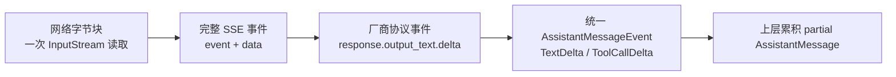
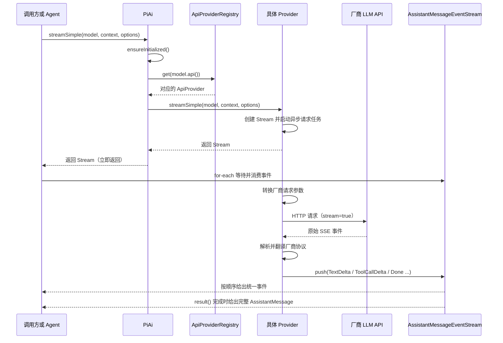

# 阶段一：pi-ai-core 学习文档

> 本文档带你系统性地学习 pi-momo-java 的底层核心模块 **pi-ai-core**，包含完整的类型体系、事件流机制、注册表架构、统一入口和工具类。建议边读本文档边打开对应源码文件对照学习。

---

## 一、模块概览

**pi-ai-core** 是整个项目的基础层，不依赖任何其他项目模块。它定义了：

- **消息类型**：LLM 对话中所有消息和内容的数据结构
- **事件流**：生产者-消费者模式的异步流式处理框架
- **注册表**：Provider 和 Model 的注册与查找机制
- **统一入口**：对外暴露的静态门面（Facade）类
- **工具类**：JSON 处理、流式解析、环境变量等辅助功能

### 模块依赖关系

```
pi-ai-core
  ├── types/      ← 消息、内容、模型、用量等数据结构
  ├── event/      ← 事件流框架（EventStream）
  ├── registry/   ← Provider 注册表（ApiProviderRegistry）
  ├── stream/     ← 统一入口（PiAi）
  └── util/       ← 工具类
```

### 外部依赖

仅依赖 Jackson（JSON 序列化/反序列化）和 SLF4J（日志），无其他项目内模块依赖。

---

## 二、类型体系（types/ 包）— 35 个文件

> 类型体系是整个项目的"语言"，所有模块都基于这些类型进行通信。建议按以下顺序逐个文件阅读。

### 2.1 消息体系（Message 家族）

#### 2.1.1 Message.java — 消息的顶层接口

**文件：** `types/Message.java`

```
sealed interface Message
    permits UserMessage, AssistantMessage, ToolResultMessage
```

这是整个项目最核心的接口，定义了所有 LLM 消息类型的统一契约。

**关键设计：**

- **`sealed interface`（Java 17 密封接口）**：限制只能被 `UserMessage`、`AssistantMessage`、`ToolResultMessage` 三种类型实现。编译器确保所有子类型都在已知范围内，配合 `switch` 的模式匹配时无需 `default` 分支。
- **`@JsonTypeInfo` + `@JsonSubTypes`**：Jackson 多态反序列化。JSON 中的 `role` 字段值决定反序列化为哪个具体类：
  - `"user"` → `UserMessage`
  - `"assistant"` → `AssistantMessage`
  - `"toolResult"` → `ToolResultMessage`
- **两个方法**：`role()` 返回角色标识，`timestamp()` 返回创建时间戳

**思考题：** 为什么 `role` 字段既作为 Jackson 的 `property` 又设置为 `visible = true`？

<details>
<summary>答案</summary>
`visible = true` 表示反序列化后，`role` 字段的值仍然保留在 JSON 中，而不是被 Jackson 消费掉。这样序列化后再反序列化能得到相同的 JSON 结构。
</details>

---

#### 2.1.2 UserMessage.java — 用户消息

**文件：** `types/UserMessage.java`

```java
public record UserMessage(String role, Object content, long timestamp) implements Message {
    // content 可以是 String，也可以是 List<UserContentBlock>
}
```

**关键设计：**

- **`record`（Java 16 记录类型）**：自动生成构造器、getter、`equals()`、`hashCode()`、`toString()`。`record` 天然不可变，适合作为值对象。
- **`content` 字段**：类型为 `Object`，实际支持两种受约束的形态：纯文本 `String`，或者 `List<UserContentBlock>`。后者可以组合 `TextContent` 与 `ImageContent`，用于多模态输入。
- **`role` 语义固定为 `"user"`**：它是 record 组件之一，便于 JSON 序列化；便捷构造器和反序列化构造器会把缺省值设置为 `"user"`。

**对比 `AssistantMessage`：** `UserMessage` 使用 `record`（不可变，内容简单），而 `AssistantMessage` 使用普通类（可变，因为流式过程中内容逐步累积）。这是设计上的重要区别，理解了这一点就理解了为什么 `AssistantMessage` 不用 record。

---

#### 2.1.3 AssistantMessage.java — 助手消息

**文件：** `types/AssistantMessage.java`

**关键设计：**

- **使用普通类而非 record**：因为流式过程中，content、usage 等字段需要逐步累积。`setContent()`、`setUsage()` 等 setter 方法专为流式场景设计。
- **`AssistantContentBlock` 内容块列表**：消息可以包含文本、思考过程、工具调用等多种内容块。
- **`Builder` 模式**：通过 `AssistantMessage.builder()` 的链式调用构建实例。
- **`StopReason` 停止原因**：`STOP`（正常结束）、`ERROR`（错误）、`ABORTED`（中止）等。
- **`Usage` 用量统计**：输入/输出 token 数、缓存命中率等。
- **`@JsonInclude(NON_NULL)`**：只序列化非 null 字段，减少 JSON 体积。

**字段一览：**

| 字段 | 类型 | 说明 |
|------|------|------|
| `role` | `String` | 固定为 "assistant" |
| `content` | `List<AssistantContentBlock>` | 响应内容块列表 |
| `api` | `String` | API 协议标识（如 "anthropic-messages"） |
| `provider` | `String` | 提供商名称（如 "anthropic"） |
| `model` | `String` | 模型名称（如 "claude-sonnet-4"） |
| `usage` | `Usage` | Token 用量统计 |
| `stopReason` | `StopReason` | 停止原因 |
| `errorMessage` | `String` | 错误信息 |
| `timestamp` | `long` | 创建时间戳 |

---

#### 2.1.4 ToolResultMessage.java — 工具执行结果

**文件：** `types/ToolResultMessage.java`

**关键设计：**
- `record` 类型，不可变
- `toolCallId`：关联到哪个工具调用
- `content`：工具执行返回的内容（文本或 JSON）
- `isError`：是否执行出错

---

### 2.2 内容块体系（ContentBlock 家族）

#### 2.2.1 ContentBlock.java — 内容块的顶层接口

**文件：** `types/ContentBlock.java`

```
sealed interface ContentBlock
    permits UserContentBlock, AssistantContentBlock
```

**作用：** 定义内容块的通用契约，Jackson 基于 `type` 字段进行多态反序列化。

**注意：** `ContentBlock` 本身不是直接 permits 具体内容类型，而是 permits 两个中间接口 `UserContentBlock` 和 `AssistantContentBlock`，它们再分别 permits 具体的内容类型。

```
ContentBlock (sealed)
  ├── UserContentBlock (sealed)    ← 用户消息中的内容块
  │     permits TextContent, ImageContent
  └── AssistantContentBlock (sealed) ← 助手消息中的内容块
        permits TextContent, ThinkingContent, ToolCall
```

**为什么分两层？** 用户消息和助手消息支持的内容块类型不同：
- 用户消息可以包含：`text`（文本）、`image`（图片）
- 助手消息可以包含：`text`（文本）、`thinking`（思考过程）、`toolCall`（工具调用）

这种分层设计在类型系统层面就保证了内容块不会出现在错误的消息类型中。

---

#### 2.2.2 TextContent.java — 文本内容块

**文件：** `types/TextContent.java`

```java
public record TextContent(String text) implements UserContentBlock, AssistantContentBlock {
    @Override public String type() { return "text"; }
}
```

最常用的内容块类型，同时实现了 `UserContentBlock` 和 `AssistantContentBlock`，所以既可以在用户消息中使用，也可以在助手消息中使用。

---

#### 2.2.3 ImageContent.java — 图片内容块

**文件：** `types/ImageContent.java`

```java
public record ImageContent(String source, String mediaType, String data)
    implements UserContentBlock {
    @Override public String type() { return "image"; }
}
```

**关键设计：**
- `source`：图片来源（"base64" 或 "url"）
- `mediaType`：MIME 类型（如 "image/jpeg"、"image/png"）
- `data`：base64 编码的数据或 URL
- 仅实现 `UserContentBlock`，所以不能出现在助手消息中

---

#### 2.2.4 ThinkingContent.java — 思考过程内容块

**文件：** `types/ThinkingContent.java`

```java
public record ThinkingContent(String thinking, String signature)
    implements AssistantContentBlock {
    @Override public String type() { return "thinking" }; }
}
```

**关键设计：**
- 仅实现 `AssistantContentBlock`，所以只出现在助手消息中
- `thinking`：模型的思考过程文本（Chain-of-Thought）
- `signature`：签名，用于验证思考内容的完整性（某些模型提供）
- 仅出现在启用了推理（reasoning）的调用中

---

#### 2.2.5 ToolCall.java — 工具调用内容块

**文件：** `types/ToolCall.java`

```java
public record ToolCall(String id, String name, String arguments)
    implements AssistantContentBlock {
    @Override public String type() { return "toolCall" }; }
}
```

**关键设计：**
- 仅实现 `AssistantContentBlock`，所以只出现在助手消息中
- `id`：工具调用的唯一标识，后续 `ToolResultMessage` 通过此 ID 关联结果
- `name`：要调用的工具名称
- `arguments`：JSON 格式的参数

---

### 2.3 模型与配置（Model、Usage 等）

#### 2.3.1 Model.java — 模型定义

**文件：** `types/Model.java`

```java
public record Model(String id, String provider, String api,
                    String endpoint, String deployment, ModelCost cost) {}
```

**关键设计：**
- `id`：模型名称（如 "claude-sonnet-4-20250514"）
- `provider`：提供商名称（如 "anthropic"）
- `api`：API 协议标识（如 "anthropic-messages"），用于路由到对应的 `ApiProvider`
- `endpoint`：自定义 endpoint（可选，用于私有部署）
- `deployment`：部署名称（可选，用于 Azure 等）
- `cost`：模型成本信息

`Model` 是连接 `PiAi` 入口和 `ApiProvider` 实现的桥梁。`PiAi.stream(model, ...)` 先根据 `model.api()` 找到对应的 `ApiProvider`，然后调用该 Provider 的 `stream()` 方法。

---

#### 2.3.2 ModelCost.java — 模型成本

**文件：** `types/ModelCost.java`

```java
public record ModelCost(double inputPerMillion, double outputPerMillion,
                        double cacheInputPerMillion, double cacheOutputPerMillion,
                        double thinkingPerMillion) {}
```

记录每百万 token 的定价，用于计算调用成本。

---

#### 2.3.3 Usage.java — Token 用量

**文件：** `types/Usage.java`

```java
public record Usage(int inputTokens, int outputTokens, int cacheReadTokens,
                    int cacheWriteTokens, int thinkingTokens, Cost cost) {
    public record Cost(double inputCost, double outputCost,
                      double cacheReadCost, double cacheWriteCost,
                      double thinkingCost) {}
}
```

**关键设计：**
- `inputTokens` / `outputTokens`：输入输出 token 数
- `cacheReadTokens` / `cacheWriteTokens`：缓存读/写 token 数（用于提示词缓存场景）
- `thinkingTokens`：推理过程 token 数
- `Cost` 内部 record：根据 token 数和模型定价计算出的费用

---

#### 2.3.4 MutableUsage.java — 可变 Usage

**文件：** `types/MutableUsage.java`

**关键设计：** `Usage` 是 `record`（不可变），而 `MutableUsage` 是可变版本，用于在流式过程中逐步累加 token 用量。流式结束后，可以通过 `toUsage()` 或 `toImmutable()` 转换为不可变的 `Usage`。

---

### 2.4 枚举与常量

#### 2.4.1 StopReason.java — 停止原因

**文件：** `types/StopReason.java`

```java
public enum StopReason {
    STOP,          // 正常结束（模型完成输出）
    ERROR,         // 错误终止
    ABORTED,       // 被用户中止
    MAX_TOKENS,    // 达到最大 token 限制
    TOOL_USE,      // 模型请求调用工具
    CONTENT_FILTER // 内容被过滤器拦截
}
```

#### 2.4.2 Transport.java — 传输协议

**文件：** `types/Transport.java`

```java
public enum Transport {
    SSE,       // Server-Sent Events（主流方式）
    WEBSOCKET  // WebSocket 协议
}
```

#### 2.4.3 ThinkingLevel.java — 思考级别

**文件：** `types/ThinkingLevel.java`

控制模型推理深度的枚举，从无推理到深度推理。

---

### 2.5 选项与配置

#### 2.5.1 StreamOptions.java — 流式选项接口

**文件：** `types/StreamOptions.java`

```java
public interface StreamOptions {
    Double temperature();
    Double topP();
    Integer maxTokens();
    List<String> stop();
    // ... 其他流式参数
    boolean reasoning();
    Integer thinkingBudgets();
}
```

定义了所有流式调用可能需要的参数。接口而非类，便于不同实现提供不同级别的配置。

#### 2.5.2 SimpleStreamOptions.java — 简化的流式选项

**文件：** `types/SimpleStreamOptions.java`

`StreamOptions` 的默认实现，使用 Builder 模式构建。包含了最常用的参数。

#### 2.5.3 Context.java — 请求上下文

**文件：** `types/Context.java`

```java
public class Context {
    private String systemPrompt;
    private List<Message> messages;
    private List<Tool> tools;
    // Builder 模式
}
```

包含一次 LLM 调用所需的所有上下文信息：系统提示词、消息历史、工具定义。

---

### 2.6 其他类型

#### 2.6.1 CancellationSignal.java — 取消信号

**文件：** `types/CancellationSignal.java`

**关键设计：** 基于 `volatile boolean` 的取消机制。当 `cancel()` 被调用时，正在流式读取的线程可以检查 `isCancelled()` 并提前终止。这是一种轻量级的协作式取消模式，比 `Thread.interrupt()` 更安全。

#### 2.6.2 PayloadInterceptor.java — 请求拦截器

**文件：** `types/PayloadInterceptor.java`

函数式接口，用于在请求发送前拦截和记录请求体，通常用于调试和日志记录。

#### 2.6.3 Tool.java — 工具定义

**文件：** `types/Tool.java`

定义 LLM 可以调用的工具，包含名称、描述和输入参数的 JSON Schema。

#### 2.6.4 兼容适配层

| 文件 | 说明 |
|------|------|
| `OpenAICompletionsCompat.java` | OpenAI Completions API 兼容适配 |
| `OpenAIResponsesCompat.java` | OpenAI Responses API 兼容适配 |
| `OpenRouterRouting.java` | OpenRouter 路由配置 |
| `VercelGatewayRouting.java` | Vercel Gateway 路由配置 |

---

## 三、事件流体系（event/ 包）— 3 个文件

### 3.1 EventStream.java — 核心事件流基础设施

**文件：** `event/EventStream.java`

**这是整个项目最核心的基础设施之一。** 理解了这个类，就理解了 pi-momo-java 的异步流式处理哲学。

#### 核心设计：生产者-消费者模式

```
生产者线程（Provider）
  ┌──────────────────────┐
  │ stream.push(event1)  │
  │ stream.push(event2)  │
  │ stream.push(event3)  │
  │ stream.end(result)   │
  └──────────┬───────────┘
             │ LinkedBlockingQueue
             ▼
  ┌──────────────────────┐
  │ for (E event : stream)│
  │   process(event)     │
  │ stream.result().join()│
  └──────────────────────┘
消费者线程（Agent 调用方）
```

#### 关键技术点

**1. 泛型参数：`EventStream<E, R>`**
- `E`（Event）：流中传递的事件类型
- `R`（Result）：流终止时产出的最终结果类型

**2. 阻塞队列：`LinkedBlockingQueue<Object>`**
- 线程安全，FIFO 顺序
- 生产者和消费者可以在不同线程中并发操作
- 使用 `Object` 作为泛型擦除后的统一类型

**3. 哨兵值（Sentinel）模式**
```java
private static final Object SENTINEL = new Object();
```
- 特殊的标记对象，放入队列通知迭代器流已结束
- 哨兵值会被放回队列，以便多个迭代器都能收到结束信号
- 使用 `Object` 类型避免泛型擦除问题

**4. 自动终止 vs 显式终止**
- **自动终止**：`push()` 时检查 `isComplete` 谓词，满足条件时自动提取结果并标记完成
- **显式终止**：调用 `end(result)` 手动标记完成

**5. 幂等性保证**
- `push()` 在流结束后静默忽略
- `end()` 可多次调用，不会产生副作用
- `close()` 使用 try-with-resources 安全关闭

**6. `Iterable<E>` 接口实现**
- 支持 `for (E event : stream)` 语法
- `iterator()` 返回阻塞式迭代器，`hasNext()` 会阻塞等待新事件
- 线程中断时优雅退出

**7. `AutoCloseable` 接口实现**
- 支持 try-with-resources 语法
- `close()` 在流未结束时自动调用 `end()`

#### 两个构造参数详解

```java
public EventStream(
    Predicate<E> isComplete,      // 判断事件是否代表流结束
    Function<E, R> extractResult   // 从结束事件中提取最终结果
)
```

**`isComplete` 示例：**
```java
// 当事件是 Done 或 Error 时，流结束
event -> event instanceof AssistantMessageEvent.Done
     || event instanceof AssistantMessageEvent.Error
```

**`extractResult` 示例：**
```java
// 从 Done 事件中提取 AssistantMessage，从 Error 事件中提取错误消息
event -> {
    if (event instanceof AssistantMessageEvent.Done d) return d.message();
    if (event instanceof AssistantMessageEvent.Error e) return e.error();
    throw new IllegalStateException("Unexpected terminal event");
}
```

---

### 3.2 AssistantMessageEvent.java — 助手消息事件

**文件：** `event/AssistantMessageEvent.java`

`sealed interface`，定义了 LLM 流式响应过程中的所有事件类型：

```
AssistantMessageEvent (sealed interface)
  ├── Start          ← 消息开始
  ├── TextStart      ← 文本内容块开始
  ├── TextDelta      ← 文本增量
  ├── TextEnd        ← 文本结束
  ├── ThinkingStart  ← 思考内容块开始
  ├── ThinkingDelta  ← 思考过程增量
  ├── ThinkingEnd    ← 思考过程结束
  ├── ToolCallStart  ← 工具调用开始
  ├── ToolCallDelta  ← 工具参数 JSON 增量
  ├── ToolCallEnd    ← 工具调用结束
  ├── Done           ← 流正常完成（含完整消息）
  └── Error          ← 流错误终止（含错误消息）
```

**事件流典型顺序：**
```
Start → TextDelta × N → TextEnd → Done
Start → TextDelta × N → TextEnd → ToolCallStart → ToolCallEnd → Done
Start → ThinkingDelta × N → ThinkingEnd → TextDelta × N → TextEnd → Done
Start → TextDelta × N → Error
```

---

### 3.3 AssistantMessageEventStream.java — 特化事件流

**文件：** `event/AssistantMessageEventStream.java`

**关键设计：**
- 继承 `EventStream<AssistantMessageEvent, AssistantMessage>`
- 固定泛型参数：事件类型为 `AssistantMessageEvent`，结果类型为 `AssistantMessage`
- 终止条件：`Done` 或 `Error` 事件
- 提供 `create()` 工厂方法

#### 把它理解成“统一事件通道”

`EventStream` 保存的不是一整条回复，也不只保存文本字符串；队列中的每一项都是一个**带类型的事件对象**。例如，一次普通文本回复可能依次产生：

```text
Start → TextStart → TextDelta("你") → TextDelta("好") → TextEnd → Done
```

其中 `TextDelta` 是一小段文本，`ThinkingDelta` 是一小段思考内容，`ToolCallDelta` 是一小段工具参数 JSON；`Start`、`Done`、`Error` 则是生命周期事件。`Done`/`Error` 到来时，`result()` 才能取得完整的 `AssistantMessage`。

需要特别区分两件事：

- **远端 SSE**：OpenAI、Anthropic 等服务通过 HTTP 返回的原始协议数据，例如 OpenAI 的 `response.output_text.delta`。
- **本地 EventStream**：Provider 将原始协议翻译为 `AssistantMessageEvent` 后，通过 `stream.push(event)` 写入的内部队列；Agent 或应用再用 `for-each` 逐个消费。

因此 `EventStream` 是“Provider 生产事件、上层消费事件”的实时通道，不是会话历史数据库。完整消息的持久化由 Agent / Session 层负责。

#### “一段流”到底对应什么

流式传输需要区分四个层次，它们不是一一对应的：



- 一次网络读取可能只有半个 SSE 事件，也可能包含多个 SSE 事件，SSE 解析器必须先按协议边界重组。
- 一个厂商 SSE 事件由具体 Provider 解释；它可能被忽略，也可能转换为一个或多个统一事件。
- `EventStream` 队列每次保存的是一个**统一类型事件**，不是原始网络字节，也不是每次都保存一条完整 `Message`。
- `TextDelta` 等事件通常携带本次增量以及当前 partial；消费者既可以追加 delta，也可以用 partial 替换当前显示内容。

例如模型生成“你好”时，内部可能经历：

```text
网络读取 → SSE(data="你") → TextDelta("你") → partial AssistantMessage("你")
网络读取 → SSE(data="好") → TextDelta("好") → partial AssistantMessage("你好")
SSE(response.completed) → Done → final AssistantMessage("你好")
```

所以“边返回边展示”是上层消费事件后的效果，不是 Provider 直接把每个网络包当成完整消息输出给前端。

---

## 四、注册表体系（registry/ 包）— 3 个文件

### 4.1 ApiProvider.java — Provider 接口

**文件：** `registry/ApiProvider.java`

定义了 LLM 服务提供商的核心接口，每种 API 协议（如 Anthropic、OpenAI）都需要实现此接口。

**两个核心方法：**
- `stream(Model, Context, StreamOptions)` — 完整流式调用
- `streamSimple(Model, Context, SimpleStreamOptions)` — 带推理参数的简化调用

**设计思路：** 策略模式。每个 Provider 是一种策略，`PiAi` 根据 `model.api()` 选择对应的策略执行。

---

### 4.2 ApiProviderRegistry.java — Provider 注册表

**文件：** `registry/ApiProviderRegistry.java`

**关键设计：**
- 全局单例注册表（`ConcurrentHashMap<String, ApiProvider>`）
- `register(String api, ApiProvider provider)` — 注册 Provider
- `get(String api)` — 根据 API 协议查找 Provider
- 线程安全，支持并发注册

**典型使用方式：**
```java
// 在应用启动时注册
ApiProviderRegistry.register(new AnthropicProvider(), "builtin");
ApiProviderRegistry.register(new OpenAIResponsesProvider(), "builtin");

// 在调用时查找
ApiProvider provider = ApiProviderRegistry.get("anthropic-messages");
```

注册表的键来自 `provider.api()`，调用时必须与 `model.api()` 完全一致。它保存的是“**API 协议标识 → Provider 实现**”的映射，而不是简单的“厂商名称 → Provider”。例如 `openai-responses` 和 `openai-codex-responses` 可以路由到不同 Provider。

---

### 4.3 ModelRegistry.java — 模型注册表

**文件：** `registry/ModelRegistry.java`

**关键设计：**
- 管理模型 ID 到 `Model` 对象的映射
- 支持按提供商、API 协议等维度查询模型
- 提供已知模型的预定义列表

---

## 五、统一入口（stream/ 包）— 1 个文件

### 5.1 PiAi.java — 统一门面入口

**文件：** `stream/PiAi.java`

**这是整个 pi-ai-core 模块对外暴露的核心入口。** 所有 LLM 调用都通过此类发起。

#### 设计模式：门面模式（Facade Pattern）

```
                    ┌──────────────┐
                    │    PiAi      │ ← 统一门面
                    └──────┬───────┘
                           │
              ┌────────────┼────────────┐
              │            │            │
              ▼            ▼            ▼
        Anthropic      OpenAI      Google
        Provider       Provider    Provider
```

#### 提供的四个静态方法

| 方法 | 参数 | 返回 | 说明 |
|------|------|------|------|
| `stream()` | `Model, Context, StreamOptions` | `AssistantMessageEventStream` | 完整流式调用 |
| `complete()` | `Model, Context, StreamOptions` | `CompletableFuture<AssistantMessage>` | 非流式调用（内部复用流式） |
| `streamSimple()` | `Model, Context, SimpleStreamOptions` | `AssistantMessageEventStream` | 带推理参数的流式调用 |
| `completeSimple()` | `Model, Context, SimpleStreamOptions` | `CompletableFuture<AssistantMessage>` | 带推理参数的非流式调用 |

`complete()` / `completeSimple()` 并没有切换成另一套非流式 HTTP 协议；它们内部仍调用对应的流式方法，只是不把中间事件暴露给调用方，而是等待 `stream.result()` 完成后返回最终 `AssistantMessage`。

#### 调用流程

```
PiAi.stream(model, context, options)
  │
  ├─ 1. ensureInitialized()
  │     └─ 首次调用时执行宿主提供的 initializer.initialize()
  │           └─ initializer 通常负责向 ApiProviderRegistry 注册 Provider
  │
  ├─ 2. resolveProvider(model.api())
  │     └─ 从 ApiProviderRegistry 中查找 API 协议对应的 Provider
  │
  └─ 3. provider.stream(model, context, options)
        └─ 委托给具体 Provider 执行 HTTP 调用
              └─ 返回 AssistantMessageEventStream
```

#### 延迟初始化机制

```java
private static volatile Initializer initializer;
private static final AtomicBoolean initialized = new AtomicBoolean(false);
```

- `setInitializer(Initializer)` — 由应用启动代码或宿主模块显式配置；它只保存初始化回调，不会立即注册 Provider
- `ensureInitialized()` — 使用 `AtomicBoolean.compareAndSet` 实现无锁化的"仅执行一次"语义
- 双重检查：先 volatile 读快速跳过，再 CAS 原子抢锁

**为什么不用 synchronized？** 避免锁竞争，`stream()` 方法可能被高频调用，CAS 的开销远小于同步块。

> 注意：`PiAi` 的延迟初始化依赖宿主先调用 `setInitializer(...)`，或者自行向 `ApiProviderRegistry` 注册 Provider。仅仅把 `pi-ai-providers` 放进 classpath 并不会从这里自动完成注册；找不到 `model.api()` 对应 Provider 时，`resolveProvider()` 会抛出 `IllegalStateException`。

#### PiAi、Provider 与 Agent 的职责边界

`pi-ai-core` 的目标不是直接完成“聊天 Agent”，而是提供一套不依赖厂商协议的统一模型调用规范：

| 层级 | 主要责任 | 不负责什么 |
|------|----------|------------|
| `PiAi` | 初始化、按 `model.api()` 路由、委托 Provider | 不组装业务提示词、不解析厂商 SSE、不执行工具 |
| `ApiProvider` 实现（位于 `pi-ai-providers`） | 将 `Context` 转为厂商请求、发送 HTTP/SSE、将厂商事件转为统一事件 | 不决定 Agent 是否继续对话或执行工具 |
| `EventStream` | 在线程间按顺序传递统一事件，并提供最终结果 Future | 不保存会话历史、不理解模型协议 |
| `pi-agent-core` | 组装 Agent 上下文、消费事件、更新状态、执行工具、决定下一轮调用 | 不关心 OpenAI/Anthropic 的原始 SSE 事件名 |

从定位上看，PiAi 与 Spring AI 的模型适配层属于同一类抽象：都用统一类型屏蔽不同模型厂商的接口差异。但 PiAi 更轻量，主要覆盖模型、消息、Provider 路由和事件流；Spring AI 还提供 Spring Boot 自动配置、ChatClient、VectorStore、RAG、Advisor 等更完整的 Spring 生态能力。因此更准确的类比是“PiAi 类似项目内自研的精简模型适配层”，而不是“整个 PiAi 项目等同于 Spring AI”。

例如，OpenAI 返回的 `response.output_text.delta` 不是 `EventStream` 事件本身；OpenAI Provider 会把它翻译为 `AssistantMessageEvent.TextDelta`，然后 `push` 到 `AssistantMessageEventStream`。换成 Anthropic 或 Gemini 时，原始事件名不同，但 Agent 仍然只消费统一的 `TextDelta`、`ToolCallDelta`、`Done`、`Error` 等事件。

#### 请求与响应的双向协议转换

PiAi 使用的 `Message` 是项目内部的厂商无关语义模型，并不是最终发送到厂商接口的 JSON。完整边界如下：

```text
请求方向：Context<Message> → Provider → 厂商 HTTP JSON
响应方向：厂商 SSE → Provider → AssistantMessageEvent → AssistantMessage
```

以 OpenAI Responses API 为例，统一的 `UserMessage("你好")` 会在 Provider 中转换成类似结构：

```json
{
  "role": "user",
  "content": [{ "type": "input_text", "text": "你好" }]
}
```

相同的 `Message` 交给 Anthropic Provider 时会转换为 Anthropic 所需的结构。也就是说，`Message` 统一“含义”，Provider 负责统一类型与厂商线协议之间的双向翻译。

---

## 六、工具类（util/ 包）— 9 个文件

### 6.1 PiAiJson.java — JSON 工具

**文件：** `util/PiAiJson.java`

**关键设计：** 封装 Jackson `ObjectMapper` 的配置，包括：
- Java 8+ 日期时间模块
- 未知属性忽略（`FAIL_ON_UNKNOWN_PROPERTIES = false`）
- 自定义序列化器/反序列化器

### 6.2 StreamingJsonParser.java — 流式 JSON 解析器

**文件：** `util/StreamingJsonParser.java`

**关键设计：** 处理 SSE 流中的增量 JSON 数据。LLM 的流式响应可能将完整的 JSON 分成多个 chunk 发送，此解析器负责缓存和拼接不完整的 JSON 片段，直到形成完整的 JSON 对象后再解析。

### 6.3 EnvApiKeys.java — 环境变量 API Key

**文件：** `util/EnvApiKeys.java`

**关键设计：** 从环境变量中读取 API Key，支持多变量名回退策略。例如，Anthropic 的 API Key 可以来自 `ANTHROPIC_API_KEY` 或 `CLAUDE_API_KEY` 等环境变量。

### 6.4 ContextOverflow.java — 上下文溢出检测

**文件：** `util/ContextOverflow.java`

**关键设计：** 检测上下文是否超出模型限制，支持两种检测方式：
- **错误型溢出**：通过匹配错误消息中的特定关键词（如 "context length exceeded"）
- **静默溢出**：通过监控 token 用量来判断是否接近限制

### 6.5 其他工具类

| 文件 | 说明 |
|------|------|
| `ShortHash.java` | 生成短哈希字符串 |
| `SimpleOptions.java` | 简单选项封装 |
| `StringEnumHelper.java` | 字符串枚举转换辅助 |
| `ToolValidator.java` | 工具调用参数校验（JSON Schema） |
| `UnicodeSanitizer.java` | Unicode 字符清理 |

---

## 七、核心流程串联

### 完整调用链示例

```java
// 1. 准备参数
Model model = new Model("claude-sonnet-4", "anthropic", "anthropic-messages", ...);
Context context = new Context.Builder()
    .systemPrompt("你是一个助手")
    .messages(List.of(new UserMessage("你好", System.currentTimeMillis())))
    .build();
SimpleStreamOptions options = SimpleStreamOptions.builder()
    .temperature(0.7)
    .maxTokens(1024)
    .build();

// 2. 发起流式调用
AssistantMessageEventStream stream = PiAi.streamSimple(model, context, options);

// 3. 消费事件
for (AssistantMessageEvent event : stream) {
    switch (event) {
        case AssistantMessageEvent.TextDelta(var idx, var delta, var _) ->
            System.out.print(delta);
        case AssistantMessageEvent.Done(var _, var msg) ->
            System.out.println("\n[完成] usage=" + msg.getUsage());
        case AssistantMessageEvent.Error(var err) ->
            System.err.println("[错误] " + err);
        default -> {}
    }
}

// 4. 获取最终结果
AssistantMessage result = stream.result().join();
```

### 从“调用 PiAi”到“消费模型输出”的完整时序

> 这张图描述直接使用 `PiAi.streamSimple()` 的路径。若上层使用 Agent，Agent 会在最后的“消费事件”位置接手，并可能因工具调用再发起下一轮 `PiAi` 请求。



如果使用 `pi-agent-core`，它不会直接把 Provider 的原始 SSE 输出到界面，而是会先消费统一事件：收到 `TextDelta` 时更新正在生成的 Agent 消息并通知监听器；收到 `Done` 时固化最终 `AssistantMessage`。如果最终消息中包含完整 `ToolCall`，AgentLoop 才会提取并执行工具，把工具结果加入上下文，再调用一次模型。`ToolCallStart/Delta/End` 主要用于流式构建工具调用内容，并不代表 Agent 在 `ToolCallEnd` 到来的一瞬间就直接执行工具。

### 数据流图

```
┌───────────┐    Model/Context/Options    ┌───────────┐
│ 调用方     │ ──────────────────────────→ │  PiAi     │
│ (Agent/App)│                            │  门面     │
└───────────┘                             └─────┬─────┘
      ▲                                         │
      │                                         ▼
      │                              ┌───────────────────┐
      │                              │ ensureInitialized │
      │                              └─────────┬─────────┘
      │                                        │
      │                                        ▼
      │                              ┌───────────────────┐
      │                              │ resolveProvider   │
      │                              │ model.api() → API │
      │                              └─────────┬─────────┘
      │                                        │
      │                                        ▼
      │                              ┌───────────────────┐
      │                              │  Provider.stream  │
      │                              │  (HTTP SSE 调用)   │
      │                              └─────────┬─────────┘
      │                                        │
      │                              ┌───────────────────┐
      │                              │  EventStream<E,R> │
      │                              │  (阻塞队列)        │
      │                              └─────────┬─────────┘
      │                                        │
      └─────────── AssistantMessageEvent ──────┘
                   (for-each 消费)
```

---

## 八、学习检查清单

学习完阶段一后，你应该能回答以下问题：

1. [ ] 为什么 `Message` 使用 `sealed interface`？它 permits 哪三个子类型？
2. [ ] `UserMessage` 为什么是 `record`，而 `AssistantMessage` 为什么是普通类？
3. [ ] 为什么 `ContentBlock` 要分 `UserContentBlock` 和 `AssistantContentBlock` 两层？
4. [ ] `EventStream` 的生产者-消费者模式是如何实现的？
5. [ ] 哨兵值（Sentinel）的作用是什么？为什么需要放回队列？
6. [ ] `PiAi` 的延迟初始化是如何保证线程安全的？
7. [ ] `PiAi.stream()` 和 `PiAi.complete()` 的区别是什么？
8. [ ] `Model` 中的 `api` 字段在路由中起什么作用？
9. [ ] `ApiProviderRegistry` 使用什么数据结构实现？为什么需要线程安全？
10. [ ] `AssistantMessageEvent` 有哪些事件类型？典型的流式事件顺序是什么？

---

## 九、下一步

完成阶段一后，你可以选择学习路线：

- **路线 A（推荐）**：进入阶段二 → **pi-agent-core**（Agent 框架，构建在 pi-ai-core 之上）
- **路线 B**：进入阶段三 → **pi-ai-oauth**（OAuth 认证系统）
- **路线 C**：进入阶段四 → **pi-ai-providers**（具体 Provider 实现，需要理解 pi-ai-core 的 ApiProvider 接口）

建议按路线 A 继续，因为 pi-agent-core 是 pi-coding-agent 的直接依赖，而 pi-coding-agent 是最终的应用层。

---

> 本文档对应文件：`pi-ai-core/src/main/java/com/pi/ai/core/` 下的所有 Java 源文件（共 46 个）
