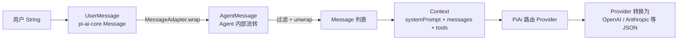
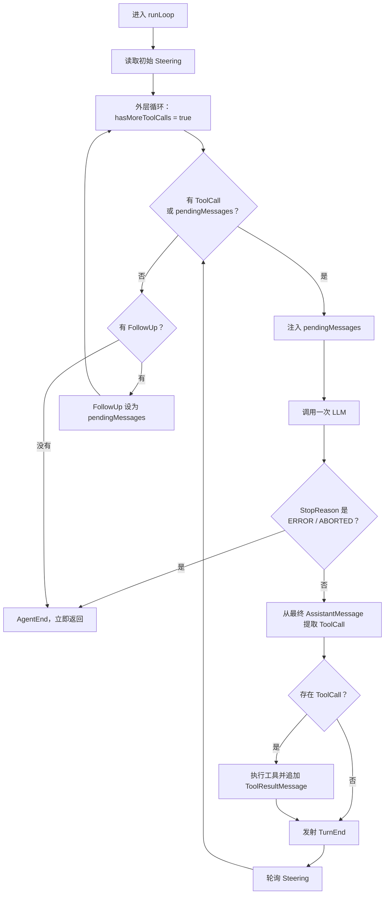
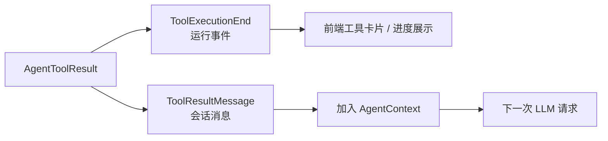

# 阶段二：pi-agent-core 学习文档

> 本文档带你系统性地学习 pi-agent-core 模块，即 Agent 框架的核心。这个模块是 LLM 智能体的"大脑"，负责将 LLM 调用组织成完整的 Agent 循环。建议边读本文档边打开对应源码文件对照学习。

---

## 一、模块概览

**pi-agent-core** 依赖 pi-ai-core（使用其消息类型、事件流、PiAi 入口），构建在 LLM 基础能力之上，提供了完整的 Agent 交互框架。

### 核心功能

- **Agent 主类**：对外暴露的统一入口，管理状态、事件、队列、生命周期
- **AgentLoop 引擎**：双循环架构，驱动 LLM 调用和工具执行
- **事件系统**：Agent 生命周期、Turn 生命周期、消息生命周期、工具执行生命周期
- **消息适配**：AgentMessage 与 LLM Message 之间的双向转换
- **钩子系统**：工具执行前/后的拦截和修改能力
- **代理流**：通过代理服务器转发 LLM 请求

### 一句话心智模型

`pi-ai-core` 解决“如何以统一方式调用一次模型”，`pi-agent-core` 解决“如何围绕模型调用持续推进一个任务”。Agent 不负责理解厂商 SSE，也不会自行判断答案质量；它根据模型返回的结构化内容、工具结果和消息队列，调度下一次模型调用。

建议先按以下主链走读，再回头看各配置类：

```text
Agent.prompt
  → Agent._runLoop
  → AgentLoop.agentLoop
  → AgentLoop.runLoop
  → streamAssistantResponse
  → PiAi.streamSimple
  → executeToolCalls（模型返回 ToolCall 时）
  → Agent._processLoopEvent
```

### 模块依赖

```
pi-ai-core (types, event, stream, util)
    ↑
pi-agent-core (Agent, AgentLoop, AgentEvent, ...)
    ↑
pi-coding-agent (应用层，依赖 pi-agent-core)
```

### 包结构

```
pi-agent-core/
  ├── Agent.java              ← 主入口
  ├── types/                  ← 类型定义
  ├── config/                 ← 配置接口
  ├── event/                  ← 事件体系
  ├── loop/                   ← AgentLoop 主循环
  └── proxy/                  ← 代理流
```

---

## 二、类型体系（types/ 包）— 15 个文件

### 2.1 AgentState.java — 运行时状态

**文件：** `types/AgentState.java`

#### 作用

Agent 的运行时状态容器，包含 Agent 在运行过程中需要维护的所有可变状态。

#### 关键字段

| 字段 | 类型 | 说明 |
|------|------|------|
| `systemPrompt` | `String` | 系统提示词 |
| `model` | `Model` | 当前使用的模型 |
| `thinkingLevel` | `AgentThinkingLevel` | 思考级别 |
| `tools` | `List<AgentTool>` | 可用工具列表 |
| `messages` | `List<AgentMessage>` | 消息历史 |
| `isStreaming` | `volatile boolean` | 是否正在流式处理中 |
| `streamMessage` | `volatile AgentMessage` | 当前正在流式处理的消息 |
| `pendingToolCalls` | `CopyOnWriteArraySet<String>` | 待处理的工具调用 ID 集合 |
| `error` | `String` | 错误信息 |

#### 线程安全设计

- `isStreaming`：`volatile` 关键字，保证跨线程可见性
- `pendingToolCalls`：`CopyOnWriteArraySet`，线程安全的并发集合
- 其他字段通过 `synchronized` 方法或 `volatile` 保证线程安全

---

### 2.2 AgentMessage.java — Agent 层消息

**文件：** `types/AgentMessage.java`

#### 作用

Agent 层消息的抽象接口。Agent 内部不直接使用 pi-ai-core 的 `Message` 类型，而是使用 `AgentMessage` 作为统一的消息抽象。

#### 设计用途

`AgentMessage` 是一个**非封闭接口**，允许应用层自由扩展。它的实现类可以包括：
- `MessageAdapter`：包装 LLM 层消息（`UserMessage`、`AssistantMessage`、`ToolResultMessage`）
- 自定义消息类型：由 pi-coding-agent 扩展，如 `BashExecutionMessage`、`BranchSummaryMessage` 等

---

### 2.3 MessageAdapter.java — 消息适配器

**文件：** `types/MessageAdapter.java`

#### 作用

**核心类！** 负责 AgentMessage 与 LLM Message 之间的双向转换。这是 Agent 层与 LLM 层之间的桥梁。

#### 适配模式

```
Agent 消息 (AgentMessage)
     │
     │ AgentMessage 是 Agent 层的统一消息抽象
     │
     ├── MessageAdapter.wrap(Message)  ← 包装 LLM 消息为 AgentMessage
     │    └── LLM Message → AgentMessage（Agent 内部使用）
     │
     ├── MessageAdapter.unwrap(AgentMessage)  ← 解包为 LLM 消息
     │    └── AgentMessage → LLM Message（发送给 LLM 前）
     │
     └── MessageAdapter.isLlmMessage(AgentMessage)  ← 判断是否为 LLM 消息
          └── 检查 AgentMessage 是否包装了 LLM Message
```

#### 为什么需要消息适配？

1. **扩展类型空间**：`pi-ai-core` 的 `Message` 是密封接口，只有 User、Assistant、ToolResult 三类；Agent 还需要容纳应用自定义消息，因此使用更宽的 `AgentMessage`
2. **无损桥接**：`MessageAdapter` 保留原始 `Message`，并把 `role()`、`timestamp()` 委托给它，不需要复制消息字段
3. **过滤**：在转换时，可以过滤掉不需要发送给 LLM 的消息类型（如系统内部消息）

#### 从用户文本到厂商协议的完整转换

需要区分“包装/解包”和“协议转换”：



- `wrap/unwrap` 不会改变消息语义，只是在 Agent 类型体系与 LLM 类型体系之间适配。
- `convertToLlm` 可以决定哪些自定义 `AgentMessage` 要转换成标准 `Message`；默认实现只保留 `MessageAdapter`。
- 真正把统一 `Message` 转成 OpenAI、Anthropic 等厂商请求 JSON 的是 `ApiProvider`，不是 `MessageAdapter`。
- 响应方向则相反：厂商 SSE → Provider → `AssistantMessageEvent` → Agent 更新 partial `AssistantMessage` → `MessageAdapter.wrap`。

---

### 2.4 AgentOptions.java — Agent 配置

**文件：** `types/AgentOptions.java`

#### 作用

Agent 构造函数的所有配置项容器。采用 Java 标准的 JavaBean 模式（getter/setter），所有字段都可选。

#### 配置项一览

| 配置项 | 类型 | 默认值 | 说明 |
|--------|------|--------|------|
| `initialState` | `AgentState` | 默认状态 | 初始状态 |
| `convertToLlm` | `ConvertToLlmFunction` | 默认转换器 | 消息转换函数 |
| `transformContext` | `TransformContextFunction` | null | 上下文转换 |
| `steeringMode` | `QueueMode` | `ONE_AT_A_TIME` | 干预队列模式 |
| `followUpMode` | `QueueMode` | `ONE_AT_A_TIME` | 跟进队列模式 |
| `streamFn` | `StreamFn` | `PiAi::streamSimple` | 流式函数 |
| `sessionId` | `String` | null | 会话 ID |
| `getApiKey` | `GetApiKeyFunction` | null | 动态 API Key |
| `onPayload` | `PayloadInterceptor` | null | 请求拦截器 |
| `thinkingBudgets` | `ThinkingBudgets` | null | 思考预算 |
| `transport` | `Transport` | `SSE` | 传输协议 |
| `maxRetryDelayMs` | `Integer` | null | 最大重试延迟 |
| `toolExecution` | `ToolExecutionMode` | `PARALLEL` | 工具执行模式 |
| `beforeToolCall` | `BeforeToolCallHook` | null | 工具调用前钩子 |
| `afterToolCall` | `AfterToolCallHook` | null | 工具调用后钩子 |

---

### 2.5 AgentContext.java — Agent 上下文

**文件：** `types/AgentContext.java`

#### 作用

Agent 运行时的上下文容器，包含系统提示词、消息历史列表和工具列表。使用 Builder 模式构建。

#### 关键设计

- `systemPrompt`：系统提示词字符串
- `messages`：消息列表（`List<AgentMessage>`），在 AgentLoop 过程中会被不断追加新消息
- `tools`：可用工具列表（`List<AgentTool>`）

`AgentContext` 是可变的——`AgentLoop` 会在循环过程中不断向 `messages` 列表追加新消息（LLM 回复、工具执行结果等）。

---

### 2.6 AgentTool.java — 工具定义

**文件：** `types/AgentTool.java`

#### 作用

定义 Agent 可用的工具，包含名称、描述、参数 Schema 和可执行方法。

#### 关键设计

```java
public record AgentTool(
    String name,                     // 工具名称
    String description,              // 工具描述
    JsonNode inputSchema,            // JSON Schema 参数定义
    ToolExecutor execute             // 可执行函数
) {
    public Tool toTool() { ... }     // 转换为 LLM Tool 定义
}
```

- `toTool()`：将 `AgentTool` 转换为 LLM 可识别的 `Tool` 对象，传递给 LLM 的 tool 参数
- `ToolExecutor`：函数式接口，接收工具调用参数，返回 `CompletableFuture<AgentToolResult<?>>`

---

### 2.7 AgentToolResult.java — 工具执行结果

**文件：** `types/AgentToolResult.java`

#### 作用

工具执行的结果封装，包含内容和附加详情。

---

### 2.8 AgentToolUpdateCallback.java — 工具进度回调

**文件：** `types/AgentToolUpdateCallback.java`

#### 作用

函数式接口，工具在执行过程中可以调用此回调报告部分结果，用于支持流式工具执行。

---

### 2.9 枚举类型

#### AgentThinkingLevel.java

**文件：** `types/AgentThinkingLevel.java`

Agent 层的思考级别枚举，与 pi-ai-core 的 `ThinkingLevel` 对应，用于在 Agent 层配置模型的推理深度。

#### QueueMode.java

**文件：** `types/QueueMode.java`

```java
public enum QueueMode {
    ONE_AT_A_TIME,  // 一次取一个消息
    ALL             // 一次性取出所有消息
}
```

控制消息队列的出队行为。`ONE_AT_A_TIME` 适合逐条处理，`ALL` 适合批量处理。

#### ToolExecutionMode.java

**文件：** `types/ToolExecutionMode.java`

```java
public enum ToolExecutionMode {
    SEQUENTIAL,  // 顺序执行工具
    PARALLEL     // 并行执行工具（默认）
}
```

---

### 2.10 钩子上下文

#### BeforeToolCallContext.java 和 BeforeToolCallResult.java

**文件：** `types/BeforeToolCallContext.java`、`types/BeforeToolCallResult.java`

工具调用前的上下文和结果。`BeforeToolCallResult` 可以设置 `block=true` 来阻止工具执行。

#### AfterToolCallContext.java 和 AfterToolCallResult.java

**文件：** `types/AfterToolCallContext.java`、`types/AfterToolCallResult.java`

工具调用后的上下文和结果。`AfterToolCallResult` 可以修改工具执行的结果内容。

---

## 三、配置接口（config/ 包）— 9 个文件

### 3.1 AgentLoopConfig.java — 循环配置

**文件：** `config/AgentLoopConfig.java`

#### 作用

**核心配置类！** 组合了 `SimpleStreamOptions` 和 Agent 专属字段，是传递给 `AgentLoop` 的完整配置。

#### 使用 Builder 模式构建

```java
AgentLoopConfig config = AgentLoopConfig.builder()
    .model(model)
    .convertToLlm(convertFn)
    .transformContext(transformFn)
    .getApiKey(getApiKeyFn)
    .toolExecution(ToolExecutionMode.PARALLEL)
    .beforeToolCall(beforeHook)
    .afterToolCall(afterHook)
    .sessionId("session-123")
    .transport(Transport.SSE)
    .maxRetryDelayMs(5000)
    .onPayload(payloadInterceptor)
    .thinkingBudgets(budgets)
    .reasoning(thinkingLevel)
    .build();
```

---

### 3.2 函数式接口

| 文件 | 函数签名 | 说明 |
|------|---------|------|
| `StreamFn.java` | `(Model, Context, SimpleStreamOptions) → AssistantMessageEventStream` | 流式调用函数 |
| `ConvertToLlmFunction.java` | `List<AgentMessage> → List<Message>` | Agent 消息 → LLM 消息 |
| `TransformContextFunction.java` | `(List<AgentMessage>, CancellationSignal) → CompletableFuture<List<AgentMessage>>` | 上下文转换 |
| `GetApiKeyFunction.java` | `(String provider) → CompletableFuture<String>` | 动态获取 API Key |
| `GetSteeringMessagesFunction.java` | `() → CompletableFuture<List<AgentMessage>>` | 获取干预消息 |
| `GetFollowUpMessagesFunction.java` | `() → CompletableFuture<List<AgentMessage>>` | 获取跟进消息 |

### 3.3 钩子接口

| 文件 | 说明 |
|------|------|
| `BeforeToolCallHook.java` | 工具调用前钩子，可阻止工具执行或修改参数 |
| `AfterToolCallHook.java` | 工具调用后钩子，可修改工具执行结果 |

---

## 四、事件体系（event/ 包）— 2 个文件

### 4.1 AgentEvent.java — 事件体系核心

**文件：** `event/AgentEvent.java`

#### 作用

**核心！** 密封接口，定义了 Agent 运行过程中所有可能发生的事件类型。事件采用 Jackson 多态序列化，基于 `type` 字段反序列化到具体子类型。

可以把它简单理解成“结构化、实时、机器可消费的运行日志”，但它不是状态本身：

- `AgentState` 保存当前消息、是否正在流式输出、待执行工具等实际状态。
- `AgentEvent` 描述刚刚发生了什么，例如消息开始、增量更新、工具结束。
- `Agent._processLoopEvent()` 消费事件并更新 `AgentState`，随后再把同一个事件通知订阅者。

#### 事件分类

```
AgentEvent (sealed interface)
│
├── Agent 生命周期
│   ├── AgentStart        ← Agent 循环开始
│   └── AgentEnd          ← Agent 循环结束（携带所有新消息）
│
├── Turn 生命周期
│   ├── TurnStart         ← 一轮交互开始
│   └── TurnEnd           ← 一轮交互结束（携带助理消息和工具结果）
│
├── 消息生命周期
│   ├── MessageStart      ← 消息开始生成
│   ├── MessageUpdate     ← 消息更新（流式增量）
│   └── MessageEnd        ← 消息完成
│
└── 工具执行生命周期
    ├── ToolExecutionStart   ← 工具开始执行（携带 toolCallId、工具名、参数）
    ├── ToolExecutionUpdate  ← 工具执行进度更新
    └── ToolExecutionEnd     ← 工具执行结束（携带结果）
```

#### 事件流顺序

```
AgentStart → TurnStart → MessageStart → MessageUpdate × N → MessageEnd
    → ToolExecutionStart → ToolExecutionUpdate × N → ToolExecutionEnd
    → MessageStart → MessageEnd → TurnEnd → TurnStart → ...
    → AgentEnd
```

这是一条“包含工具调用”的典型顺序，不是每次运行都具备所有事件：普通文本回答不会出现工具事件；工具没有调用 `onUpdate` 时不会出现 `ToolExecutionUpdate`；并行工具执行时，不同 `toolCallId` 的事件可能交错。

#### 从模型增量到前端展示

Agent 层接收的不是厂商原始 SSE，而是 Provider 已经翻译好的 `AssistantMessageEvent`：

```mermaid
sequenceDiagram
    participant Provider
    participant LlmStream as AssistantMessageEventStream
    participant AgentLoop
    participant AgentStream as EventStream&lt;AgentEvent&gt;
    participant Agent
    participant Consumer as Session / Controller / 前端桥接层

    Provider->>LlmStream: push(TextDelta + partial)
    AgentLoop->>LlmStream: for-each 消费
    AgentLoop->>AgentLoop: 更新当前 partial AssistantMessage
    AgentLoop->>AgentStream: push(MessageUpdate)
    Agent->>AgentStream: for-each 消费
    Agent->>Agent: _processLoopEvent 更新 AgentState
    Agent-->>Consumer: emit(MessageUpdate)
    Consumer-->>Consumer: 追加 delta 或替换当前消息
```

`pi-agent-core` 只负责把 `AgentEvent` 放进内部事件流并通知监听器；真正发送到浏览器还需要 Session、Controller 等上层通过 SSE/WebSocket 转发。一次 `MessageUpdate` 通常表示一次统一增量事件，不等于一个 TCP 网络包。

---

### 4.2 ProxyAssistantMessageEvent.java

**文件：** `event/ProxyAssistantMessageEvent.java`

#### 作用

代理模式下的辅助消息事件，与普通 `AssistantMessageEvent` 的区别在于：
- 从代理服务器接收事件时，`partial` 字段可能为 null（代理服务器为节省带宽移除了 partial 字段）
- 客户端需要根据收到的增量事件，在本地重建完整的 `AssistantMessage`

---

## 五、AgentLoop 引擎（loop/ 包）— 3 个文件

### 5.1 AgentLoop.java — 核心循环引擎

**文件：** `loop/AgentLoop.java`（Agent 调度的核心实现）

#### 核心架构：双循环结构

```
AgentLoop 双循环结构
═══════════════════════

外层循环：FollowUp 处理
┌──────────────────────────────────────────────────────────────┐
│  while (true) {                                              │
│      // 内层循环：工具调用 + Steering 处理                    │
│      while (hasMoreToolCalls || !pendingMessages.isEmpty()) { │
│          streamAssistantResponse()  ← 调用 LLM               │
│          extractToolCalls()         ← 提取工具调用           │
│          executeToolCalls()         ← 执行工具               │
│          pollSteeringMessages()     ← 检查干预消息           │
│      }                                                       │
│                                                              │
│      // 内层循环结束，检查 FollowUp 消息                      │
│      pollFollowUpMessages()                                  │
│      if (有 FollowUp 消息) → 继续外层循环                     │
│      else → 结束                                             │
│  }                                                           │
└──────────────────────────────────────────────────────────────┘
```

双循环不是“外层分析问题、内层分析问题”，而是两个不同优先级的调度边界：

| 循环 | 负责什么 | 继续条件 | 结束条件 |
|------|----------|----------|----------|
| 内层 | 当前任务的 LLM → Tool → LLM 工作链，并处理 Steering | 本轮模型返回 ToolCall，或存在待注入消息 | 没有 ToolCall 且没有 Steering |
| 外层 | 当前任务准备结束时检查 FollowUp | FollowUp 队列非空 | FollowUp 队列为空 |



`hasMoreToolCalls` 初始被设为 `true`，只是为了保证第一次必定进入内层循环并调用一次 LLM，并不表示此时已经存在工具调用。此后的值完全来自 `extractToolCalls()` 的结果。

> Agent 没有“答案是否完善”的质量判断器。它不会因为觉得回答不够好而自动再问一次模型；继续内层循环的结构化原因只有 ToolCall 或待处理消息。模型可能因为缺少信息而主动返回 ToolCall，但这是 LLM 的语义决策，不是 Agent 对答案质量的二次评审。

#### 详细流程

```
agentLoop(prompts, context, config, signal, streamFn)
  │
  ├─ 创建 EventStream（完成条件：AgentEnd 事件）
  ├─ 异步执行 runAgentLoop
  │     │
  │     ├─ 将 prompts 追加到 context.messages
  │     ├─ 发射 AgentStart 事件
  │     ├─ 发射 TurnStart 事件
  │     ├─ 为每个 prompt 发射 MessageStart/MessageEnd
  │     └─ 调用 runLoop()
  │           │
  │           ├─ while (true)  ← 外层循环
  │           │     │
  │           │     ├─ while (hasMoreToolCalls || pendingMessages)  ← 内层循环
  │           │     │     │
  │           │     │     ├─ 非首轮发射 TurnStart
  │           │     │     ├─ 处理 Steering 消息（注入上下文）
  │           │     │     ├─ streamAssistantResponse()  ← ★ 调用 LLM
  │           │     │     │     │
  │           │     │     │     ├─ 上下文转换（transformContext）
  │           │     │     │     ├─ 消息转换（AgentMessage → Message）
  │           │     │     │     ├─ 构建 LLM Context
  │           │     │     │     ├─ 解析 API Key
  │           │     │     │     ├─ 调用 streamFn（PiAi::streamSimple）
  │           │     │     │     └─ 处理事件流（Start → Delta × N → Done/Error）
  │           │     │     │
  │           │     │     ├─ 检查 StopReason（ERROR/ABORTED → 终止）
  │           │     │     ├─ 提取 ToolCall 列表
  │           │     │     ├─ 如果有工具调用 → executeToolCalls()
  │           │     │     │     │
  │           │     │     │     ├─ SEQUENTIAL 模式 → 逐个执行
  │           │     │     │     │     prepareToolCall → executePreparedToolCall → finalizeExecutedToolCall
  │           │     │     │     │
  │           │     │     │     └─ PARALLEL 模式 → 三阶段流水线
  │           │     │     │           顺序准备 → 并行执行 → 顺序完成
  │           │     │     │
  │           │     │     ├─ 追加工具结果到上下文
  │           │     │     ├─ 发射 TurnEnd
  │           │     │     └─ pollSteeringMessages()
  │           │     │
  │           │     └─ pollFollowUpMessages()
  │           │           ├─ 有 FollowUp → pendingMessages = followUp, 继续外层循环并重新进入内层
  │           │           └─ 无 FollowUp → break 外层循环
  │           │
  │           └─ 发射 AgentEnd
  │
  └─ 返回 EventStream（调用方通过 for-each 消费事件）
```

#### 5.1.1 streamAssistantResponse() — 调用 LLM

**这是 Agent 循环中与 LLM 交互的核心环节**，实现了一个完整的 6 步调用流水线：

1. **上下文转换（可选）**：如果配置了 `transformContext`，对消息列表进行转换
2. **消息转换**：`AgentMessage` → `Message`（LLM 可识别的格式）
3. **构建 LLM Context**：系统提示 + 消息列表 + 工具列表
4. **解析 API Key**：优先使用动态获取的 API Key，否则使用静态配置
5. **调用流式函数**：`PiAi::streamSimple` 或自定义 streamFn
6. **处理事件流**：处理 Start/Delta/Done/Error 事件，同时发射对应的 AgentEvent

默认消息转换的核心代码可以概括为：

```java
List<Message> llmMessages = messages.stream()
    .filter(MessageAdapter::isLlmMessage) // 过滤掉不能直接发给 LLM 的自定义 AgentMessage
    .map(MessageAdapter::unwrap)          // 取出 User/Assistant/ToolResultMessage
    .collect(Collectors.toList());

List<Tool> tools = null;
if (context.getTools() != null && !context.getTools().isEmpty()) {
    tools = context.getTools().stream()
        .map(AgentTool::toTool)           // AgentTool → LLM Tool 定义
        .collect(Collectors.toList());
}

Context llmContext = new Context(
    context.getSystemPrompt(), llmMessages, tools);

AssistantMessageEventStream response =
    PiAi.streamSimple(model, llmContext, options);
```

`Start` 到来时，AgentLoop 把初始 partial 包装成 `AgentMessage` 并发射 `MessageStart`；每个 Delta 到来时，用事件里的 partial 更新上下文并发射 `MessageUpdate`；`Done/Error` 到来时，用最终消息替换 partial 并发射 `MessageEnd`。因此前端看到的流式消息是 Agent 对统一事件的再次封装，不是厂商 SSE 的直接透传。

#### 5.1.2 executeToolCalls() — 执行工具调用

支持两种执行模式：

**SEQUENTIAL（顺序执行）：**
```
prepareToolCall → executePreparedToolCall → finalizeExecutedToolCall
    ↓ 下一个工具
prepareToolCall → executePreparedToolCall → finalizeExecutedToolCall
```

**PARALLEL（并行执行）— 三阶段流水线：**
```
第一阶段：顺序准备
    prepareToolCall(tool1) → prepareToolCall(tool2) → ...
    
第二阶段：并行执行
    CompletableFuture.supplyAsync(() -> executePreparedToolCall(tool1))
    CompletableFuture.supplyAsync(() -> executePreparedToolCall(tool2))
    ...
    
第三阶段：顺序完成（按原始顺序 join）
    finalizeExecutedToolCall(tool1) → finalizeExecutedToolCall(tool2) → ...
```

#### 5.1.3 prepareToolCall() — 工具准备

执行工具前的 3 步检查：

1. **查找工具**：根据工具调用名称在上下文中查找匹配的 `AgentTool`
2. **参数校验**：使用 `ToolValidator` 校验参数是否符合 JSON Schema
3. **前置钩子检查**：如果配置了 `BeforeToolCallHook`，调用它以允许拦截或修改

#### 5.1.4 executePreparedToolCall() — 执行工具

调用 `AgentTool.execute()` 执行实际逻辑，支持进度回调（`ToolExecutionUpdate` 事件）。

#### 5.1.5 finalizeExecutedToolCall() — 完成工具

工具执行后的 4 步后处理：

1. **调用后置钩子**（可选）：`AfterToolCallHook` 修改结果
2. **发射 `ToolExecutionEnd`** 事件
3. **构建 `ToolResultMessage`**
4. **发射 `MessageStart`/`MessageEnd`** 事件

#### 5.1.6 Tool Result 为什么既是事件又是消息

同一个工具结果有两个不同消费者，因此会形成两种表达：



- `ToolExecutionStart(toolCallId, toolName, args)`：前端可以显示“工具正在执行”。
- `ToolExecutionUpdate(..., partialResult)`：只有工具主动调用 `onUpdate` 时才会出现，适合进度、分批结果或长任务状态。
- `ToolExecutionEnd(..., result, isError)`：携带最终 `AgentToolResult`，适合前端展示成功结果或错误。
- `MessageStart/MessageEnd(MessageAdapter(ToolResultMessage))`：表示工具结果已经成为会话消息，之后会被解包成 `Message` 发给 LLM。

前端应使用 `toolCallId` 关联同一次工具调用的 Start/Update/End。并行执行多个工具时，不同 ID 的 Update 可能交错；当前实现会在并行执行后按原始 ToolCall 顺序逐个 finalize，因此 End 和最终 ToolResultMessage 仍保持原始顺序。`pi-agent-core` 已产生这些事件，但不会自行建立浏览器连接，上层仍需通过 SSE/WebSocket 转发，并对可能包含密钥、内部路径或大对象的 `result.details` 做裁剪和脱敏。

---

### 5.2 PrepareResult.java — 准备结果

**文件：** `loop/PrepareResult.java`

密封接口，两种结果类型：
- `PrepareResult.Prepared`：所有检查通过，工具可以执行（包含原始 toolCall、解析后的 AgentTool、校验通过的参数）
- `PrepareResult.Immediate`：检查失败，直接返回结果（包含错误结果和错误标志）

---

### 5.3 ExecuteResult.java — 执行结果

**文件：** `loop/ExecuteResult.java`

Record，包含：
- `result`：`AgentToolResult<?>` 执行结果
- `isError`：是否发生错误

---

## 六、Agent 主类 — 整合所有组件

### 6.1 Agent.java — 最高层入口

**文件：** `Agent.java`

#### 作用

Agent 框架对外暴露的统一入口，整合了状态管理、事件订阅、消息队列、生命周期控制和 AgentLoop 调用。

#### 核心能力

**1. 状态管理**
- `getState()`：获取运行时状态
- `setSystemPrompt()` / `setModel()` / `setThinkingLevel()` / `setTools()`：修改状态
- `replaceMessages()` / `appendMessage()` / `clearMessages()`：操作消息列表

**2. 事件订阅**
- `subscribe(Consumer<AgentEvent>)`：订阅事件，返回 `Runnable` 用于取消订阅
- 内部通过 `CopyOnWriteArraySet` 存储监听器，支持并发安全

**3. 消息队列**

Agent 提供两个独立的消息队列，用于在运行时注入消息：

| 队列 | 方法 | 用途 | 处理时机 |
|------|------|------|---------|
| **Steering 队列** | `steer()` | 干预消息（高优先级） | 当前 LLM/工具轮次结束后轮询，在下一次 LLM 调用前注入 |
| **FollowUp 队列** | `followUp()` | 跟进消息（低优先级） | 内层循环结束、Agent 本来准备停止时轮询 |

**4. 生命周期控制**
- `prompt(text/message/list)`：发送提示消息，启动 Agent 循环
- `continueProcessing()`：继续处理（重试/跟进）
- `abort()`：中止当前循环（线程安全）
- `waitForIdle()`：等待空闲（返回 `CompletableFuture`）
- `reset()`：重置到初始状态

**5. 内部调用流程**

```
Agent.prompt(messages)
  │
  ├─ 检查 isStreaming → 已流式 → 抛出异常
  ├─ 检查 model → 未配置 → 抛出异常
  │
  └─ _runLoop(messages, continueMode=false)
        │
        ├─ 创建 CancellationSignal
        ├─ 设置 isStreaming = true
        ├─ 构建 AgentContext
        ├─ 构建 AgentLoopConfig
        ├─ 调用 AgentLoop.agentLoop()
        │     └─ 返回 EventStream<AgentEvent, List<AgentMessage>>
        │
        ├─ 迭代 EventStream
        │     └─ _processLoopEvent(event)
        │           ├─ MessageStart → streamMessage = event.message
        │           ├─ MessageUpdate → streamMessage = event.message
        │           ├─ MessageEnd → streamMessage = null, messages.add(event.message)
        │           ├─ ToolExecutionStart → pendingToolCalls.add(event.toolCallId)
        │           ├─ ToolExecutionEnd → pendingToolCalls.remove(event.toolCallId)
        │           ├─ TurnEnd → 检查错误
        │           └─ AgentEnd → isStreaming = false
        │
        ├─ 同步消息到状态
        └─ finally → isStreaming = false, signal = null, promise.complete()
```

---

## 七、代理流（proxy/ 包）— 2 个文件

### 7.1 ProxyStream.java — 代理流式请求

**文件：** `proxy/ProxyStream.java`

#### 作用

将 LLM 调用通过代理服务器转发，而非直接调用 LLM 提供商。适用于需要统一认证、审计、缓存等中间件场景。

#### 代理方案

```
客户端                   代理服务器                    LLM 提供商
  │                         │                           │
  │── HTTP POST ──────────→ │                           │
  │   (请求体 + authToken)  │── HTTP POST ────────────→ │
  │                         │   (转发请求 + 认证)       │
  │                         │←── SSE 流 ────────────── │
  │←── SSE 流 ──────────── │                           │
  │   (移除 partial 字段)  │                           │
```

#### 关键设计

- 代理服务器在返回 SSE 流时，会移除 delta 事件中的 `partial` 字段以节省带宽
- 客户端根据收到的增量事件，在本地重建完整的 `AssistantMessage`
- 对应 TypeScript 侧的 `streamProxy` 函数

---

### 7.2 ProxyStreamOptions.java — 代理选项

**文件：** `proxy/ProxyStreamOptions.java`

#### 作用

扩展 `SimpleStreamOptions`，增加代理相关的配置项：
- `authToken`：代理认证令牌
- `proxyUrl`：代理服务器 URL

---

## 八、核心流程时序图

```mermaid
sequenceDiagram
    participant User as 用户 / 调用方
    participant Agent
    participant Loop as AgentLoop
    participant PiAi
    participant Provider
    participant LLM
    participant Tool
    participant UI as 事件订阅者 / 前端桥接层

    User->>Agent: prompt("你好")
    Agent->>Agent: UserMessage → MessageAdapter → AgentMessage
    Agent->>Agent: 构建 AgentContext / AgentLoopConfig
    Agent->>Loop: agentLoop(prompts, context, config)
    Loop-->>Agent: EventStream&lt;AgentEvent&gt;
    Loop-->>Agent: AgentStart / TurnStart / 用户 MessageEnd
    Agent-->>UI: emit(AgentEvent)

    Loop->>Loop: AgentMessage 过滤并 unwrap 为 Message
    Loop->>PiAi: streamSimple(model, Context, options)
    PiAi->>Provider: 按 model.api() 路由
    Provider->>Provider: Message / Tool → 厂商 JSON
    Provider->>LLM: HTTP 请求（stream=true）

    loop 模型流式生成
        LLM-->>Provider: 厂商 SSE 事件
        Provider-->>Loop: AssistantMessageEvent
        Loop-->>Agent: MessageStart / MessageUpdate
        Agent-->>UI: emit(AgentEvent)
    end

    LLM-->>Provider: completed
    Provider-->>Loop: Done(final AssistantMessage)
    Loop-->>Agent: MessageEnd
    Agent-->>UI: emit(AgentEvent)

    alt 最终消息包含 ToolCall
        Loop-->>Agent: ToolExecutionStart
        Agent-->>UI: emit(AgentEvent)
        Loop->>Tool: execute(arguments, onUpdate)
        opt 工具主动报告进度
            Tool-->>Loop: onUpdate(partialResult)
            Loop-->>Agent: ToolExecutionUpdate
            Agent-->>UI: emit(AgentEvent)
        end
        Tool-->>Loop: AgentToolResult
        Loop-->>Agent: ToolExecutionEnd(result)
        Agent-->>UI: emit(AgentEvent)
        Loop->>Loop: 构建并追加 ToolResultMessage
        Loop-->>Agent: MessageStart / MessageEnd(toolResult)
        Agent-->>UI: emit(AgentEvent)
        Loop->>PiAi: 携带 ToolResultMessage 再调用 LLM
    else 没有 ToolCall
        Loop->>Loop: 检查 Steering / FollowUp
    end

    Loop-->>Agent: TurnEnd / AgentEnd
    Agent-->>UI: emit(AgentEvent)
    Agent->>Agent: 同步消息并清理 isStreaming
```

这张图中有两条流不要混淆：Provider 的 `AssistantMessageEventStream` 传递模型内容事件；AgentLoop 对外返回的 `EventStream<AgentEvent, List<AgentMessage>>` 传递 Agent、Turn、消息和工具生命周期事件。上层通常只订阅后者。

### 用“查询天气”实际走一遍源码

假设用户输入：“查询北京天气，并告诉我怎么穿衣”。可以按下面顺序打断点：

1. `Agent.prompt(String)`：创建 `UserMessage`，通过 `MessageAdapter.wrap()` 得到 `AgentMessage`。
2. `Agent.prompt(List)`：检查当前不在 streaming、模型已配置，然后进入 `_runLoop()`。
3. `AgentLoop.agentLoop()`：把用户消息加入 `AgentContext`，发射 `AgentStart`、`TurnStart` 和用户消息事件。
4. `runLoop()`：`hasMoreToolCalls = true` 强制首次进入内层循环。
5. `streamAssistantResponse()`：过滤并解包 `AgentMessage`，组装统一 `Context`，调用 `PiAi.streamSimple()`。
6. Provider：把 `Context<Message>` 转成厂商 JSON，解析厂商 SSE，并逐步返回统一 `AssistantMessageEvent`。
7. AgentLoop：把模型增量转成 `MessageUpdate`；本次响应完成后，最终 `AssistantMessage` 中包含 `get_weather` 的 `ToolCall`。
8. `executeToolCalls()`：发射 `ToolExecutionStart`，执行天气工具，必要时发射 Update，最后发射 `ToolExecutionEnd`。
9. `finalizeExecutedToolCall()`：把 `AgentToolResult` 构造成 `ToolResultMessage`，发射该消息的 Start/End；`runLoop()` 再把它加入上下文。
10. 回到内层循环：因为上一轮存在 ToolCall，再次调用 LLM。第二次请求携带用户问题、Assistant ToolCall 和 ToolResultMessage。
11. LLM 返回穿衣建议且不再包含 ToolCall，`hasMoreToolCalls = false`；若没有 Steering，内层结束。
12. 外层检查 FollowUp；也为空时发射 `AgentEnd`，`Agent` 同步状态并结束本次 `prompt()` Future。

这条路径体现了最重要的闭环：

```text
用户问题 → LLM 决定调用工具 → Agent 执行工具
        → 工具结果加入上下文 → LLM 基于结果生成最终回答
```

---

## 九、学习检查清单

1. [ ] Agent 的双循环结构是什么？外层循环和内层循环各自处理什么？
2. [ ] Steering 消息和 FollowUp 消息有什么区别？分别在什么时候处理？
3. [ ] `MessageAdapter` 的作用是什么？为什么需要它？
4. [ ] Agent 有哪些生命周期事件？事件发射的完整顺序是什么？
5. [ ] 工具执行的 SEQUENTIAL 和 PARALLEL 模式有什么区别？
6. [ ] `prepareToolCall` 做了哪些检查？`BeforeToolCallHook` 的作用是什么？
7. [ ] `finalizeExecutedToolCall` 做了哪些后处理？`AfterToolCallHook` 的作用是什么？
8. [ ] 代理流（ProxyStream）的设计目的是什么？与直接调用有什么区别？
9. [ ] Agent 的线程安全策略是如何设计的？哪些字段是 volatile？哪些集合是并发安全的？
10. [ ] `Agent.prompt()` 和 `Agent.continueProcessing()` 有什么区别？
11. [ ] 为什么 Tool Result 同时会产生 `ToolExecutionEnd` 和 `ToolResultMessage`？
12. [ ] 厂商 SSE、`AssistantMessageEvent`、`AgentEvent.MessageUpdate` 三者是什么关系？
13. [ ] Agent 在什么条件下继续循环？它会不会判断“答案是否完善”？

---

## 十、下一步

完成阶段二后，进入阶段三（pi-ai-oauth）或阶段四（pi-ai-providers），然后进入阶段五（pi-coding-agent）。
