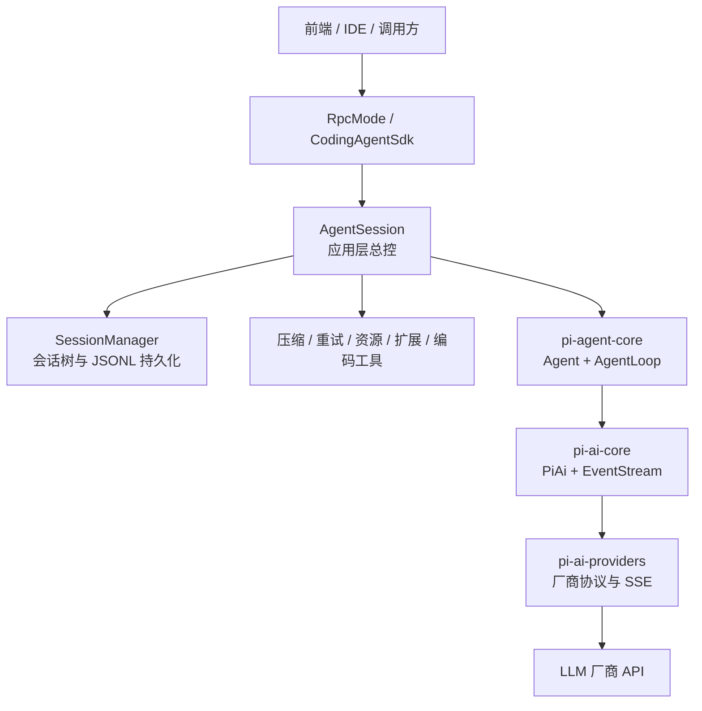
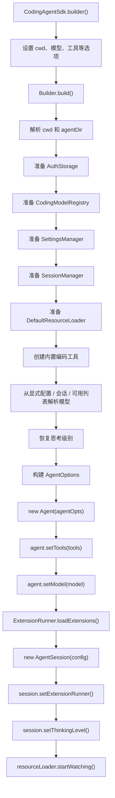
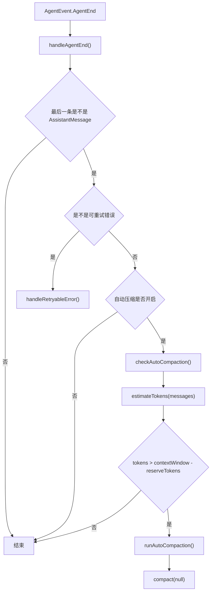
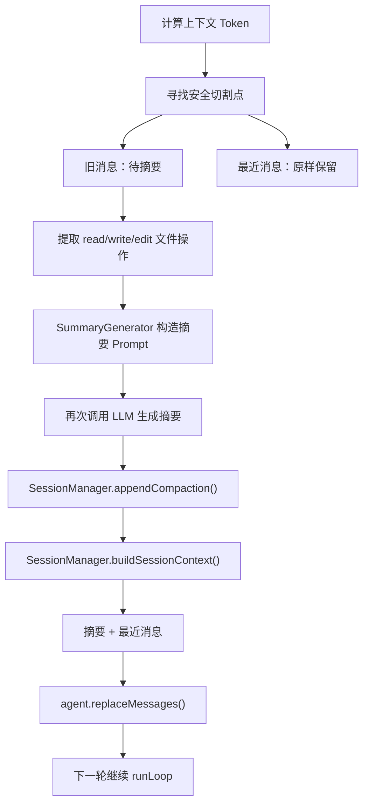
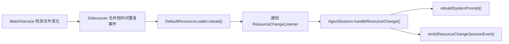
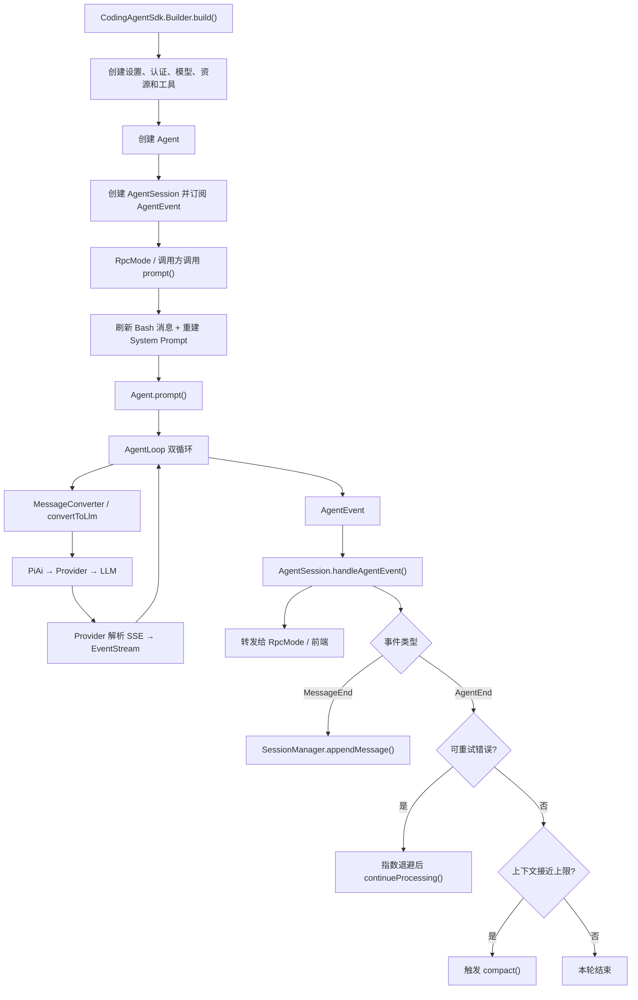

# 阶段五：pi-coding-agent 应用层学习文档

> 本阶段学习 `pi-coding-agent`。它不是另一套 Agent 推理引擎，而是围绕 `pi-agent-core` 的 `runLoop` 增加会话、持久化、压缩、重试、编码工具、资源热更新、扩展和 RPC 接入等应用能力。

---

## 一、本阶段到底在学习什么

一句话概括：

> 前四阶段解决“如何调用模型、解析流、执行工具并完成 ReAct 循环”，第五阶段解决“如何把这个循环包装成一个能长期使用的编码 Agent 应用”。

### 1.1 模块分层



### 1.2 它为 `runLoop` 增加了什么

| 时间点 | 第五阶段增加的能力 |
|---|---|
| Agent 启动前 | 读取设置、认证、选择模型、加载工具、Skills、扩展和系统提示词 |
| Agent 运行中 | 会话门面、消息持久化、事件转发、RPC 输出、资源热更新 |
| Agent 结束后 | 判断错误是否重试、判断上下文是否压缩 |
| 跨多轮对话 | JSONL 会话树、分支、模型切换记录、思考级别记录、上下文恢复 |

因此，你之前的理解是正确的：第五阶段的大部分功能都在更好地服务 `runLoop`，核心 Agent 范式仍然是基础的 ReAct/工具调用循环。

---

## 二、推荐阅读顺序：先走主线，再看附加能力

不要从 `auth` 包开始逐个类扫描。第五阶段最有效的阅读顺序如下。

### 第一遍：创建一个可运行的 Coding Agent

1. `sdk/CodingAgentSdk.java`
   - `builder()`
   - `Builder.build()`
2. `session/AgentSessionConfig.java`
3. `session/AgentSession.java`
   - 构造方法 `AgentSession(...)`
4. `pi-agent-core` 中的 `Agent` 构造方法

### 第二遍：发送一条用户消息

1. `rpc/RpcMode.start()`（如果从 RPC 进入）
2. `RpcMode.handleLine()`
3. `RpcMode.handlePrompt()`
4. `AgentSession.prompt()`
5. `Agent.prompt()`
6. `Agent.continueProcessing()`
7. `AgentLoop.runLoop()`

### 第三遍：观察事件如何返回并持久化

1. `AgentLoop` 中的 `stream.push(new AgentEvent...)`
2. `Agent.emit()`
3. `AgentSession.handleAgentEvent()`
4. `AgentSession.emit()`
5. `RpcMode.emitEvent()`
6. `AgentSession.persistMessage()`
7. `SessionManager.appendMessage()`

### 第四遍：看 Agent 结束后的附加能力

1. `AgentSession.handleAgentEnd()`
2. 自动重试：
   - `isRetryableError()`
   - `handleRetryableError()`
3. 自动压缩：
   - `checkAutoCompaction()`
   - `runAutoCompaction()`
   - `compact()`
4. `CompactionUtils.shouldCompact()`
5. `Compaction.findCutPoint()`
6. `SummaryGenerator.generateSummary()`
7. `SessionManager.appendCompaction()`
8. `SessionManager.buildSessionContext()`

### 第五遍：最后阅读外围能力

- `tool/`：编码工具
- `resource/`：Skills、Prompt、上下文文件和热更新
- `extension/`：扩展注册和扩展事件
- `auth/`：API Key/OAuth
- `settings/`：全局与项目设置

---

## 三、启动阶段：`CodingAgentSdk.Builder.build()` 做了什么

`CodingAgentSdk` 是组装入口，`AgentSession` 是运行入口。它们不是一回事。

### 3.1 `build()` 的实际方法顺序



### 3.2 关键类职责

| 类 | 主要职责 | 不负责什么 |
|---|---|---|
| `CodingAgentSdk` | 创建和组装所有组件 | 不执行 Agent 循环 |
| `CodingModelRegistry` | 模型查询、可用模型和 Provider API Key | 不发送 HTTP 请求 |
| `AgentSessionConfig` | 把组装结果传给 `AgentSession` | 不保存运行状态 |
| `AgentSession` | 运行期应用层门面 | 不实现底层 ReAct 循环 |
| `Agent` | 管理 Agent 状态并启动 `AgentLoop` | 不负责 JSONL 会话树 |

### 3.3 一个值得注意的当前接线问题

项目已经实现了 `MessageConverter.convertToLlm()`，用于把 `BashExecutionMessage`、`CompactionSummaryMessage`、`BranchSummaryMessage`、`CustomMessage` 等应用层消息转成 LLM 的 `Message`。

但当前 `CodingAgentSdk.Builder.build()` 构建 `AgentOptions` 时，没有显式配置：

```java
.convertToLlm(MessageConverter::convertToLlm)
```

因此默认情况下，`Agent` 使用自己的默认转换器，只透传由 `MessageAdapter` 包装的 `user/assistant/toolResult`。第五阶段的部分自定义消息转换能力已经存在，但 SDK 主装配链尚未完整接入。

---

## 四、发送消息的完整调用链

### 4.1 从 RPC 到 Provider

```mermaid
sequenceDiagram
    participant UI as "前端 / IDE"
    participant RPC as "RpcMode"
    participant Session as "AgentSession"
    participant Agent as "Agent"
    participant Loop as "AgentLoop"
    participant Converter as "MessageConverter / convertToLlm"
    participant PiAi as "PiAi"
    participant Provider as "具体 Provider"
    participant LLM as "厂商 LLM"

    UI->>RPC: "stdin 写入 Prompt JSON"
    RPC->>RPC: "handleLine()"
    RPC->>RPC: "handlePrompt()"
    RPC->>Session: "prompt(text, options)"
    Session->>Session: "flushPendingBashMessages()"
    Session->>Session: "rebuildSystemPrompt()"
    Session->>Agent: "prompt(text)"
    Agent->>Loop: "启动/继续 runLoop"
    Loop->>Converter: "AgentMessage -> Message"
    Converter-->>Loop: "LLM Message 列表"
    Loop->>PiAi: "streamSimple(...)"
    PiAi->>Provider: "按 provider 路由"
    Provider->>LLM: "HTTP + 厂商协议"
    LLM-->>Provider: "分段 SSE"
```

### 4.2 `AgentSession.prompt()` 的职责很少但位置关键

```java
public CompletableFuture<Void> prompt(String text, PromptOptions options) {
    if (options == null) options = PromptOptions.defaults();
    flushPendingBashMessages();
    rebuildSystemPrompt();
    return agent.prompt(text);
}
```

逐行理解：

1. `PromptOptions.defaults()`：补充调用参数；当前方法中没有继续使用这些 options，说明选项能力仍未完全接入。
2. `flushPendingBashMessages()`：把用户在 Agent 循环之外执行的 Bash 结果补进上下文。
3. `rebuildSystemPrompt()`：根据当前工具、Skills、上下文文件等重新生成系统提示词。
4. `agent.prompt(text)`：真正进入 `pi-agent-core`；后面的双循环、模型调用和工具调用都不在第五阶段实现。

---

## 五、模型返回后的事件链

### 5.1 数据链和事件链要分开理解

```text
厂商 SSE 数据
    ↓ Provider 解析
pi-ai EventStream<ModelEvent>
    ↓ AgentLoop 消费
AgentMessage / AgentEvent
    ↓ Agent.emit
AgentSession.handleAgentEvent
    ├── 转发给会话订阅者
    ├── MessageEnd：持久化
    └── AgentEnd：检查重试和压缩
```

- Provider 的 `EventStream` 保存的是“一个有类型的流式事件片段”。
- `AgentEvent` 表示 Agent 运行阶段，而不是厂商原始协议。
- 前端通常消费 `AgentSessionEvent`，不直接消费 Provider SSE。

### 5.2 `AgentSession` 如何订阅底层 Agent

构造时完成订阅：

```java
this.agentUnsubscribe = agent.subscribe(this::handleAgentEvent);
```

底层有事件时，`Agent.emit(event)` 会同步调用已经注册的 `Consumer`，然后进入：

```java
private void handleAgentEvent(AgentEvent event) {
    emit(new AgentEventWrapper(event));

    if (event instanceof AgentEvent.MessageEnd me) {
        persistMessage(me.message());
    }

    if (event instanceof AgentEvent.AgentEnd ae) {
        handleAgentEnd(ae);
    }
}
```

这不是“一个线程一直轮询有没有事件”，而是回调式观察者模式：

```text
没有事件：什么都不发生
有事件：生产者立即调用监听器
```

它和 MQ 都有发布/订阅思想，但这里是进程内、同步回调、通常不持久化、没有 Broker，也没有 MQ 默认具备的确认、重投和消费组语义。

### 5.3 三种关键分支

| 收到的事件 | `AgentSession` 行为 |
|---|---|
| 任意 `AgentEvent` | 包装成 `AgentEventWrapper` 并转发 |
| `MessageEnd` | 调用 `persistMessage()` → `SessionManager.appendMessage()` |
| `AgentEnd` | 调用 `handleAgentEnd()`，先判断重试，再判断压缩 |

### 5.4 前端是如何收到事件的

`RpcMode.start()` 会订阅 `AgentSession`：

```java
eventUnsubscribe = session.subscribe(event -> {
    String eventType = event.getClass().getSimpleName();
    String snakeType = camelToSnake(eventType);
    emitEvent(snakeType, event);
});
```

接下来：

```text
AgentSessionEvent
    ↓ RpcMode.emitEvent()
RpcEvent
    ↓ Jackson 序列化
一行 JSON + 换行
    ↓ stdout
IDE / 前端
```

所以“Agent 事件转发”本身不限定一定发给前端；任何订阅者都可以消费。当前 `RpcMode` 恰好把它转换成 JSONL 输出给外部进程。

---

## 六、会话持久化：`SessionManager`

### 6.1 为什么不是简单的消息 List

`SessionManager` 使用追加式 JSONL，并让每个条目携带 `id` 和 `parentId`。这样可以同时满足：

- 写入简单：每次追加一行。
- 原始历史不被覆盖。
- 可以从旧节点创建新分支。
- 模型切换、思考级别、压缩也能作为事件记录。

### 6.2 JSONL 条目

```json
{"type":"session", "version":3, "sessionId":"..."}
{"type":"message", "id":"1", "parentId":null, "message":{}}
{"type":"message", "id":"2", "parentId":"1", "message":{}}
{"type":"compaction", "id":"3", "parentId":"2", "summary":"..."}
```

主要条目类型：

| 条目 | 含义 |
|---|---|
| `SessionMessageEntry` | 用户、助手或工具消息 |
| `ModelChangeEntry` | 模型切换记录 |
| `ThinkingLevelChangeEntry` | 思考级别切换记录 |
| `CompactionEntry` | 上下文压缩摘要和保留边界 |
| `BranchSummaryEntry` | 从其他分支返回时的摘要 |
| `CustomMessageEntry` | 扩展注入的自定义上下文消息 |
| `LabelEntry` / `SessionInfoEntry` | 元数据 |

### 6.3 `MessageEnd` 的持久化顺序

```mermaid
sequenceDiagram
    participant Loop as "AgentLoop"
    participant Agent as "Agent"
    participant Session as "AgentSession"
    participant Manager as "SessionManager"
    participant File as "JSONL 文件"

    Loop->>Agent: "MessageEnd(message)"
    Agent->>Session: "handleAgentEvent(event)"
    Session->>Session: "emit(AgentEventWrapper)"
    Session->>Session: "persistMessage(message)"
    Session->>Manager: "appendMessage(message)"
    Manager->>Manager: "生成 id、parentId、timestamp"
    Manager->>File: "追加一行 JSON"
    Manager->>Manager: "leafId = 新条目 id"
```

注意：`MessageUpdate` 只是流式过程，不会每个片段都写入会话文件；完整消息到 `MessageEnd` 时才持久化。

### 6.4 `buildSessionContext()` 的顺序

1. 根据 `leafId` 找到当前叶子。
2. 沿 `parentId` 从叶子回溯到根。
3. 反转成根到叶子的当前分支路径。
4. 扫描路径，恢复最后一次模型和思考级别设置。
5. 找到最近的 `CompactionEntry`。
6. 如果存在压缩条目，先加入摘要，再从 `firstKeptEntryId` 加入最近消息。
7. 加入分支摘要和需要进入上下文的自定义消息。
8. 返回 `SessionContext(messages, thinkingLevel, model)`。

`buildSessionContext()` 构建的是“当前分支应该交给 Agent/LLM 的有效上下文”，不是重新返回整个 JSONL 历史。

---

## 七、上下文压缩：目标流程与当前实现

### 7.1 为什么需要压缩

模型有上下文窗口限制。长期会话如果把所有历史原样传入，会出现：

- 超过模型上下文窗口。
- 输入 Token 成本不断增加。
- 很早以前的低价值细节干扰当前任务。

压缩的目标不是删除会话文件，而是缩短下一次发给 LLM 的有效上下文：

```text
完整原始历史仍保存在 JSONL

发给 LLM：
旧历史的摘要 + 最近若干条原始消息
```

### 7.2 自动压缩触发链



判断公式：

```text
需要压缩 = 当前上下文 Token > 模型窗口 - 预留 Token
```

### 7.3 `Compaction.findCutPoint()` 做什么

`keepRecentTokens` 表示压缩后大约保留多少最近 Token。算法从后向前累计消息 Token，达到预算后选择合法切割点。

合法性重点：

- 不从 `ToolResult` 中间开始，否则模型会看到一个没有对应 ToolCall 的结果。
- 优先在用户消息等轮次边界切割。
- 如果必须在一轮中间切割，会记录 `turnStartIndex` 和 `isSplitTurn`，为“轮次前缀摘要”提供信息。
- 文件读写编辑操作会被提取到摘要详情中，避免压缩后忘记改过哪些文件。

### 7.4 设计完整时应该这样运行



### 7.5 当前代码真正完成到哪里

当前实现还没有形成完整闭环，阅读源码时必须区分“设计目标”和“已经执行的代码”。

| 环节 | 当前状态 |
|---|---|
| Token 估算 | 已实现，近似按字符数量估算 |
| 超限判断 | 已实现 |
| 安全切割点 | 已实现 |
| 文件操作提取 | 已实现 |
| 摘要 Prompt 构造 | 已实现 |
| 真正调用 LLM 生成摘要 | **未实现，返回结构化占位摘要** |
| `AgentSession.compact()` 调用 `SummaryGenerator` | **未接入，直接返回“压缩摘要占位符”** |
| `compact()` 调用 `appendCompaction()` | **未接入** |
| 压缩后重建并替换 Agent 消息 | **未接入** |

也就是说，现在代码能够判断“应该压缩”并找到“从哪里切”，但还不能真正把旧历史总结后替换运行上下文。

### 7.6 和 Spring AI 的关系

Spring AI 的 `MessageWindowChatMemory` 是超过数量后淘汰旧轮次，属于滑动窗口；这里设计的是 Token 阈值触发、调用 LLM 生成旧历史摘要，再保留最近消息。Spring AI 可以提供模型调用、Memory 和 Advisor 扩展点，但这种摘要压缩策略仍需要应用层实现。

---

## 八、自动重试

### 8.1 调用顺序

```text
AgentEnd
→ handleAgentEnd()
→ isRetryableError()
→ handleRetryableError()
→ 计算指数退避时间
→ emit(AutoRetryStartEvent)
→ 异步等待
→ agent.continueProcessing()
→ emit(AutoRetryEndEvent)
```

### 8.2 哪些错误会重试

当前逻辑要求：

1. `AssistantMessage.stopReason == ERROR`。
2. 错误文本包含 `overloaded`、`rate_limit`、`500`、`503`、`529` 等临时错误特征。
3. 设置中启用了重试且没有超过 `maxRetries`。

退避公式：

```text
delay = min(baseDelay × 2^(attempt - 1), maxDelay)
```

压缩和重试都由 `AgentEnd` 触发检查，但顺序是先重试判断。命中可重试错误后会直接返回，本次不会继续执行普通的阈值压缩检查。

---

## 九、消息转换：`AgentMessage` 到 LLM `Message`

### 9.1 为什么需要第二次转换

第五阶段会产生一些只有应用层理解的消息：Bash 执行、分支摘要、压缩摘要、自定义扩展消息。LLM Provider 只理解 `user/assistant/toolResult` 等标准 `Message`，所以需要 `MessageConverter`。

```text
AgentMessage（应用层语义）
    ↓ MessageConverter.convertToLlm()
Message（pi-ai-core 标准模型）
    ↓ Provider 请求转换器
厂商协议 JSON
```

### 9.2 转换规则

| AgentMessage | 转换结果 |
|---|---|
| `MessageAdapter` | 解包并透传标准 `Message` |
| `BashExecutionMessage` | 格式化成 `UserMessage`；可按标记排除上下文 |
| `CustomMessage` | 转成文本或多模态 `UserMessage` |
| `BranchSummaryMessage` | 用 `<summary>` 包裹后转成 `UserMessage` |
| `CompactionSummaryMessage` | 用压缩说明和 `<summary>` 包裹后转成 `UserMessage` |
| 未知类型 | 返回 `null`，从 LLM 上下文中过滤 |

这里要记住三层格式：

```text
AgentMessage：Agent 和应用层流转
Message：PiAi 的跨厂商统一消息
厂商 JSON：OpenAI/Anthropic 等最终请求格式
```

---

## 十、资源加载和热更新

### 10.1 `DefaultResourceLoader`

负责加载：

- Skills
- Prompt Templates
- Context Files
- 系统提示词附加内容
- 资源冲突和诊断信息

### 10.2 热更新链



这里确实存在一个后台监听线程，因为文件系统 `WatchService` 需要等待文件变化；它和 `AgentEvent` 的同步回调观察者模式不是同一种实现。

---

## 十一、扩展系统

扩展系统允许插件注册：

- Command
- Tool
- Flag
- Shortcut
- ExtensionEventHandler

主要类：

| 类 | 职责 |
|---|---|
| `ExtensionLoader` | 从显式 `ExtensionFactory` 或 JAR 中发现扩展工厂 |
| `ExtensionRunner` | 调用工厂、保存已加载扩展、发送扩展事件 |
| `ExtensionAPI` | 扩展注册命令、工具、Flag、快捷键和事件处理器的入口 |
| `ExtensionAPIImpl` | 收集扩展注册内容 |
| `EventBusImpl` | 扩展之间按事件名进行进程内发布/订阅 |

需要区分三套“事件”：

| 事件机制 | 用途 |
|---|---|
| `pi-ai EventStream` | 模型流式数据 |
| `AgentEvent / AgentSessionEvent` | Agent 和会话运行生命周期 |
| `extension.EventBus` | 扩展之间的自定义通知 |

它们都使用事件思想，但承载的语义和消费者不同。

---

## 十二、编码工具系统

### 12.1 通用结构

```text
ReadTool                    Agent 可调用工具
    ↓
ReadOperations              操作策略接口
    ↓
DefaultReadOperations       本地默认实现
    ↓
ReadToolDetails             返回给上层的结构化详情
```

采用 Operations 接口的原因是把“Agent 工具协议”与“本地文件/进程实现”解耦，未来可以替换成远程执行、沙箱执行或测试桩。

### 12.2 内置工具

| 工具 | 能力 |
|---|---|
| `ReadTool` | 按范围读取文件并限制输出大小 |
| `WriteTool` | 写入文件 |
| `EditTool` | 精确文本替换并生成 diff |
| `BashTool` | 执行命令、超时、中止、输出截断 |
| `FindTool` | 按 glob 搜索文件 |
| `GrepTool` | 按内容/正则搜索 |
| `LsTool` | 枚举目录 |

工具在第五阶段被创建和配置，但真正的 ToolCall 检测、顺序/并发执行、ToolResult 回填和再次请求 LLM，仍由 `pi-agent-core` 的 `AgentLoop` 完成。

---

## 十三、RPC：事件如何真正出现在外部应用

### 13.1 输入和输出是两条通道

```text
输入：stdin JSONL
    Prompt / Steer / FollowUp / Abort / Compact / Bash / ...

输出：stdout JSONL
    RpcResponse：某条命令是否接收或执行成功
    RpcEvent：Agent 运行过程中持续产生的事件
```

### 13.2 方法顺序

```text
RpcMode.start()
├── session.subscribe(...)
├── reader.readLine()
├── handleLine(line)
│   ├── JSON 反序列化为 RpcCommand
│   └── 分派到 handlePrompt/handleAbort/handleCompact/...
├── emitResponse(response)
└── AgentSession 有事件时 emitEvent(eventType, event)
```

`RpcMode.start()` 中确实有阻塞读取 stdin 的循环；但 Agent 事件通知本身不依赖这个循环轮询，而是 `session.subscribe()` 注册的回调主动写出。

---

## 十四、其他应用层能力速查

### 14.1 认证

| 类 | 作用 |
|---|---|
| `AuthCredential` | API Key 与 OAuth 凭证的统一抽象 |
| `AuthStorage` | 凭证存取门面 |
| `AuthStorageBackend` | 存储后端接口 |
| `FileAuthStorageBackend` | 文件持久化 |
| `InMemoryAuthStorageBackend` | 进程内存储 |
| `FallbackResolver` | 按优先级寻找可用凭证 |

### 14.2 设置

`SettingsManager` 合并全局设置和项目设置，并提供：

- `CompactionSettings`
- `RetrySettings`
- `BranchSummarySettings`
- `ThinkingBudgets`

写文件时使用文件锁，避免多进程并发覆盖。

### 14.3 模型和提示词

| 类 | 作用 |
|---|---|
| `CodingModelRegistry` | 管理模型配置、可用模型和认证信息 |
| `SystemPromptBuilder` | 把工具、Skills、工作目录和上下文说明拼成系统提示词 |
| `SystemPromptConfig` | 系统提示词输入配置 |

---

## 十五、第五阶段总流程图



---

## 十六、建议断点顺序

### 16.1 普通消息，不调用工具

1. `RpcMode.handlePrompt()`
2. `AgentSession.prompt()`
3. `Agent.prompt()`
4. `AgentLoop.runLoop()`
5. Provider 的请求方法
6. Provider 的 SSE 转换方法
7. `AgentLoop` 的模型事件消费位置
8. `AgentSession.handleAgentEvent()`
9. `SessionManager.appendMessage()`
10. `RpcMode.emitEvent()`

### 16.2 有工具调用

在上面基础上增加：

1. `AgentLoop` 识别 ToolCall 的位置
2. `ToolExecutionStart` 产生位置
3. 具体 `AgentTool.execute()`
4. `ToolExecutionEnd` 产生位置
5. ToolResult 包装为消息的位置
6. 第二次请求 LLM 的位置

### 16.3 Agent 结束

1. `AgentSession.handleAgentEvent()`
2. `AgentSession.handleAgentEnd()`
3. `isRetryableError()`
4. `checkAutoCompaction()`
5. `CompactionUtils.shouldCompact()`
6. `Compaction.findCutPoint()`
7. `AgentSession.compact()`

走第三条断点时会直接看到：当前压缩链在生成占位摘要后就结束了，并未更新会话上下文。

---

## 十七、学习检查清单

- [ ] 能说明为什么 `pi-coding-agent` 是应用层，而不是新的 Agent 推理内核。
- [ ] 能按顺序说出 `CodingAgentSdk.Builder.build()` 创建了哪些组件。
- [ ] 能从 `RpcMode.handlePrompt()` 走到 Provider 的模型请求。
- [ ] 能区分 `AgentMessage`、`Message` 和厂商协议 JSON。
- [ ] 能说明 `MessageUpdate` 与 `MessageEnd` 哪一个会持久化。
- [ ] 能解释 `AgentSession` 的观察者模式为什么不需要轮询线程。
- [ ] 能说出 `AgentEvent`、`AgentSessionEvent` 和扩展 `EventBus` 的区别。
- [ ] 能解释 JSONL 为什么同时使用 `id`、`parentId` 和 `leafId`。
- [ ] 能说明 `buildSessionContext()` 如何从会话树恢复有效上下文。
- [ ] 能说出自动重试的触发条件和指数退避公式。
- [ ] 能画出自动压缩的目标闭环。
- [ ] 能指出当前压缩实现尚未接通的关键步骤。
- [ ] 能说明编码工具的 Operations 接口为什么存在。
- [ ] 能解释 `RpcResponse` 和 `RpcEvent` 的区别。

---

## 十八、阶段总结

学完第五阶段后，完整认知应该是：

```text
pi-ai-providers
    解决厂商协议和 SSE

pi-ai-core
    解决统一模型、消息和流式事件

pi-agent-core
    解决 Agent 双循环、工具调用和 AgentEvent

pi-coding-agent
    把 Agent 包装成可持续运行的编码应用：
    会话 + 持久化 + 重试 + 压缩 + 资源 + 扩展 + RPC + 编码工具
```

你不需要记住第五阶段的每一个数据类。真正需要掌握的是三条主线：

1. **创建线**：`CodingAgentSdk.build()` → `Agent` → `AgentSession`。
2. **运行线**：`prompt()` → `runLoop` → Provider SSE → `AgentEvent`。
3. **会话线**：`handleAgentEvent()` → 持久化 / 重试 / 压缩 / RPC 转发。

掌握这三条线，就已经掌握了 `pi-coding-agent` 的核心。
