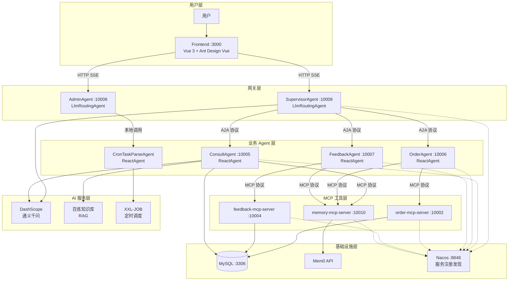
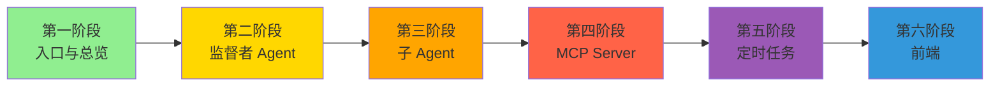

# 云边奶茶铺多智能体系统 —— 完整学习文档

> 基于 Spring AI Alibaba 的分布式多智能体系统，从入门到精通

---

## 项目简介

云边奶茶铺智能助手 Demo，支持一站式咨询、点单与反馈，持续根据用户行为和喜好推荐并下单产品。

### 核心能力

| 端口 | 服务 | 角色 |
|------|------|------|
| 3000 | frontend | Vue 3 前端界面 |
| 10008 | supervisor-agent | 监督者 Agent，路由分发 |
| 10005 | consult-sub-agent | 咨询子 Agent，RAG + 推荐 |
| 10006 | order-sub-agent | 订单子 Agent，下单/查询 |
| 10007 | feedback-sub-agent | 反馈子 Agent，投诉/安抚 |
| 10002 | order-mcp-server | 订单 MCP Server，9 个工具 |
| 10004 | feedback-mcp-server | 反馈 MCP Server，4 个工具 |
| 10010 | memory-mcp-server | 记忆 MCP Server，Mem0 读写 |

### 技术栈

- **后端**：Java 17+, Spring Boot 3.2.0, Spring AI 1.0.0, Spring AI Alibaba 1.0.0.4
- **前端**：Vue 3, Ant Design Vue, Vite
- **中间件**：MySQL, Redis, Nacos
- **AI 服务**：阿里云 DashScope（通义千问）+ 百炼知识库（RAG）+ Mem0（记忆管理）
- **调度**：XXL-JOB

---

## 文档导航

### 第一阶段：入口与总览
**[📖 阅读文档 →](./phase-01-overview.md)**

建立整体认知，了解项目结构、模块依赖和启动流程。

- README.md — 业务场景 + 架构图
- pom.xml — 模块依赖关系
- SupervisorAgentApplication.java — 启动入口

### 第二阶段：监督者 Agent（核心路由逻辑）
**[📖 阅读文档 →](./phase-02-supervisor-agent.md)**

理解 LlmRoutingAgent 的路由机制、A2A 协议、SSE 流式输出。

- SupervisorAgent.java — LlmRoutingAgent 构建 + A2A 协议
- SanitizingRoutingChatModel.java — 路由输出清洗
- SupervisorAgentController.java — HTTP SSE 接口
- application.yml — 完整配置解析
- AdminAgent.java — 管理端路由 Agent

### 第三阶段：子 Agent（业务处理）
**[📖 阅读文档 →](./phase-03-sub-agents.md)**

理解 ReactAgent 的业务逻辑、本地工具与 MCP 远程工具的组合使用。

- ConsultAgent.java — RAG + 本地Tool + MCP 远程Tool
- ConsultTools.java — 4 个本地工具
- ConsultService.java — 百炼知识库检索
- OrderAgent.java — 双 MCP 通道
- FeedbackAgent.java — 单一 MCP 通道

### 第四阶段：MCP Server（工具远程化）
**[📖 阅读文档 →](./phase-04-mcp-server.md)**

理解 MCP 协议如何将 @Tool 方法暴露为远程服务。

- OrderMcpTools.java — 9 个订单工具
- FeedbackMcpTools.java — 4 个反馈工具
- MemoryMcpTools.java — 2 个记忆工具
- MemoryService.java — Mem0 API 调用原理

### 第五阶段：定时任务（Agent 自主运行）
**[📖 阅读文档 →](./phase-05-scheduled-tasks.md)**

理解 Graph 编排、自定义节点、XXL-JOB 调度。

- DailyReportAgentConfiguration.java — 手写 StateGraph
- EvaluationAgentConfiguration.java — IterationNode 迭代
- CronAgentTools.java — 定时任务创建
- DingMessageSenderNode.java — 自定义 Graph 节点

### 第六阶段：前端
**[📖 阅读文档 →](./phase-06-frontend.md)**

理解前端如何调用 Agent 的 SSE 流式接口。

- Vue 3 + Ant Design Vue 界面
- SSE EventSource 流式消费
- 与 SupervisorAgent 的交互流程

---

## 核心概念速查

| 概念 | 一句话解释 | 详见 |
|------|-----------|------|
| A2A 协议 | Google 制定的 Agent 间通信开放标准 | 第二阶段 |
| MCP 协议 | 把 @Tool 方法暴露为远程服务的开放标准 | 第四阶段 |
| LlmRoutingAgent | LLM 决策路由 + Graph 条件边的内置 Agent | 第二阶段 |
| ReactAgent | ReAct 范式的标准 Agent（思考→行动→观察） | 第三阶段 |
| StateGraph | 显式编排节点和边的工作流引擎 | 第五阶段 |
| NodeAction | Graph 中的节点，实现 apply() 方法 | 第五阶段 |
| IterationNode | 对数组每个元素执行相同子图的迭代节点 | 第五阶段 |
| ToolCallback | 工具的抽象封装，本地和远程统一接口 | 第三/四阶段 |
| SanitizingRoutingChatModel | 装饰器模式，过滤 LLM 思考块 | 第二阶段 |
| MinimaxCompatibleChatModel | 流式思考块状态过滤 | 第三阶段 |

---

## 系统全景架构

---

## 学习路线图

---

> 文档生成日期：2026-07-09
> 基于项目：spring-ai-alibaba-multi-agent-demo v1.0.0