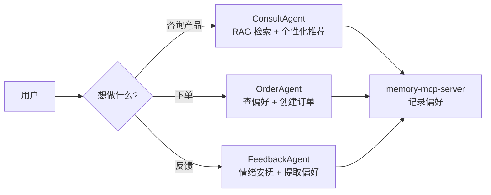
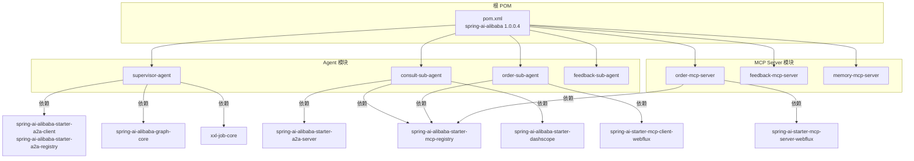
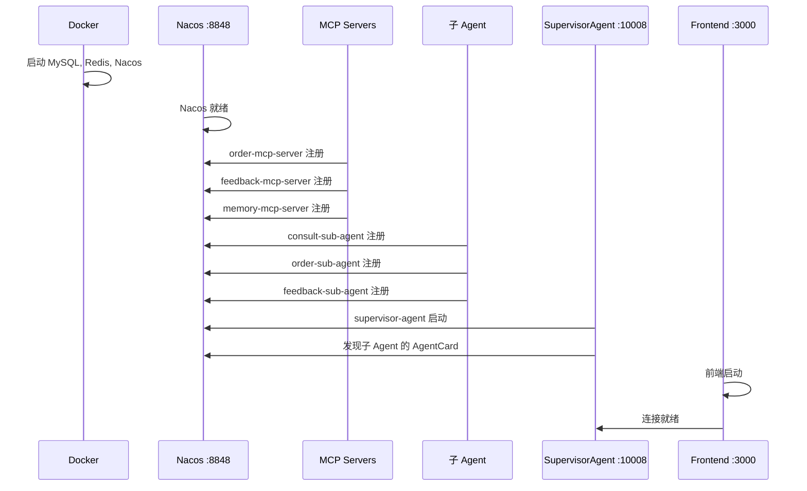

# 第一阶段：入口与总览

> 建立整体认知，了解项目结构、模块依赖和启动流程

---

## 1. README.md — 业务场景 + 架构图

### 一句话概括

云边奶茶铺智能助手 Demo，是一个**带记忆的个性化多智能体电商系统**——用户咨询、下单、反馈，系统持续学习用户偏好，实现"越来越懂我"。

### 核心业务流程



### 三大核心能力

1. **产品咨询与推荐**：根据用户习惯和喜好推荐奶茶，记录偏好
2. **点单与订单查询**：下单、修改、查询订单，记录下单习惯
3. **反馈与投诉处理**：处理用户反馈，安抚情绪，提取偏好

### 服务架构

```
用户端 (C端):
  前端(3000) → SupervisorAgent(10008) → consult/order/feedback 子Agent

管理端 (B端):
  前端(3000) → AdminAgent(10008) → CronTaskParseAgent → 定时任务

定时任务:
  XXL-JOB → DailyReportAgent(日报) / EvaluationAgent(评价分析) → 钉钉通知
```

---

## 2. pom.xml — 模块依赖关系

### 根 POM 模块结构

```xml
<modules>
    <module>supervisor-agent</module>       <!-- 监督者 Agent -->
    <module>consult-sub-agent</module>      <!-- 咨询子 Agent -->
    <module>order-sub-agent</module>        <!-- 订单子 Agent -->
    <module>feedback-sub-agent</module>     <!-- 反馈子 Agent -->
    <module>order-mcp-server</module>       <!-- 订单 MCP Server -->
    <module>feedback-mcp-server</module>    <!-- 反馈 MCP Server -->
    <module>memory-mcp-server</module>      <!-- 记忆 MCP Server -->
</modules>
```

### 关键版本号

```xml
<properties>
    <spring-ai.version>1.0.0</spring-ai.version>
    <spring-ai-alibaba.version>1.0.0.4</spring-ai-alibaba.version>
    <java.version>17</java.version>
</properties>
```

### 核心依赖关系图



### 依赖分类

| 依赖类型 | 关键依赖 | 用途 |
|---------|---------|------|
| **A2A 通信** | spring-ai-alibaba-starter-a2a-client/server/registry | Agent 间通信 |
| **MCP 工具** | spring-ai-starter-mcp-server-webflux/client-webflux | 远程工具暴露/发现 |
| **MCP 注册** | spring-ai-alibaba-starter-mcp-registry | Nacos 注册发现 |
| **Graph 引擎** | spring-ai-alibaba-graph-core | Graph 编排 |
| **AI 模型** | spring-ai-starter-model-openai | OpenAI 兼容协议 |
| **RAG** | spring-ai-alibaba-starter-dashscope | 百炼知识库 |
| **调度** | xxl-job-core | 定时任务 |

---

## 3. SupervisorAgentApplication.java — 启动入口

### 代码

```java
@SpringBootApplication
public class SupervisorAgentApplication {
    public static void main(String[] args) {
        SpringApplication.run(SupervisorAgentApplication.class, args);
    }
}
```

### 为什么 SupervisorAgent 是入口

SupervisorAgent 是整个系统的**网关**——它不处理具体业务，只负责路由分发。所有用户请求先到达它，再转发给子 Agent。

### 启动顺序



**关键原则**：SupervisorAgent 必须最后启动，因为它在启动时需要从 Nacos 发现子 Agent——如果子 Agent 还没注册，SupervisorAgent 会打印 WARN 日志，路由功能不可用。

---

## 第一阶段总结

| 学到什么 | 关键概念 |
|---------|---------|
| 项目整体架构 | 7 个微服务模块，分层架构 |
| 模块依赖关系 | A2A 通信、MCP 工具、Graph 引擎、RAG |
| 启动顺序 | MCP Server → 子 Agent → SupervisorAgent → 前端 |
| 核心流程 | 用户请求 → 路由分发 → 业务处理 → 工具调用 → 记忆存储 |

**下一步**：[第二阶段：监督者 Agent](./phase-02-supervisor-agent.md) — 深入理解 LlmRoutingAgent 的路由机制和 A2A 协议。