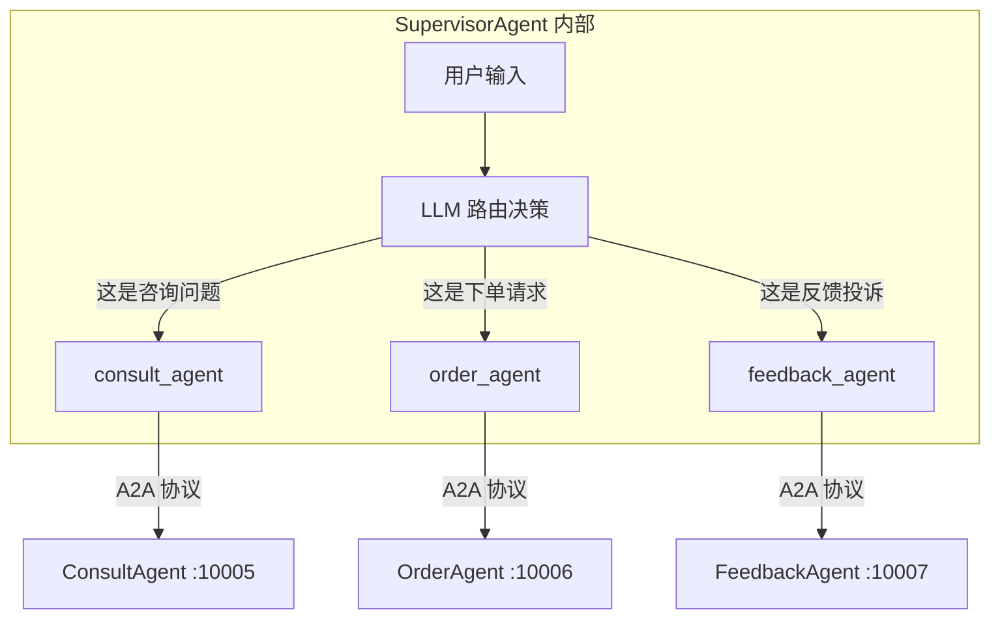
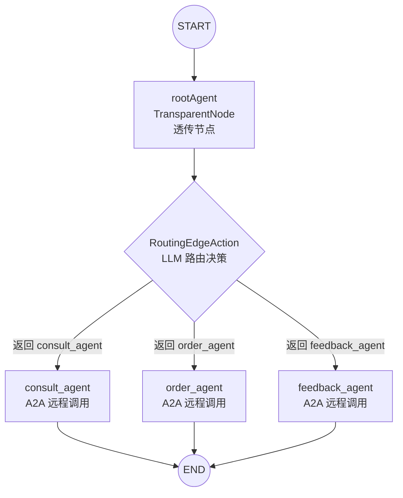
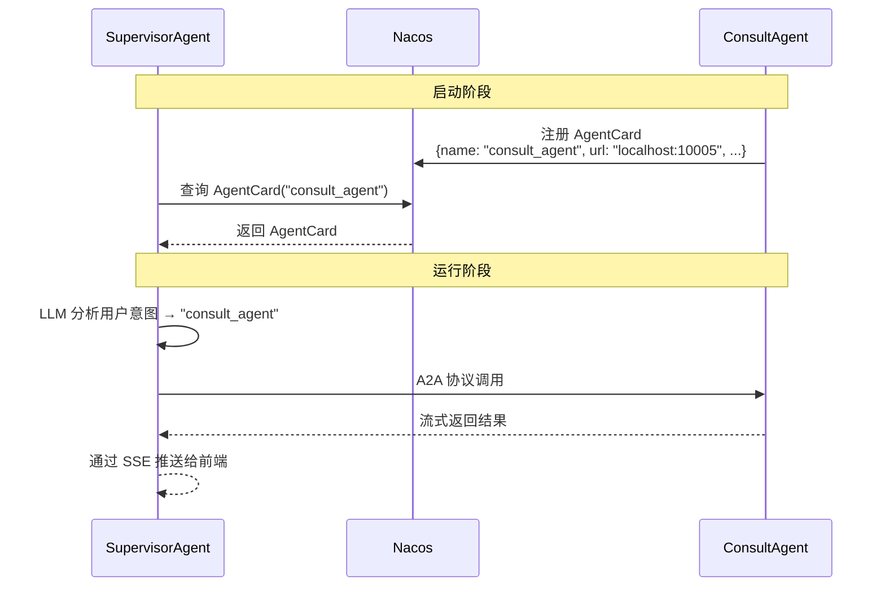
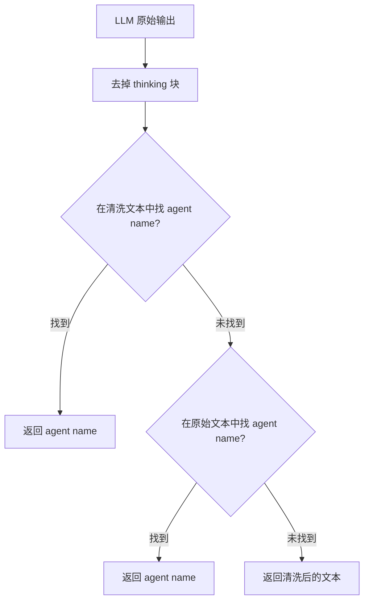
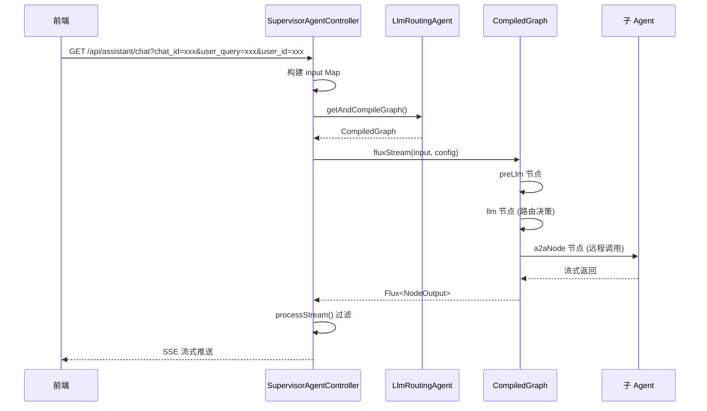

# 第二阶段：监督者 Agent（核心路由逻辑）

> 理解 LlmRoutingAgent 的路由机制、A2A 协议、SSE 流式输出

---

## 4. SupervisorAgent.java — 主 Agent：LlmRoutingAgent 构建

### 一句话概括

SupervisorAgent 是系统的**智能路由器**——它不处理业务，只负责分析用户意图，然后通过 A2A 协议把请求转发给合适的子 Agent。

### 核心架构



### 完整代码分析

```java
@Configuration
public class SupervisorAgent {

    @Bean
    public LlmRoutingAgent supervisorAgentBean(
            @Qualifier("openAiChatModel") ChatModel chatModel,
            @Autowired @Qualifier("nacosAgentCardProvider")
            AgentCardProvider agentCardProvider) throws Exception {

        // ============ 步骤 1：配置 State 策略 ============
        // ReplaceStrategy：每次更新覆盖旧值，适合路由场景
        KeyStrategyFactory stateFactory = () -> {
            HashMap<String, KeyStrategy> keyStrategyHashMap = new HashMap<>();
            keyStrategyHashMap.put("input", new ReplaceStrategy());    // 用户输入
            keyStrategyHashMap.put("chat_id", new ReplaceStrategy());  // 会话 ID
            keyStrategyHashMap.put("user_id", new ReplaceStrategy());  // 用户 ID
            keyStrategyHashMap.put("messages", new ReplaceStrategy()); // 消息列表
            return keyStrategyHashMap;
        };

        // ============ 步骤 2：从 Nacos 获取子 Agent 的 AgentCard ============
        // AgentCard 是子 Agent 的"名片"：包含名称、描述、URL、能力声明
        A2aRemoteAgent consultAgent = A2aRemoteAgent.builder()
                .name("consult_agent")
                .agentCardProvider(agentCardProvider)  // 从 Nacos 动态获取
                .description("处理奶茶相关产品、活动等咨询问题")
                .build();

        A2aRemoteAgent feedbackAgent = A2aRemoteAgent.builder()
                .name("feedback_agent")
                .agentCardProvider(agentCardProvider)
                .description("云边奶茶铺反馈处理助手")
                .build();

        A2aRemoteAgent orderAgent = A2aRemoteAgent.builder()
                .name("order_agent")
                .agentCardProvider(agentCardProvider)
                .description("云边奶茶铺智能订单处理助手")
                .build();

        // ============ 步骤 3：创建路由 ChatModel ============
        // SanitizingRoutingChatModel：过滤 LLM 思考块，提取 agent name
        ChatModel routingChatModel = new SanitizingRoutingChatModel(
                chatModel,
                List.of("consult_agent", "feedback_agent", "order_agent"));

        // ============ 步骤 4：构建 LlmRoutingAgent ============
        return LlmRoutingAgent.builder()
                .name("supervisor_agent")
                .model(routingChatModel)
                .state(stateFactory)
                .description(promptConfig.getSupervisorAgentInstruction())
                .inputKey("input")      // 从 state["input"] 读取用户输入
                .outputKey("messages")  // 结果写入 state["messages"]
                .subAgents(List.of(consultAgent, feedbackAgent, orderAgent))
                .build();
    }
}
```

### LlmRoutingAgent 内部 Graph 结构



### 关键知识点

**A2A 协议不是 Spring AI 专有的**——它是 Google 2025 年 4 月发布的开放标准，2025 年 9 月已捐赠给 Linux 基金会。Spring AI Alibaba 只是实现了这个协议并适配了 Nacos 作为服务发现。



---

## 5. SanitizingRoutingChatModel.java — 路由输出清洗

### 一句话概括

这个类解决了 LLM 输出"不干净"的问题——过滤掉思考块，精准提取路由目标。

### 问题场景

```text
LLM 原始输出:
  " thinking用户想点奶茶，这是订单相关的请求
  我应该调用 order_agent 来处理这个请求。
   response用户想点一杯云边茉莉..."

LlM 输出中可能包含:
  1.  thinking... response 思考块（对路由无意义）
  2. 多余的解释文字（"我认为应该调用..."）
  3. 正文（需要转发给子 Agent 的内容）

路由决策只需要: "order_agent"
```

### 核心处理逻辑

```java
final class SanitizingRoutingChatModel implements ChatModel {
    // 思考块匹配正则
    private static final Pattern THINKING_BLOCK =
        Pattern.compile("(?is) thinking.*? response");

    private String sanitize(String text) {
        if (text == null) return null;

        // 第一步：去掉  thinking... 块
        String withoutThinking = THINKING_BLOCK.matcher(text)
            .replaceAll("").trim();

        // 第二步：在清洗后的文本中找子 Agent 名称
        String routeId = lastRouteId(withoutThinking);
        if (routeId != null) return routeId;

        // 第三步：回退到原始文本中找（容错）
        routeId = lastRouteId(text);
        return routeId != null ? routeId : withoutThinking;
    }
}
```

### 容错设计



**为什么先查清洗文本再回退原始文本？** 因为 thinking 块中可能也包含 agent name，但那是模型的"思考"过程，不是"决策"结果。优先相信清洗后的文本。

---

## 6. SupervisorAgentController.java — HTTP SSE 接口

### 一句话概括

这是对外的 HTTP 接口，接收前端请求，通过 SSE 流式返回 AI 响应。

### API 端点

```
GET /api/assistant/chat?chat_id={会话ID}&user_query={用户输入}&user_id={用户ID}
```

### 数据流



### processStream 过滤逻辑

```java
public void processStream(Flux<NodeOutput> generator,
                          Sinks.Many<ServerSentEvent<String>> sink) {
    generator
        // 只保留 a2aNode 的输出（子 Agent 的返回内容）
        .filter(output -> "a2aNode".equals(output.node())
                && output instanceof StreamingOutput)
        // 提取流式文本块
        .cast(StreamingOutput.class)
        .map(StreamingOutput::chunk)
        // 过滤空内容和状态消息
        .filter(content -> content != null && !content.isEmpty()
                && !content.equals("Agent State: submitted"))
        // 包装为 SSE 事件
        .map(content -> ServerSentEvent.builder(content).build())
        // 发送
        .doOnNext(sink::tryEmitNext)
        .doOnComplete(() -> sink.tryEmitComplete())
        .subscribe();
}
```

### 为什么只过滤 a2aNode 的输出

LlmRoutingAgent 内部 Graph 有多个节点：

| 节点 | 作用 | 是否对用户可见 |
|------|------|---------------|
| preLlm | 准备上下文 | ❌ 内部 |
| llm | LLM 路由决策 | ❌ 内部 |
| **a2aNode** | **子 Agent 返回内容** | **✅ 用户可见** |

只有 a2aNode 的输出是用户真正需要看到的内容。

---

## 7. application.yml — 完整配置解析

### 核心配置结构

```yaml
server:
  port: 10008                        # SupervisorAgent 端口

spring:
  application:
    name: supervisor-agent

  ai:
    # OpenAI 兼容协议（LLM 模型）
    openai:
      api-key: ${AI_OPENAI_API_KEY}
      base-url: ${AI_OPENAI_BASE_URL}
      chat:
        options:
          model: ${AI_OPENAI_MODEL:MiniMax-M3}

    # A2A 协议配置
    alibaba:
      a2a:
        nacos:
          server-addr: ${NACOS_SERVER_ADDR:127.0.0.1:8848}
          discovery:
            enabled: true              # ★ 启用 A2A 服务发现

# 提示词配置
agent:
  prompts:
    supervisor-agent-instruction: |
      角色与职责:
      你是云边奶茶铺的监督者智能体，负责协调和管理其他子智能体的工作。
      你可以调用以下子智能体来处理不同类型的用户请求：
      - feedback_agent: 处理用户反馈、投诉和差评
      - consult_agent: 处理产品咨询、活动信息和冲泡指导
      - order_agent: 处理订单相关业务，包括下单、查询、修改等
```

### 提示词的作用

这个提示词会被注入到 LlmRoutingAgent 的 RoutingEdgeAction 中，成为 LLM 的系统提示词。LLM 根据这个提示词理解自己的角色和可用的子 Agent，然后做出路由决策。

---

## 8. AdminAgent.java — 管理端路由 Agent

### 一句话概括

AdminAgent 和 SupervisorAgent 都使用 LlmRoutingAgent，但有一个关键区别：**子 Agent 是本地 BaseAgent 而非远程 A2aRemoteAgent**。

### 与 SupervisorAgent 的对比

| 维度 | SupervisorAgent | AdminAgent |
|------|----------------|------------|
| **服务对象** | C 端用户 | B 端管理员 |
| **子 Agent 类型** | A2aRemoteAgent（远程） | BaseAgent（本地 ReactAgent） |
| **子 Agent 数量** | 3 个 | 1 个（CronTaskParseAgent） |
| **输入 key** | `input` | `user_query` |
| **输出 key** | `messages` | `agent_input` |

### 为什么 AdminAgent 不用远程调用

```java
// AdminAgent 的子 Agent 是本地 ReactAgent
@Bean
public LlmRoutingAgent adminAgentBean(
        @Qualifier("openAiChatModel") ChatModel chatModel,
        @Qualifier("cronTaskParseAgent") BaseAgent cronTaskParseAgent) {

    return LlmRoutingAgent.builder()
            .name("admin_agent")
            .model(routingChatModel)
            .inputKey("user_query")
            .outputKey("agent_input")    // ★ 输出到 CronTaskParseAgent 的输入 key
            .subAgents(List.of(cronTaskParseAgent))  // 本地 Agent
            .build();
}
```

CronTaskParseAgent 需要直接操作 Spring 容器中的 Bean（注册定时任务），所以不能远程部署。对比 consult/order/feedback 子 Agent 是独立的微服务，需要 A2A 协议通信。

---

## 第二阶段总结

| 学到什么 | 关键概念 |
|---------|---------|
| LlmRoutingAgent 构建 | A2A 协议、AgentCard 注册发现、Graph 条件路由 |
| 路由输出清洗 | 装饰器模式、思考块过滤、容错回退 |
| SSE 流式输出 | Sinks.Many、processStream 过滤、a2aNode |
| 提示词配置 | @ConfigurationProperties 外置管理 |
| 管理端 vs 用户端 | 本地 BaseAgent vs 远程 A2aRemoteAgent |

**下一步**：[第三阶段：子 Agent](./phase-03-sub-agents.md) — 深入理解 ReactAgent 的业务逻辑和工具组合。