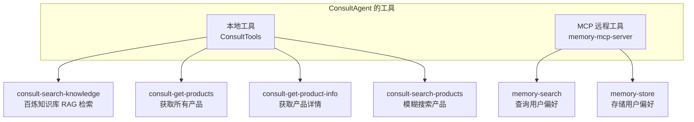
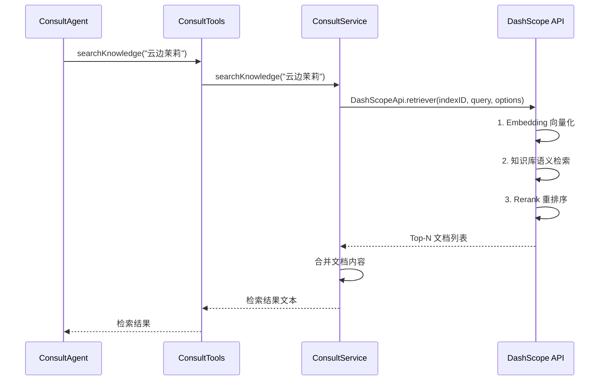
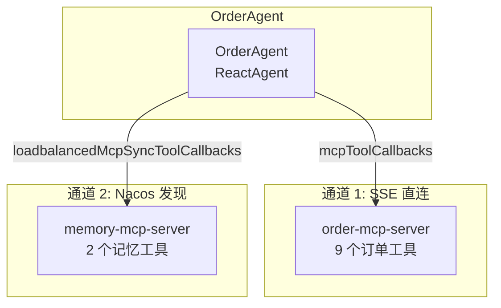

# 第三阶段：子 Agent（业务处理）

> 理解 ReactAgent 的业务逻辑、本地工具与 MCP 远程工具的组合使用

---

## 12. ConsultAgent.java — ReactAgent + 本地Tool + MCP远程Tool

### 一句话概括

ConsultAgent 是三个子 Agent 中**最复杂的**——它同时使用本地工具（RAG 检索）和 MCP 远程工具（记忆管理），展示了两种工具来源的完美组合。

### 工具架构



### 两种工具加载方式的对比

```java
@Bean
public ReactAgent consultSubAgentBean(
        @Qualifier("openAiChatModel") ChatModel chatModel,
        @Autowired(required = false)
        @Qualifier("loadbalancedMcpSyncToolCallbacks")
        ToolCallbackProvider toolsProvider) {

    List<ToolCallback> tools = new ArrayList<>();

    // ============ 方式 1：MCP 远程工具 ============
    // 从 Nacos 发现 memory-mcp-server，自动获取其工具
    for (ToolCallback toolCallback : toolsProvider.getToolCallbacks()) {
        // toolCallback 是远程代理对象，调用时走 MCP 协议
        tools.add(toolCallback);
    }

    // ============ 方式 2：本地工具 ============
    // 扫描 ConsultTools 的 @Tool 方法，包装为 ToolCallback
    MethodToolCallbackProvider localToolsProvider =
        MethodToolCallbackProvider.builder()
            .toolObjects(consultTools)
            .build();
    for (ToolCallback toolCallback : localToolsProvider.getToolCallbacks()) {
        // toolCallback 是本地代理，调用时直接执行方法
        tools.add(toolCallback);
    }

    return ReactAgent.builder()
            .name("consult_agent")
            .model(new MinimaxCompatibleChatModel(chatModel))
            .tools(tools)  // 合并两种工具
            .build();
}
```

### 为什么选择本地 vs MCP

| 工具 | 方式 | 原因 |
|------|------|------|
| 知识库检索 | 本地 @Tool | 只有 ConsultAgent 需要，且需要直接访问 MySQL |
| 产品查询 | 本地 @Tool | Agent 专属，简单高效 |
| 记忆管理 | MCP 远程 | 三个 Agent 都需要，放在 MCP 中统一管理 |

---

## 13. ConsultService.java — 阿里云百炼 RAG 检索

### 一句话概括

这是 ConsultAgent 的"知识大脑"——当用户咨询产品时，Agent 通过 RAG 从百炼知识库中检索相关信息。

### RAG 检索流程



### 重排序（Reranking）配置

```yaml
spring:
  ai:
    dashscope:
      document-retrieval:
        enable-reranking: true      # 启用重排序
        rerank-top-n: 2             # 只保留 Top 2
        rerank-min-score: 0         # 最低分数阈值
```

重排序的作用：初次检索可能返回多条结果，重排序模型对结果重新打分，过滤低相关度文档，提高检索精度。

---

## 15. MinimaxCompatibleChatModel.java — 流式思考块过滤

### 一句话概括

与 SanitizingRoutingChatModel 类似，但针对**流式场景**做了有状态优化——因为 ` thinking` 和 ` response` 标签可能跨多个 chunk 出现。

### 流式处理的挑战

```text
同步调用（完整文本）:
  直接用正则  thinking.*? response 替换即可

流式调用（逐 chunk）:
  chunk 1: "正常文本  thinking内部思考"
  chunk 2: "更多思考  response正常文本"
  → 需要跨 chunk 跟踪状态！
```

### 有状态过滤实现

```java
private String sanitizeStreaming(String text, ThinkingState state) {
    StringBuilder visible = new StringBuilder();
    int index = 0;
    while (index < text.length()) {
        if (state.inThinking) {
            // 在思考块内：寻找  response 结束标记
            int end = text.indexOf(" response", index);
            if (end < 0) return visible.toString();  // 还没结束
            state.inThinking = false;
            index = end + " response".length();
        } else {
            // 在思考块外：寻找  thinking 开始标记
            int start = text.indexOf(" thinking", index);
            if (start < 0) {
                visible.append(text.substring(index));
                break;
            }
            visible.append(text, index, start);
            state.inThinking = true;
            index = start + " thinking".length();
        }
    }
    return visible.toString();
}

// 状态跟踪器
private static final class ThinkingState {
    private boolean inThinking;
}
```

---

## 16. OrderAgent.java — 双 MCP 通道

### 一句话概括

OrderAgent 是唯一使用**两个 MCP 通道**的 Agent——同时连接 order-mcp-server 和 memory-mcp-server。

### 双通道架构



```java
@Bean
public ReactAgent orderSubAgentBean(
        @Qualifier("openAiChatModel") ChatModel chatModel,
        @Autowired(required = false)
        @Qualifier("mcpToolCallbacks")            // ★ 通道 1
        ToolCallbackProvider toolsProvider,
        @Autowired(required = false)
        @Qualifier("loadbalancedMcpSyncToolCallbacks")  // ★ 通道 2
        ToolCallbackProvider nacosToolsProvider) {

    List<ToolCallback> tools = new ArrayList<>();

    // 通道 1：SSE 直连 order-mcp-server
    for (ToolCallback tc : toolsProvider.getToolCallbacks()) {
        tools.add(tc);
    }

    // 通道 2：Nacos 发现 memory-mcp-server
    for (ToolCallback tc : nacosToolsProvider.getToolCallbacks()) {
        tools.add(tc);
    }

    return ReactAgent.builder()
            .name("order_agent")
            .tools(tools)
            .build();
}
```

---

## 17. FeedbackAgent.java — 单一 MCP 通道

### 与 OrderAgent 的对比

| 维度 | OrderAgent | FeedbackAgent |
|------|-----------|---------------|
| **MCP 通道数** | 2 个 | 1 个 |
| **工具来源** | order-mcp + memory-mcp | feedback-mcp + memory-mcp |
| **本地工具** | 无 | 无 |
| **核心能力** | 订单 CRUD + 记忆 | 反馈处理 + 情绪安抚 |

### 情绪处理策略（来自提示词）

| 用户情绪 | 处理策略 |
|---------|---------|
| 愤怒 | 先道歉安抚，再提供解决方案 |
| 失望 | 表示理解，提供补偿方案 |
| 满意 | 表示感谢，记录正面偏好 |
| 建议 | 积极回应，记录改进建议 |

---

## 第三阶段总结

| 学到什么 | 关键概念 |
|---------|---------|
| 工具组合 | 本地 @Tool + MCP 远程 Tool |
| RAG 检索 | 百炼知识库 + 重排序 |
| 流式过滤 | 有状态跨 chunk 处理 |
| 双 MCP 通道 | SSE 直连 vs Nacos 发现 |
| 情绪处理 | 差异化安抚策略 |

**下一步**：[第四阶段：MCP Server](./phase-04-mcp-server.md) — 深入理解 MCP 协议如何暴露工具。