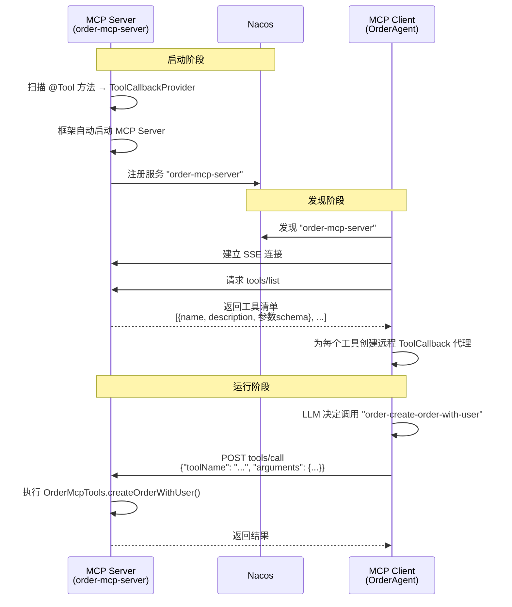
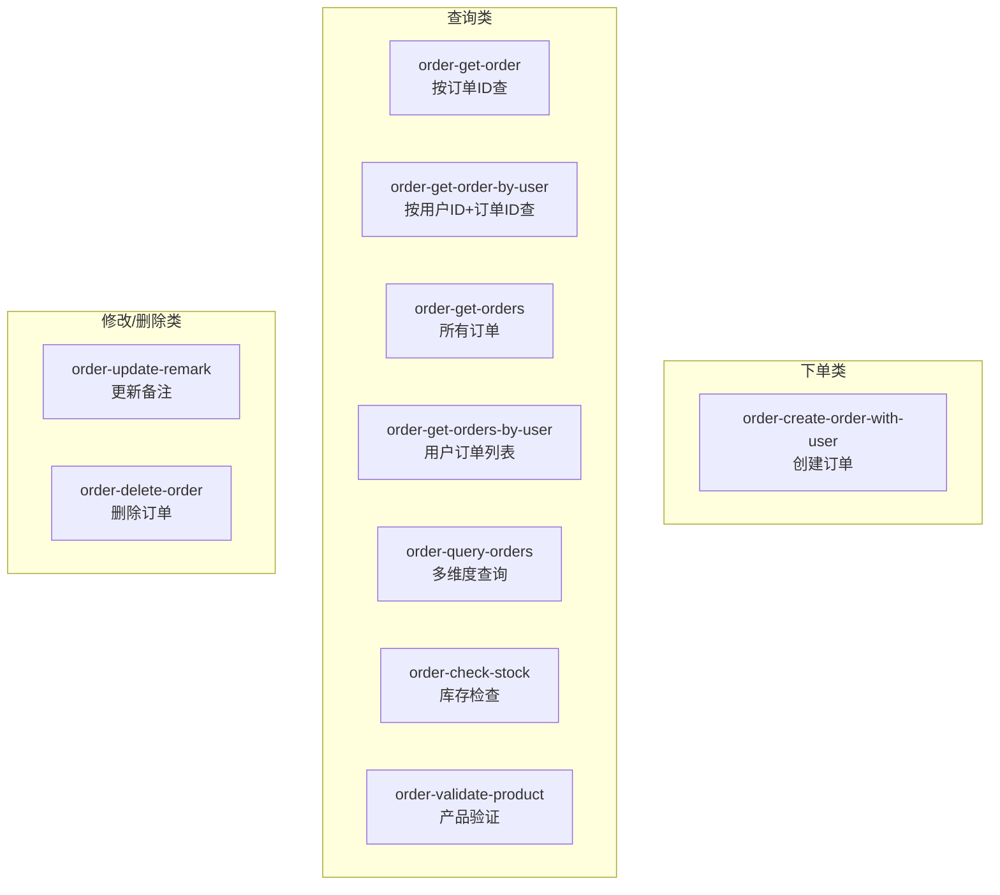
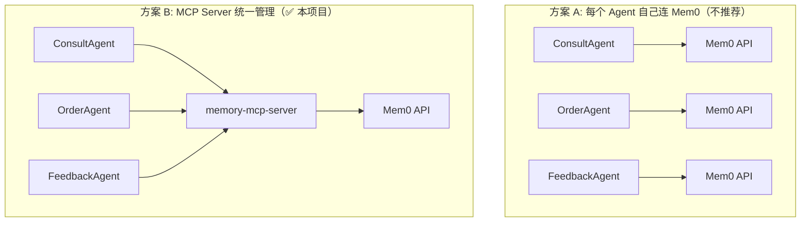
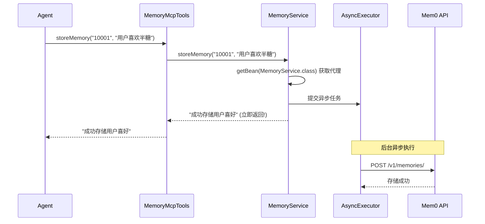

# 第四阶段：MCP Server（工具远程化）

> 深入理解 MCP 协议如何将 @Tool 方法暴露为远程服务

---

## MCP 协议概述

### 一句话概括

MCP（Model Context Protocol）是 Anthropic 制定的开放标准，用于**把 @Tool 方法通过标准协议暴露给远程 Agent 调用**。和 HTTP 暴露 REST API 一个道理，但 MCP 是专门为 AI Agent 设计的。

### MCP 完整通信链路



---

## 18. OrderMcpTools.java — 9 个订单工具

### 工具分类



### 安全设计：双重验证

```java
// ★ 安全设计：同时验证用户ID 和订单ID
@Tool(name = "order-delete-order",
      description = "根据用户ID和订单ID删除订单。只能删除属于该用户的订单。")
public String deleteOrder(
        @ToolParam(description = "用户ID，必须为正整数") Long userId,
        @ToolParam(description = "订单ID") String orderId) {
    boolean deleted = orderService.deleteOrder(userId, orderId);
    // 只有 userId + orderId 都匹配才能删除
    return deleted ? "删除成功" : "删除失败，订单不存在或无权限";
}
```

### 甜度/冰量的自然语言转换

```java
// LLM 输出自然语言 → 数据库数字编码
// 无糖=1, 微糖=2, 半糖=3, 少糖=4, 标准糖=5
private Integer convertSweetnessToNumber(String sweetness) {
    if (sweetness == null) return 5;
    switch (sweetness.toLowerCase()) {
        case "无糖": return 1;
        case "微糖": return 2;
        case "半糖": return 3;
        case "少糖": return 4;
        case "标准糖": return 5;
        default: return 5;
    }
}
```

---

## 19. OrderServerApplication.java — MCP Server 启动

### 核心代码

```java
@SpringBootApplication
public class OrderServerApplication {
    public static void main(String[] args) {
        SpringApplication.run(OrderServerApplication.class, args);
    }

    // ★ 关键：将 @Tool 方法包装为 ToolCallbackProvider
    @Bean
    public ToolCallbackProvider orderTools(OrderMcpTools orderMcpTools) {
        return MethodToolCallbackProvider.builder()
                .toolObjects(orderMcpTools)  // 扫描所有 @Tool 方法
                .build();
    }
}
```

### 框架自动完成的工作

```
1. 检测到 ToolCallbackProvider Bean
2. Spring AI Alibaba MCP 自动配置启动 MCP Server
3. 暴露 MCP 协议端点（SSE/HTTP）
4. 注册到 Nacos
```

### 配置触发

```yaml
spring:
  ai:
    mcp:
      server:
        name: order-mcp-server
        type: SYNC
    alibaba:
      mcp:
        nacos:
          register:
            enabled: true          # ★ 注册到 Nacos
```

---

## 21. MemoryMcpTools.java — 2 个记忆工具

### 为什么记忆要独立为 MCP Server



**三个好处**：
1. API Key 只保存在 MCP Server 中（安全）
2. 记忆格式统一（一致性）
3. 升级只需改 MCP Server（维护成本低）

---

## 22. MemoryService.java — Mem0 API 调用原理

### 异步存储设计



### 为什么异步

| 原因 | 说明 |
|------|------|
| 不阻塞对话 | 用户不需要等记忆存完 |
| 容错 | Mem0 挂了不影响正常对话 |
| 削峰 | 大量并发写入不会拖垮 Agent |

### 时间范围过滤

```java
// 只查最近两周的记忆，避免返回过时偏好
LocalDate twoWeeksAgo = today.minusWeeks(2);
// 请求体中的过滤条件
filters.put("AND", List.of(
    Map.of("user_id", userId),
    Map.of("created_at", Map.of("gte", startDate, "lte", endDate))
));
```

---

## 第四阶段总结

| 学到什么 | 关键概念 |
|---------|---------|
| MCP Server 注册 | @Tool → ToolCallbackProvider → 框架自动暴露 |
| MCP Client 发现 | Nacos 发现 → 建立连接 → 获取工具清单 → 创建代理 |
| 安全设计 | 双重验证（用户ID + 订单ID） |
| 异步存储 | getBean 代理 + @Async 线程池 |
| 语义检索 | Mem0 V2 API + 时间范围 + 向量相似度 |

**下一步**：[第五阶段：定时任务](./phase-05-scheduled-tasks.md) — 理解 Agent 如何自主定时运行。