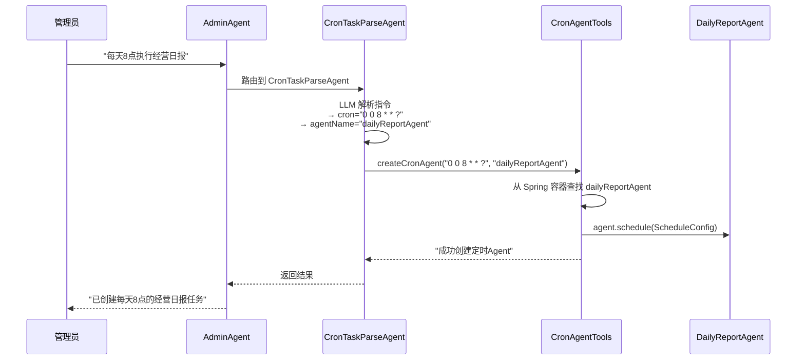
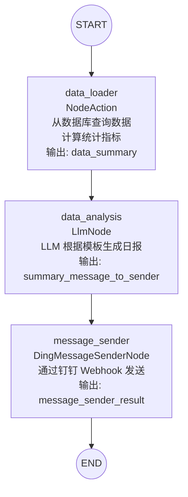
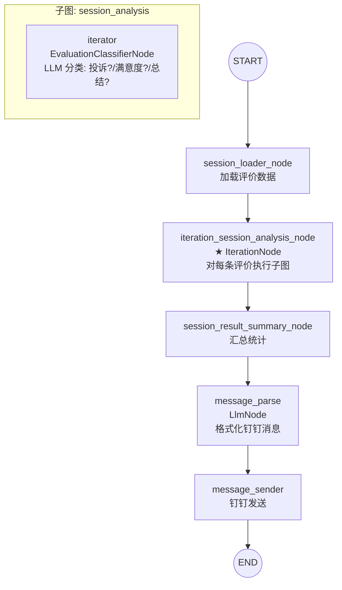
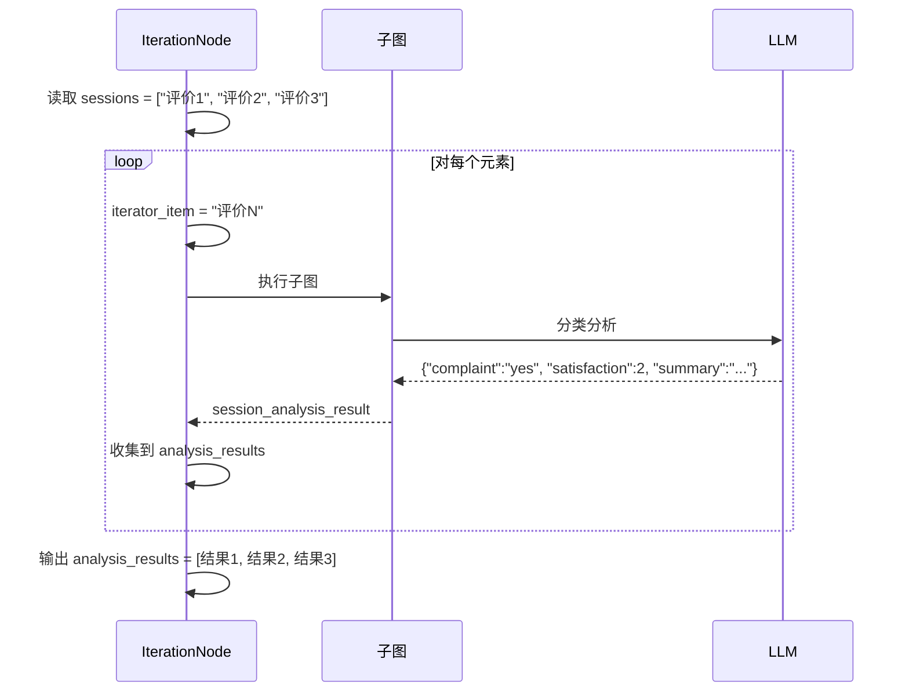

# 第五阶段：定时任务（Agent 自主运行）

> 理解 Graph 编排、自定义节点、XXL-JOB 调度——Agent 不需要用户触发，自己定时运行

---

## 核心概念速查

### Agent vs Graph vs NodeAction vs Tool

```mermaid
graph TD
    subgraph "Agent（有脑子）"
        A[Agent<br/>有 LLM 推理循环<br/>自主决策调 Tool]
    end

    subgraph "Graph（流程编排）"
        G[StateGraph<br/>固定流程<br/>按顺序执行节点]
    end

    subgraph "执行者（没脑子）"
        N[NodeAction<br/>实现 apply()<br/>被 Graph 调用]
        T[Tool<br/>@Tool 方法<br/>被 LLM 调用]
    end

    A -->|可以包含| G
    G -->|编排执行| N
    A -->|主动调用| T
```

| 角色 | 有 LLM 吗 | 谁决定调用 | 调用方式 |
|------|----------|-----------|---------|
| **Agent** | ✅ 有 | 自己决策 | 主动调用 Tool |
| **Graph** | ❌ 没有 | 编排决定 | 被动执行节点 |
| **NodeAction** | ❌ 没有 | Graph 编排 | 被动执行 apply() |
| **Tool** | ❌ 没有 | LLM 决定 | 被动等召唤 |

---

## 23. CronAgentConfiguration.java — 定时任务解析 Agent

### 一句话概括

这是一个 ReactAgent，专门解析管理员的自然语言定时指令（如"每天8点执行日报"），调用工具创建定时任务。

### 数据流



---

## 24. CronAgentTools.java — 定时任务创建工具

### 核心代码

```java
@Tool(description = "可根据用户提供的定时表达式, 创建运行相应的Agent在后台定时执行")
public String createCronAgent(
        @ToolParam(description = "Cron表达式，6段格式") String cron,
        @ToolParam(description = "Agent Bean名称") String agentName) {

    // 从 Spring 容器中查找 CompiledGraph Bean
    CompiledGraph agent = agentsMap.get(agentName);
    if (agent == null) return "Agent not found";

    // 创建定时配置
    ScheduleConfig config = ScheduleConfig.builder()
            .cronExpression(cron)
            .build();

    // 注册定时任务
    agent.schedule(config);
    return "成功创建了一个 " + cron + " 的定时Agent";
}
```

---

## 27. DailyReportAgentConfiguration.java — 日报 Agent

### 一句话概括

这是**手写 StateGraph 的完整示例**——三个节点线性排列，LLM 按模板生成日报，最后通过钉钉发送。

### Graph 结构



### 节点说明

```java
// 节点 1：数据加载（纯 Java 计算，不调用 LLM）
AsyncNodeAction dataLoaderNode = node_async((state) -> {
    // 从 MySQL 查询订单和反馈数据
    List<Order> orders = orderMapper.findOrdersByTimeRange(startTime, endTime);
    List<Feedback> feedbacks = feedbackMapper.selectByTimeRange(startTime, endTime);

    // 计算 TOP3 销量榜、营收榜、好评率、评分分布...
    // ...

    // 输出到 State，供下一个节点使用
    return Map.of("data_summary", templateData);
});

// 节点 2：LLM 分析（调用 LLM 按模板生成日报）
LlmNode llmDataAnalysisNode = LlmNode.builder()
        .chatClient(chatClient)
        .paramsKey("data_summary")              // 从 State 读取模板参数
        .outputKey("summary_message_to_sender") // 输出到钉钉发送节点
        .userPromptTemplate(DAILY_REPORT)       // 日报模板
        .build();

// 节点 3：构建 Graph
StateGraph stateGraph = new StateGraph("OperationAnalysisAgent", ...)
        .addNode("data_loader", dataLoaderNode)
        .addNode("data_analysis", node_async(llmDataAnalysisNode))
        .addNode("message_sender", node_async(generateMessageSender()))
        .addEdge(START, "data_loader")
        .addEdge("data_loader", "data_analysis")
        .addEdge("data_analysis", "message_sender")
        .addEdge("message_sender", END);
```

### 为什么用 Graph 而不是 ReactAgent

日报生成是**确定性流程**——加载→分析→发送，不需要 Agent 自主决策。用 Graph 更精确、更高效，不需要 LLM 参与流程控制。

---

## 28. EvaluationAgentConfiguration.java — 评价分析 Agent

### 一句话概括

比日报 Agent 更复杂，使用了 **IterationNode**——对每条评价逐条调用 LLM 分析，然后汇总统计。

### Graph 结构



### IterationNode 工作原理

```java
// IterationNode 的配置
StateGraph iterationNode = IterationNode.converter()
        .inputArrayJsonKey("sessions")           // 输入数组: 评价列表
        .outputArrayJsonKey("analysis_results")  // 输出数组: 分析结果列表
        .iteratorItemKey("iterator_item")        // 当前元素
        .iteratorResultKey("session_analysis_result") // 当前结果
        .subGraph(sessionAnalysisGraph)          // 对每个元素执行的子图
        .convertToStateGraph();
```



---

## 29. DingMessageSenderNode.java — 自定义 Graph 节点

### 一句话概括

这是一个**自定义 NodeAction**，实现 Graph 中的一个独立节点——从 State 读取消息，通过钉钉 Webhook 发送。

### 核心代码

```java
public class DingMessageSenderNode implements NodeAction {

    @Override
    public Map<String, Object> apply(OverAllState state) throws Exception {
        // 从 State 读取消息内容
        Object message = state.value(messageContentKey).orElse(null);
        String messageContent = extractText(message);

        // 获取 access token
        Object accessToken = state.value(accessTokenKey)
                .orElse(this.accessToken);

        // 发送钉钉消息
        String response = sendMessage(accessToken.toString(), messageContent);
        return Map.of(resultKey, response);
    }
}
```

### 为什么是独立类而不是 lambda

```
lambda 方式:  node_async((state) -> { ... })
  适合: 简单逻辑，一次性使用

独立类方式:  class DingMessageSenderNode implements NodeAction
  适合: 复杂逻辑，多状态，可复用（DailyReportAgent 和 EvaluationAgent 都用）
```

---

## 第五阶段总结

| 学到什么 | 关键概念 |
|---------|---------|
| Agent/Graph/NodeAction/Tool 区别 | 有脑子 vs 流程编排 vs 执行者 |
| 手写 StateGraph | 节点定义、边连接、数据传递 |
| IterationNode | 数组迭代处理，类似串行 fan-out |
| 自定义 NodeAction | 实现 apply()，注册到 Graph |
| XXL-JOB 集成 | 分布式调度 + Agent 定时执行 |

**下一步**：[第六阶段：前端](./phase-06-frontend.md) — 理解前端如何调用 Agent 的 SSE 流式接口。