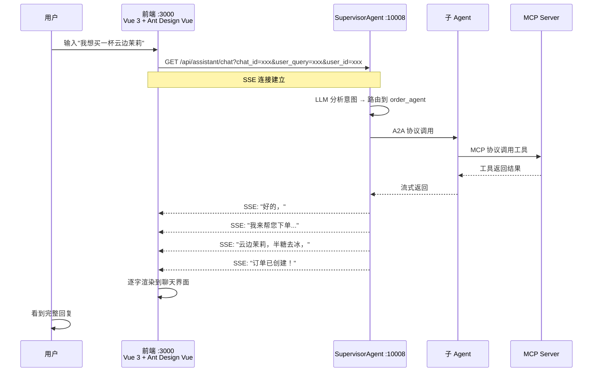
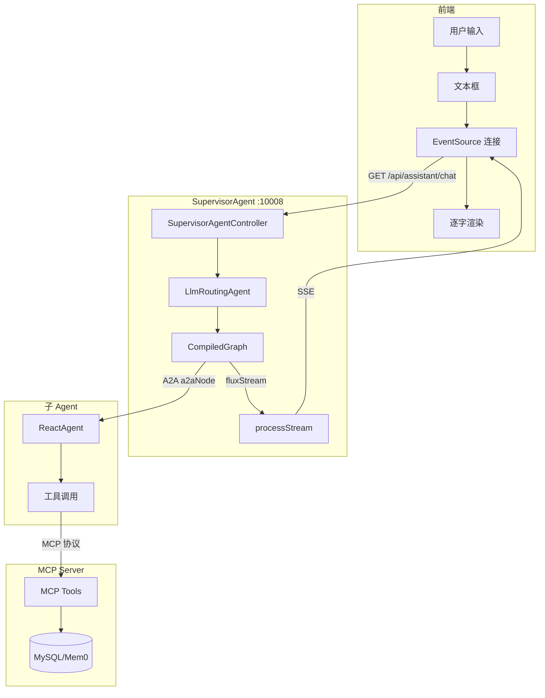
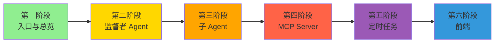

# 第六阶段：前端（Vue 3 全链路）

> 理解前端如何调用 Agent 的 SSE 流式接口，完成从用户输入到 AI 回复的全链路

---

## 整体交互流程



---

## 前端技术栈

```
Vue 3 + Vite + Ant Design Vue + EventSource (SSE)
```

---

## 核心：SSE 流式消费

### 前端 EventSource 调用

```javascript
// 前端发起 SSE 连接
const eventSource = new EventSource(
    `/api/assistant/chat?chat_id=${chatId}&user_query=${userQuery}&user_id=${userId}`
);

// 接收流式消息
eventSource.onmessage = (event) => {
    // event.data 是 AI 返回的文本片段
    appendToChat(event.data);  // 逐字追加到界面
};

// 流结束
eventSource.addEventListener('done', () => {
    eventSource.close();
});

// 错误处理
eventSource.onerror = (error) => {
    console.error('SSE connection error:', error);
    eventSource.close();
};
```

### 为什么用 SSE 而不是 WebSocket

| 维度 | SSE | WebSocket |
|------|-----|-----------|
| **方向** | 单向（服务器→客户端） | 双向 |
| **复杂度** | 简单（浏览器原生 EventSource） | 复杂（需要额外库） |
| **适合场景** | AI 流式输出 | 实时聊天、游戏 |
| **本项目场景** | 用户发一条消息，AI 逐字返回 | — |

---

## 全链路数据流



---

## 关键 API 端点

| 端点 | 方法 | 用途 |
|------|------|------|
| `/api/assistant/chat` | GET | 用户端对话（SSE 流式） |
| `/api/admin/chat` | GET | 管理端对话（SSE 流式） |
| `/api/consult_sub_agent/debug` | GET | 咨询 Agent 调试（直连） |

---

## processStream 过滤了什么

```java
// 后端 Controller 中的过滤逻辑
generator
    .filter(output -> "a2aNode".equals(output.node())  // 只要子 Agent 的输出
            && output instanceof StreamingOutput)
    .cast(StreamingOutput.class)
    .map(StreamingOutput::chunk)                       // 提取文本块
    .filter(content -> content != null
            && !content.isEmpty()
            && !content.equals("Agent State: submitted")) // 过滤状态消息
    .map(content -> ServerSentEvent.builder(content).build())
```

**前端看到的**：只有子 Agent 的实际回复内容，看不到内部路由决策和状态消息。

---

## 第六阶段总结

| 学到什么 | 关键概念 |
|---------|---------|
| SSE 流式消费 | EventSource API、单向推送 |
| 全链路数据流 | 前端 → SupervisorAgent → 子Agent → MCP Server → DB |
| processStream 过滤 | 只要 a2aNode 的输出，过滤状态消息 |
| 为什么不用 WebSocket | AI 对话只需要单向流，SSE 更简单 |

---

## 完整学习路线回顾



### 核心知识体系

```
                    ┌──────────────┐
                    │  Supervisor  │  ← LlmRoutingAgent + A2A 协议 + SSE 流式输出
                    │  (路由分发)   │
                    └──────┬───────┘
                           │
          ┌────────────────┼────────────────┐
          ▼                ▼                ▼
    ┌──────────┐   ┌──────────┐   ┌──────────┐
    │ Consult  │   │  Order   │   │ Feedback │  ← ReactAgent + 本地Tool + MCP远程Tool
    │  Agent   │   │  Agent   │   │  Agent   │
    └────┬─────┘   └────┬─────┘   └────┬─────┘
         │              │              │
         └──────────────┼──────────────┘
                        │ MCP 协议
         ┌──────────────┼──────────────┐
         ▼              ▼              ▼
    ┌──────────┐ ┌──────────┐ ┌──────────┐
    │ Memory   │ │  Order   │ │ Feedback │  ← MCP Server: @Tool 暴露为远程服务
    │  MCP     │ │  MCP     │ │  MCP     │
    └──────────┘ └──────────┘ └──────────┘

                    ┌──────────────┐
                    │  定时任务     │  ← StateGraph + NodeAction + IterationNode
                    │  日报/评价    │     + XXL-JOB 调度
                    └──────────────┘
```

---

> 文档生成日期：2026-07-09
> 项目：spring-ai-alibaba-multi-agent-demo v1.0.0
> 返回：[INDEX.md](./INDEX.md)